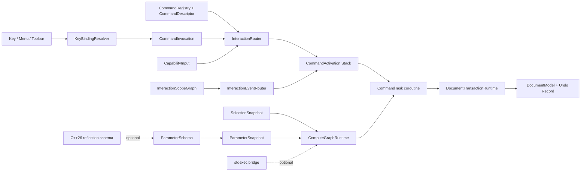

# Sora Experimental Command Runtime

## 1. 目标

`CommandRuntime.h` 是一个隔离在 `Sora::Kernel::Experimental::CommandRuntime` 命名空间下的实验性 CAD 命令运行时。
它把传统 CAA `CATCommandSelector + CATCommand` 树拆为九个正交模块：

1. `CommandDescriptor`：命令元数据、默认 key binding 建议、可用性查询、参数 schema 和工厂。
2. `ParameterSchema`：命令参数字段、必填约束和 `ParameterSnapshot` 校验。
3. `KeyBindingResolver`：用户输入键位到 `CommandInvocation` 的上下文解析。
4. `InteractionEventRouter`：target-to-root 事件路由和 active command fallback。
5. `InteractionRouter`：exclusive/shared/passive 命令模式和 activation stack。
6. `FunctionSender` / `CommandTask`：最小 Sender/Receiver completion 与命令协程语法层。
7. `ComputeGraphRuntime`：只接受 snapshot 输入的计算 DAG。
8. `DocumentTransactionRuntime`：版本校验、`ChangeSet` 提交、undo record 生成与一步撤销。
9. `CommandRuntimeStdexec.h` / `CommandRuntimeReflection.h`：`stdexec` 桥接和 C++26 reflection schema 原型。

该模块不修改 `Experimental` 外部文件。Demo 和测试入口同样放在本目录下，作为独立编译目标使用。

## 2. 当前实现边界

| 架构点 | 当前实现 | 后续接入点 |
|---|---|---|
| Command descriptor | `CommandRegistry` 管理 descriptor、参数 schema 和默认绑定导出 | 接入 Sora 资源系统 |
| Parameter schema | `ParameterSchema`、`ParameterField`、`ValidateParameters` 校验 snapshot | 接入属性面板、命令搜索、脚本 API |
| Static reflection | `CommandRuntimeReflection.h` 在无 `<experimental/meta>` 时使用手写 schema fallback | COCA 提供 reflection header 后启用自动字段生成 |
| Contextual key binding | 支持 workbench、editor kind、focused scope、modal、text input、冲突检测、旧 chord 压制 | 接入用户 profile 和项目级配置持久化 |
| Interaction router | 支持 exclusive/shared/passive activation stack | 接入真实 viewer/panel/modal scope graph |
| Sender/Receiver | `FunctionSender` 提供 value/error/stopped completion | 接入真实异步 scheduler |
| stdexec bridge | `CommandRuntimeStdexec.h` 将 runtime sender 作为 `Completion<T>` value 放入 stdexec 图 | CMake target 暴露 `stdexec` include path 后执行真实 bridge 测试 |
| Coroutine | `CommandTask<T>` 可 `co_await` runtime sender | 加入 activation stop scope 和 trace span 绑定 |
| Compute graph | 拓扑排序、环检测、stopped、typed error | 接入异步调度器、GPU/CPU resource class |
| Transaction | document version 校验、`ChangeSet` commit、可执行 undo record、insert/update/erase 冲突检查 | 接入真实 Sora document model |
| UI safety | `UiAffine` 与 `BackgroundSafe` concept 约束后台输入 | 接入真实 UI/viewer/widget 类型 |

## 3. 编译与运行

独立测试：

```powershell
python T:\toolchains\coca-toolchain-p2996\setup.py env --shell powershell | Invoke-Expression
clang++ -std=gnu++26 -freflection-latest -I G:\Teaching\Vulkan\Sora\include `
  G:\Teaching\Vulkan\Sora\include\Sora\Kernel\Experimental\CommandRuntimeTest.cpp `
  -o C:\tmp\SoraCommandRuntimeTest.exe
C:\tmp\SoraCommandRuntimeTest.exe
```

启用父级 `thirdparty/stdexec` include path 的测试：

```powershell
python T:\toolchains\coca-toolchain-p2996\setup.py env --shell powershell | Invoke-Expression
clang++ -std=gnu++26 -freflection-latest -I G:\Teaching\Vulkan\Sora\include `
  -I G:\Teaching\Vulkan\thirdparty\stdexec\include `
  G:\Teaching\Vulkan\Sora\include\Sora\Kernel\Experimental\CommandRuntimeTest.cpp `
  -o C:\tmp\SoraCommandRuntimeTestStdexec.exe
C:\tmp\SoraCommandRuntimeTestStdexec.exe
```

独立 Demo：

```powershell
python T:\toolchains\coca-toolchain-p2996\setup.py env --shell powershell | Invoke-Expression
clang++ -std=gnu++26 -freflection-latest -I G:\Teaching\Vulkan\Sora\include `
  G:\Teaching\Vulkan\Sora\include\Sora\Kernel\Experimental\CommandRuntimeDemo.cpp `
  -o C:\tmp\SoraCommandRuntimeDemo.exe
C:\tmp\SoraCommandRuntimeDemo.exe
```

启用 `stdexec` include path 的 Demo：

```powershell
python T:\toolchains\coca-toolchain-p2996\setup.py env --shell powershell | Invoke-Expression
clang++ -std=gnu++26 -freflection-latest -I G:\Teaching\Vulkan\Sora\include `
  -I G:\Teaching\Vulkan\thirdparty\stdexec\include `
  G:\Teaching\Vulkan\Sora\include\Sora\Kernel\Experimental\CommandRuntimeDemo.cpp `
  -o C:\tmp\SoraCommandRuntimeDemoStdexec.exe
C:\tmp\SoraCommandRuntimeDemoStdexec.exe
```

## 4. 测试覆盖

`CommandRuntimeTest.cpp` 覆盖二十三类行为：

1. parameter schema fallback 生成 schema，并校验 `ParameterSnapshot`。
2. `stdexec` bridge 暴露可检测状态；若 header 可用，则实际 `sync_wait` runtime sender。
3. 同一 key chord 在不同 workbench 中解析到不同命令。
4. 文本输入焦点消费 key event，不触发命令。
5. 同一上下文中同优先级绑定产生结构化 conflict。
6. 用户 profile 绑定覆盖系统默认绑定。
7. 快捷键支持 `focused_scope` 上下文匹配、旧 chord 压制和新 chord 重绑。
8. interaction scope 按 target-to-root 顺序路由事件，并在未处理时进入 active fallback。
9. exclusive command 激活，shared command 暂停并恢复旧命令。
10. compute graph 执行依赖节点并生成 feature。
11. transaction 校验 document version，拒绝 stale `ChangeSet`。
12. `CommandTask<T>` 通过 `co_await` 串联 compute graph 和 transaction。
13. `UiAffine` / `BackgroundSafe` 静态边界拒绝 UI 类型进入后台输入集合。
14. capability query 拒绝不可用命令，且不污染 activation stack。
15. 新 exclusive command 替换旧命令时取消旧 activation，并传播 stop token。
16. passive command 叠加到栈顶时不暂停当前 active command。
17. compute graph 检测依赖环并返回 `CycleDetected`。
18. compute graph 在 stop token 已请求时返回 stopped completion。
19. transaction 拒绝空 `ChangeSet`，避免生成无语义 undo record。
20. `ChangeSet` 支持 insert/update/erase，并拒绝 update 与 erase 同时作用于同一对象。
21. `UndoRecord` 记录 label、base/new version、对象 id 摘要和反向快照，失败提交不污染历史。
22. `UndoLast` 可反向撤销 insert/update/erase，且撤销后 document version 保持单调递增。
23. 撤销入口版本不匹配时拒绝执行，避免旧 undo record 覆盖后续修改。

## 5. 设计不变量

1. `CommandDescriptor` 不保存用户修改后的快捷键，只保存默认绑定建议。
2. `KeyBindingResolver` 只生成 `CommandInvocation`，不直接启动命令。
3. `InteractionRouter` 启动命令前必须执行 capability query。
4. `ComputeGraphRuntime` 不接受 UI-affine 类型作为输入。
5. 计算图输出不能直接修改 document；document 修改必须经过 transaction 和 `ChangeSet`。
6. 命令协程只作为语法层；异步完成状态仍以 value/error/stopped 表达。
7. 事务提交必须检查 `DocumentVersion`，旧版本 `ChangeSet` 不得静默覆盖当前文档。
8. 参数 schema 描述命令输入契约；命令执行只能读取已经冻结的 `ParameterSnapshot`。
9. `stdexec` 桥接不得把 `CommandError` 和 stopped 隐式擦除为普通 value 或普通异常。
10. reflection 只生成 schema 元数据，不参与 command activation 的动态控制流。
11. undo record 必须携带足够的反向快照；撤销改变 document version，但不得把版本号回滚到旧值。

## 6. 前沿依据与本地边界

本实验层对齐两条 C++26 方向：

1. WG21 [P2300R10](https://wg21.link/P2300R10) 将异步计算表达为 sender/receiver 图；本设计把命令副作用归约为
   `Completion<T>`，并用 `CommandRuntimeStdexec.h` 提供向 `stdexec` 图的桥接入口。
2. WG21 [P2996R13](https://wg21.link/P2996R13) 定义静态反射模型；本设计把 command parameter schema 放到运行时
   核心类型中，并用 `CommandRuntimeReflection.h` 在 reflection header 可用时生成字段元数据。

当前 standalone 基线编译命令只传入 `G:\Teaching\Vulkan\Sora\include`。在该 include path 下，
`stdexec/execution.hpp` 与 `experimental/meta` 均不可见，因此 demo 输出 `stdexec bridge: header unavailable` 和
`static reflection: manual fallback`。加入 `G:\Teaching\Vulkan\thirdparty\stdexec\include` 后，`stdexec` bridge 已经
通过真实编译和运行验证，demo 输出 `stdexec bridge: available`。`experimental/meta` 当前仍不可见，reflection
schema 走手写 fallback。

## 7. 架构流



该图刻画三条分离边界：输入解析不直接启动命令，activation 不直接修改 document，compute graph 不拥有 UI 状态。
`stdexec` 只进入调度层，reflection 只进入 schema 生成层，二者都不改变 command runtime 的核心语义。

## 17. 风险与反例

本节按反例刻画运行时边界。每个反例都对应一条设计防线、一段核心代码和一个测试入口；若后续接入真实
Sora document、viewer、配置系统或 stdexec scheduler，本节的不变量必须保持。

| 反例 | 设计处理 | 核心类型 | 测试入口 |
|---|---|---|---|
| 快捷键写死在 command descriptor 中，用户改键后与上下文脱钩 | descriptor 只给默认建议，真实解析由 `KeyBindingResolver` 基于上下文、来源和优先级完成 | `CommandDescriptor`、`KeyBindingResolver` | `TestContextualKeyBinding`、`TestUserKeyBindingOverride` |
| 用户把 `L` 改成 `P`，但旧的 `L` 默认绑定仍然触发命令 | resolver 支持 `suppressed` 规则；高优先级 suppression 可以只在指定 workbench/editor/scope 下压制旧 chord | `KeyBindingRule`、`KeyBindingResolver` | `TestScopedKeyBindingSuppressionAndRebind` |
| 参数面板、脚本入口和快捷命令各自解析参数，字段缺失到执行期才暴露 | command parameter schema 统一描述字段契约，执行前校验 `ParameterSnapshot` | `ParameterSchema`、`ValidateParameters` | `TestParameterSchemaValidation` |
| 文本框获得焦点时，`L` 同时输入字符和触发 Line 命令 | `text_input_active` 先于所有规则匹配，直接返回 `TextInputConsumed` | `KeyBindingContext` | `TestContextualKeyBinding` |
| 两个命令在同一上下文绑定同一 key chord，运行时随机选择一个 | 同分规则形成结构化 conflict，调用者必须展示冲突或要求用户消解 | `KeyBindingResolution` | `TestKeyBindingConflict` |
| command tree 退化为全局单栈，测量命令、拖拽命令、模态命令相互污染 | activation stack 区分 exclusive/shared/passive，替换、暂停、恢复和叠加语义显式化 | `InteractionRouter` | `TestRouterModes`、`TestExclusiveCommandCancelsExistingStack`、`TestPassiveCommandDoesNotSuspendActiveCommand` |
| 菜单或快捷键直接启动不可用命令，例如无选择集时删除对象 | `Invoke` 前执行 capability query，不可用命令返回 `Unavailable`，不进入栈 | `CapabilityQuery` | `TestCommandCapabilityRejection` |
| 后台计算节点捕获 viewer/widget 指针，跨线程读取 UI 状态 | compute graph 只接受 snapshot；`UiAffine` 输入的 `Run` 重载被删除 | `ComputeInput`、`UiAffine`、`BackgroundSafe` | `TestStaticSafetyBoundaries` |
| 计算图有环或用户取消，但命令仍等待或提交半成品 | DAG 遍历检测 visiting 集合；每个节点前检查 stop token；节点返回 stopped 时向上传播 | `ComputeGraphRuntime` | `TestComputeGraphCycleDetection`、`TestComputeGraphStopToken` |
| 预览计算基于旧文档版本，提交时覆盖用户刚做的修改 | transaction 使用 `base_version` 与当前 document version 比较，版本不一致则拒绝 commit | `DocumentTransactionRuntime` | `TestComputeGraphAndTransaction` |
| 空变更也创建 undo record，使撤销栈出现无语义记录 | transaction 拒绝空 `ChangeSet`，document version 和对象集合保持不变 | `ChangeSet` | `TestEmptyTransactionPatchRejected` |
| 修改和删除同时作用于同一对象，提交顺序决定结果 | transaction 在 commit 前做冲突检查，拒绝自相矛盾的 `ChangeSet` | `ChangeSet` | `TestChangeSetUpdateEraseAndConflict` |
| undo record 只保存对象 id，撤销 update/erase 时无法恢复原对象 | `AppliedChange` 同时保存 inserted-after、updated-before 和 erased-before 快照，erase 还保存原索引 | `UndoRecord` | `TestChangeSetUpdateEraseAndConflict` |
| 撤销也递增 document version，导致下一条历史记录的原始 `new_version` 过期 | `UndoRecord` 区分提交产生的 `new_version` 与当前可撤销入口 `undo_from_version` | `UndoRecord` | `TestChangeSetUpdateEraseAndConflict` |
| 另一个 transaction runtime 已推进文档，旧撤销记录仍尝试反向覆盖当前状态 | `UndoLast` 比较 `undo_from_version` 与当前 document version，不一致则返回 `VersionMismatch` | `DocumentTransactionRuntime` | `TestUndoRejectsVersionMismatch` |
| coroutine 把 error/stopped 藏成异常泄漏或静默成功 | `SenderAwaiter` 将 completion 映射为异常，`CommandTask` promise 再统一折回 typed completion | `FunctionSender`、`CommandTask` | `TestCoroutineCommandTask` |
| 桥接到 `stdexec` 后把 command error/stopped 擦除为普通返回值或普通异常 | bridge 将 runtime sender 运输为 `Completion<T>` value，不改变语义域 | `CommandRuntimeStdexec.h` | `TestStdexecBridgeStatus` |

### 17.1 快捷键是上下文解析结果，不是命令固有属性

风险根源在于把 shortcut 当作 command 的静态字段。复杂交互软件的快捷键至少具有四类上下文：
workbench、editor kind、focused scope、modal state；还具有多类来源：系统默认、工作台建议、用户 profile、
项目配置和临时 modal 层。将这些信息塞回 command tree 会导致两个问题：命令元数据无法表达用户改键，
交互层无法解释同一 key chord 在不同工作区、不同编辑器、不同焦点 scope 中的不同含义。

核心代码把 default binding 与实际 binding 分离：

```cpp
struct CommandDescriptor {
    CommandId id{};
    std::vector<DefaultKeyBinding> default_key_bindings{};
    CommandMode default_mode{CommandMode::Exclusive};
    CapabilityQuery capability{[](const CapabilityInput&) { return CapabilityResult::Available(); }};
};

void CommandRegistry::ExportDefaultBindings(KeyBindingResolver& resolver) const {
    for (const auto& [_, descriptor] : descriptors_) {
        for (const DefaultKeyBinding& binding : descriptor.default_key_bindings) {
            resolver.Add(KeyBindingRule{.chord = binding.chord,
                                        .command = descriptor.id,
                                        .workbench = binding.workbench,
                                        .editor_kind = binding.editor_kind,
                                        .focused_scope = binding.focused_scope,
                                        .origin = BindingOrigin::SystemDefault});
        }
    }
}
```

真实解析发生在 `KeyBindingResolver`：

```cpp
if (context.text_input_active) {
    return KeyBindingResolution{.status = ResolutionStatus::TextInputConsumed};
}

std::ranges::sort(matches, [&](const KeyBindingRule* lhs, const KeyBindingRule* rhs) {
    return Score(*lhs, context) > Score(*rhs, context);
});

if (conflicts.size() > 1) {
    return KeyBindingResolution{.status = ResolutionStatus::Conflict, .conflicts = std::move(conflicts)};
}
```

`Score` 中的偏序是：显式 precedence、workbench 匹配、editor kind 匹配、focused scope 匹配、modal 匹配、
binding origin。用户 profile 因此可以覆盖系统默认，但不能绕过上下文匹配。真正的“改键”不是简单添加一条
新绑定；它通常需要一条带显式 precedence 的 `suppressed` 规则压制旧 chord，再添加新 chord：

```cpp
resolver.Suppress(KeyBindingRule{.chord = KeyChord{"L"},
                                 .command = CommandId{"geometry.create_line"},
                                 .workbench = WorkbenchId{"Sketcher"},
                                 .focused_scope = ScopeId{"viewer"},
                                 .origin = BindingOrigin::UserProfile,
                                 .precedence = 100});
resolver.Add(KeyBindingRule{.chord = KeyChord{"P"},
                            .command = CommandId{"geometry.create_line"},
                            .workbench = WorkbenchId{"Sketcher"},
                            .focused_scope = ScopeId{"viewer"},
                            .origin = BindingOrigin::UserProfile,
                            .precedence = 100});
```

### 17.2 activation stack 替代裸 command tree

传统 command tree 的危险不是树结构本身，而是把交互状态、父子 ownership、事件路由和生命周期混为一体。本设计
保留 tree 可表达的 target-to-root 事件语义，但把命令生命周期落到 activation stack 上。

```cpp
void ApplyMode(CommandActivation& next) {
    if (next.Mode() == CommandMode::Passive) {
        return;
    }

    if (next.Mode() == CommandMode::Exclusive) {
        for (auto& activation : stack_) {
            activation->Cancel("exclusive-replacement");
        }
        stack_.clear();
        return;
    }

    if (next.Mode() == CommandMode::Shared && !stack_.empty()) {
        stack_.back()->Suspend();
    }
}
```

由此得到三条确定语义：exclusive 替换所有旧命令并发出 stop request；shared 暂停栈顶命令，结束后恢复；
passive 叠加到栈顶，不暂停当前命令。测量、坐标读数、状态栏 hover 等交互应属于 passive；临时测量工具可属于
shared；几何创建、编辑变换、草图约束求解应属于 exclusive。

### 17.3 capability query 阻断非法启动

菜单、toolbar、快捷键和脚本入口都可能绕过 UI 灰显状态。运行时不能相信显示层。`InteractionRouter::Invoke`
在创建 activation 之前查询 capability，不可用命令不进入栈。

```cpp
CapabilityResult capability = descriptor->capability(input);
if (!capability.available) {
    return Completion<std::shared_ptr<CommandActivation>>::Error(
        CommandError::Make(ErrorCode::Unavailable, capability.reason));
}
```

此处的关键点是失败发生在 activation 创建之前。否则会出现不可用命令占据 active slot、消费后续事件、污染撤销语义的
连锁错误。

### 17.4 task graph 只处理纯计算，不拥有 UI 和 document

task graph 适合表达 profile、preview mesh、constraint solve、feature build 等可依赖、可取消、可重算的计算。
它不适合表达 widget 生命周期和 document mutation。设计上以 snapshot 作为唯一合法输入，UI-affine 类型无法编译进入
`Run`。

```cpp
template<typename T>
concept UiAffine = std::derived_from<std::remove_cvref_t<T>, UiAffineTag>;

template<typename T>
concept BackgroundSafe =
    ImmutableSnapshot<std::remove_cvref_t<T>> ||
    std::same_as<std::remove_cvref_t<T>, ComputeInput> ||
    std::same_as<std::remove_cvref_t<T>, DocumentVersion> ||
    std::same_as<std::remove_cvref_t<T>, std::string>;

template<UiAffine T>
[[nodiscard]] auto Run(T&&, std::stop_token = {}) const =
    delete("UI-affine state must be converted to immutable snapshots before background compute.");
```

反例是后台节点捕获 viewer 指针读取 selection。正确路径是 UI 层先抽取 `SelectionSnapshot` 和
`ParameterSnapshot`，计算图只看稳定引用和版本号。

### 17.5 计算图失败必须显式化

计算图的两个基本反例是环和取消。环表示调度偏序不存在；取消表示用户意图或 activation 生命周期已经结束。二者都不应
退化为异常崩溃或空结果。

```cpp
for (const auto& [id, _] : nodes_) {
    if (!Visit(id, visiting, visited, order)) {
        return Completion<ComputeGraphResult>::Error(
            CommandError::Make(ErrorCode::CycleDetected, "compute graph contains a cycle"));
    }
}

for (const std::string& id : order) {
    if (stop.stop_requested()) {
        return Completion<ComputeGraphResult>::Stop();
    }
    Completion<std::any> value = nodes_.at(id).run(context);
    if (value.IsStopped()) {
        return Completion<ComputeGraphResult>::Stop();
    }
}
```

`Visit` 使用 `visiting` 和 `visited` 两个集合区分临时标记和永久标记。该结构等价于 DFS 上的 back-edge 检测：
若访问到 `visiting` 中的节点，则依赖图存在有向环。

### 17.6 document mutation 只经事务层

预览计算和最终提交之间存在时间间隔。若文档在这段时间内被其他命令修改，旧计算结果必须失效。事务层以
`DocumentVersion` 作为乐观并发控制边界。当前实现已经从仅能追加的 `DocumentPatch` 升级为轻量 `ChangeSet`；
`DocumentPatch` 只作为兼容入口保留。

```cpp
if (request.base_version != document_.Version()) {
    return Completion<TransactionResult>::Error(
        CommandError::Make(ErrorCode::VersionMismatch, "document version changed before commit"));
}
if (change.Empty()) {
    return Completion<TransactionResult>::Error(
        CommandError::Make(ErrorCode::InvalidInput, "empty change set"));
}
if (std::optional<CommandError> conflict = Validate(change)) {
    return Completion<TransactionResult>::Error(std::move(*conflict));
}

AppliedChange applied = document_.Apply(std::move(change));
const std::size_t undo_record = undo_records_.size() + 1;
undo_records_.push_back(UndoRecord{.id = undo_record,
                                   .label = request.label,
                                   .base_version = request.base_version,
                                   .new_version = document_.Version(),
                                   .undo_from_version = document_.Version(),
                                   .summary = std::move(applied.summary),
                                   .inserted_after = std::move(applied.inserted_after),
                                   .updated_before = std::move(applied.updated_before),
                                   .erased_before = std::move(applied.erased_before)});
```

此设计把 compute graph 和 document model 之间的关系收缩为一条窄接口：计算图生产候选 `StateObject`，事务层决定
这些候选是否仍可提交，并为有效提交创建 undo record。`ChangeSet` 当前覆盖 insert、update、erase 三类操作；
它还不是完整历史图，但已经消除了“只能追加数组”和“undo 只是数字”的草台边界。

### 17.7 undo 是线性栈顶反向变更，不是完整历史图

当前 undo 的目标是形成最小闭环：一次有效提交必须能被栈顶撤销；撤销失败不得改变 document 或 undo 栈。
因此 `UndoRecord` 同时保存三类反向信息：

1. insert 的提交后对象：撤销时按反序删除这些对象。
2. update 的提交前对象：撤销时按反序替换回旧对象。
3. erase 的提交前对象和原索引：撤销时按反序插回，恢复对象集合顺序。

撤销本身也是一次 document mutation，所以 document version 继续递增，而不是回滚到旧版本。为避免连续 undo
时下一条记录的原始 `new_version` 失效，record 额外维护 `undo_from_version`：它表示“当前必须处于哪个版本，
这条记录才允许被撤销”。栈顶被撤销后，新的栈顶记录会把 `undo_from_version` 更新为当前 document version。

```cpp
if (last.undo_from_version != document_.Version()) {
    return Completion<TransactionResult>::Error(
        CommandError::Make(ErrorCode::VersionMismatch, "document version changed before undo"));
}
if (std::optional<CommandError> invalid = ValidateUndo(last)) {
    return Completion<TransactionResult>::Error(std::move(*invalid));
}

document_.UndoAppliedChange(last.inserted_after, last.updated_before, last.erased_before);
undo_records_.pop_back();
if (!undo_records_.empty()) {
    undo_records_.back().undo_from_version = document_.Version();
}
```

`UndoAppliedChange` 的反向顺序是 insert → update → erase 的逆过程。这里没有引入 redo，也没有把 undo
扩展成分支历史 DAG，因为当前实验层还没有多视图历史浏览、历史重放、跨命令合并这些需求；提前引入会把接口复杂度
推高，却不能增加当前提交路径的正确性。

### 17.8 coroutine 只是语法层，completion 仍是语义层

协程的价值是把多步命令写成顺序代码，例如 selection snapshot、preview compute、commit transaction。风险在于把
error/stopped 隐式吞掉。当前实现中，`co_await` 先把 sender 归约为 completion，再在 `await_resume` 中显式分派。

```cpp
decltype(auto) await_resume() {
    if (completion_->IsStopped()) {
        throw CommandStoppedException{};
    }
    if (completion_->HasError()) {
        throw CommandException{completion_->Error()};
    }
    return std::move(*completion_).Value();
}
```

`CommandTask` 的 promise 捕获这些异常并折回 `Completion<T>`。因此 command author 获得顺序写法，运行时仍保留
`value/error/stopped` 三分 completion 语义；桥接 `stdexec` 时也必须保持这一点。

### 17.8 parameter schema 是命令输入契约

CAD 命令的输入入口不止属性面板。快捷键、菜单、脚本、宏录制、命令搜索都可能构造参数。若每个入口各自解析字段，
必填参数缺失会延迟到 compute node 或 transaction 才暴露，错误位置已经偏离用户操作。

```cpp
struct ParameterSchema {
    std::string name{};
    std::vector<ParameterField> fields{};
    bool generated_from_reflection{};
};

[[nodiscard]] inline ParameterValidationResult ValidateParameters(const ParameterSchema& schema,
                                                                  const ParameterSnapshot& snapshot);
```

`CommandRuntimeReflection.h` 提供两条 schema 生成路径：若类型声明了 `CommandParameterSchema()`，直接使用手写 schema；
若后续工具链暴露 `<experimental/meta>` 和 `__cpp_reflection`，则通过 `nonstatic_data_members_of(^^T, ...)` 生成字段名。
当前 standalone 环境走手写 fallback，测试仍验证 schema 校验逻辑。

### 17.9 stdexec bridge 不改变 completion 语义

`stdexec` 的价值是调度、组合和结构化异步；CAD command runtime 的语义边界仍是 `Completion<T>`。因此桥接层不把
`CommandError` 映射成任意异常，也不把 stopped 当作普通返回值。

```cpp
template<stdexec::scheduler Scheduler, RuntimeSender Sender>
[[nodiscard]] auto ScheduleCompletion(Scheduler scheduler, Sender sender) {
    return stdexec::schedule(std::move(scheduler)) |
           stdexec::then([runtime_sender = std::move(sender)]() mutable {
               return SyncWait(std::move(runtime_sender));
           });
}
```

桥接后的 stdexec sender 产出 `Completion<T>`。上层可以继续用 `then`、`let_value`、scheduler transfer 等机制组织任务，
但必须在明确位置解释 `HasValue()`、`HasError()` 和 `IsStopped()`。
