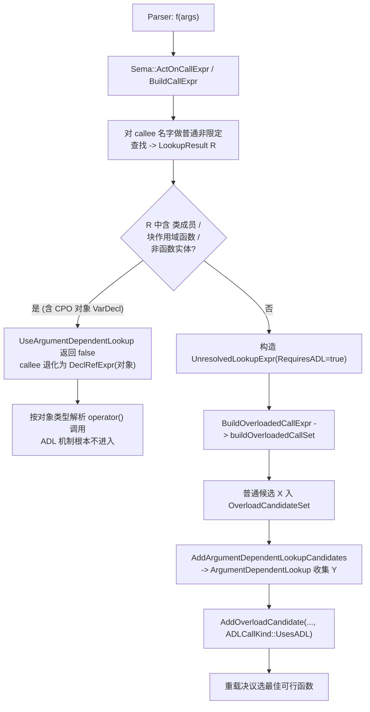

# ADL 与定制点对象 (Argument-Dependent Lookup and Customization Point Objects)

本文记录 `Mashiro/Core/ToString.h` 在 2026 年 6 月一次重构中暴露并修复的无限递归缺陷，并以此为切入点，系统讲解实参依赖查找 (ADL) 的语言语义、它在 LLVM/Clang 前端的实现、定制点对象 (CPO) 的原理，以及二者交互产生的典型现象。读者对象为已掌握 C++ 重载决议基本概念的工程师。

## 1. 动机：一次无限递归

`ToString` 的早期形态是命名空间作用域的函数模板 `Mashiro::ToString`。它的分支一负责探测用户是否提供了自由函数形式的定制：

```cpp
namespace Mashiro::Detail::ADL::FreeToString {
    void ToString() = delete;                       // poison pill

    template<typename T>
    concept Available = requires(T&& v) {
        { ToString(std::forward<T>(v)) } -> std::convertible_to<std::string>;
    };
}
```

`Available` 中那句非限定调用 `ToString(v)` 的查找分两步：普通非限定查找在本命名空间命中 poison pill（一个函数），查找停止；因命中的是函数，ADL 继续，把实参类型的关联命名空间里的同名函数并入候选集。

对全局命名空间的实参类型，关联命名空间是全局，不含 `Mashiro`，探测正常。对一个声明在 `Mashiro` 中的类型（如 `float3`），关联命名空间恰为 `Mashiro`，于是 ADL 找到了通用模板 `Mashiro::ToString` 自身。结果 `Available<float3>` 恒为真，分支一调用 `Invoke`，`Invoke` 再调 `ToString`，再次落入分支一，形成无限递归。AddressSanitizer 报告栈溢出。

此缺陷的根源不在 `float3`，而在派发器与定制点共享名字 `ToString` 且同处一个命名空间。任何 `Mashiro` 内的聚合类型都会触发。它长期潜伏，仅因此前从未对 `Mashiro` 内类型调用过 `ToString`。

## 2. ADL 的语言语义

### 2.1 定义与动机

ADL（亦称 Koenig lookup）规定：对形如 `f(a1, ..., an)` 的非限定函数调用，除普通非限定查找外，编译器还在各实参类型的关联命名空间与关联类中查找名字 `f`，并入重载候选集。其设计动机是让 `operator<<(cout, x)`、`swap(a, b)` 这类与类型语义绑定的自由函数能在不显式限定命名空间的前提下被找到，从而支撑泛型代码的接口原则。

### 2.2 关联命名空间与关联类的计算

关联集合按实参类型的结构递归确定。下表给出主要规则（依据 ISO C++ `[basic.lookup.argdep]`）。

| 实参类型 | 关联命名空间 | 关联类 |
|----------|------------|--------|
| 基本类型 (`int`、`float`) | 空 | 空 |
| 类类型 `X` | `X` 及其各基类的最内层外围命名空间 | `X`、`X` 的外围类、`X` 的直接与间接基类 |
| 类模板特化 `C<Args...>` | 上述并入各模板实参的关联命名空间 | 上述并入各类型模板实参的关联类 |
| 枚举类型 `E` | `E` 声明处的最内层外围命名空间 | 若 `E` 为成员，则其外围类 |
| 指针/数组 `T*`、`T[]` | 取被指/元素类型 `T` 的关联集合 | 同 |
| 函数类型 | 参数类型与返回类型的关联集合 | 同 |
| 成员指针 `T X::*` | `T` 与 `X` 的关联集合 | 同 |
| 重载集/函数模板名 | 各成员关联集合之并 | 同 |

两条推论对本文至关重要。其一，基本类型无关联命名空间，故对 `float` 成员递归调用 `ToString` 时，ADL 无所获，只能依赖普通查找。其二，类类型的关联命名空间只取最内层外围命名空间，`Mashiro::float3` 关联 `Mashiro` 而非 `Mashiro::Detail`，这正是缺陷只命中 `Mashiro` 直接成员的原因。

### 2.3 ADL 的触发与抑制

ADL 并非总是执行。当普通非限定查找命中以下任一种声明时，ADL 被抑制：

1. 类成员；
2. 块作用域的函数声明（using-声明除外）；
3. 既非函数也非函数模板的声明（即变量、对象、类型等）。

第三条是 CPO 设计的支点：若一个名字在普通查找阶段解析为对象，ADL 不再执行，编译器直接对该对象施加调用语法（即调用其 `operator()`）。

### 2.4 隐藏友元

定义在类体内的友元函数（hidden friend）不参与普通查找，只能经 ADL 找到。这一机制使 `operator<<` 等运算符可以内联定义在类内、却仍能被 `cout << x` 命中，同时避免污染外围命名空间的名字表。它是 ADL 唯一的可见性来源，因此与 poison-pill 惯用法天然契合。

## 3. ADL 在 LLVM/Clang 中的实现

本节代码引用均取自本地检出 `D:\repos\llvm-reflection`，行号随版本漂移，函数名与逻辑结构稳定。主体在 `clang/lib/Sema/SemaExpr.cpp`、`clang/lib/Sema/SemaLookup.cpp`、`clang/lib/Sema/SemaOverload.cpp` 三文件。

### 3.1 名字查找的形式刻画

把一次名字使用的解析抽象为：普通非限定查找产出候选集 X，ADL 产出候选集 Y，调用的候选集为 X ∪ Y，再交由重载决议择优。ADL 的语言条款 `[basic.lookup.argdep]p3` 规定 X 中一旦出现某些声明，则 Y 取空集。这一条款在 Clang 中由两处共同落实：调用点是否启动 ADL 由 `Sema::UseArgumentDependentLookup` 判定（决定是否计算 Y），Y 的内容由 `Sema::ArgumentDependentLookup` 在关联命名空间内收集时再次过滤。两处的过滤标准一致，构成对 CPO 设计的双重保证（详见 §3.6）。

### 3.2 调用表达式的处理流水线



关键的分叉在节点 D。当普通查找把 `ToString` 解析为一个对象（`VarDecl`），`UseArgumentDependentLookup` 返回假，前端不再构造带 ADL 的 `UnresolvedLookupExpr`，而是生成指向该对象的 `DeclRefExpr`，外层调用转为对类对象的 `operator()` 重载决议。ADL 的整套机制在此路径上从未被触及。

### 3.3 抑制判定：UseArgumentDependentLookup

`clang/lib/Sema/SemaExpr.cpp:3129` 实现 §2.3 的抑制规则，逐条对应标准条款：

```cpp
// SemaExpr.cpp:3129
bool Sema::UseArgumentDependentLookup(const CXXScopeSpec &SS,
                                      const LookupResult &R,
                                      bool HasTrailingLParen) {
  if (!HasTrailingLParen) return false;          // 仅用作调用的 postfix-expression
  if (SS.isNotEmpty())    return false;          // 有限定符则不做 ADL
  if (!getLangOpts().CPlusPlus) return false;
  for (const NamedDecl *D : R) {
    if (D->isCXXClassMember()) return false;     // -- 类成员
    if (isa<UsingShadowDecl>(D))
      D = cast<UsingShadowDecl>(D)->getTargetDecl();
    else if (D->getLexicalDeclContext()->isFunctionOrMethod())
      return false;                              // -- 块作用域函数声明(非 using)
    if (const auto *FDecl = dyn_cast<FunctionDecl>(D)) {
      if (FDecl->getBuiltinID() && FDecl->isImplicit()) return false;
    } else if (!isa<FunctionTemplateDecl>(D))
      return false;                              // -- 既非函数也非函数模板 (即变量/对象)
  }
  return true;
}
```

最后一个分支是 CPO 的支点：CPO 入口 `Mashiro::ToString` 是 `VarDecl`，普通查找命中它后，`dyn_cast<FunctionDecl>` 失败且非 `FunctionTemplateDecl`，函数返回假，ADL 在调用点即被关闭。

### 3.4 关联集合计算

`Sema::FindAssociatedClassesAndNamespaces`（`SemaLookup.cpp:3336`）遍历各实参表达式，对每个实参类型调 `addAssociatedClassesAndNamespaces`。后者对规范类型 (`getCanonicalTypeInternal`) 做基于 `getTypeClass()` 的分派，是 §2.2 规则表的直接代码化：

```cpp
// SemaLookup.cpp:3158  addAssociatedClassesAndNamespaces(AssociatedLookup&, QualType)
switch (T->getTypeClass()) {
case Type::Pointer:        // T* / T[] -> 取被指/元素类型, continue 循环
case Type::ConstantArray:  T = ...->getElementType(); continue;
case Type::Builtin:        break;          // 基本类型: 关联集合为空
case Type::Record:         addAssociatedClassesAndNamespaces(Result, Class); break;
case Type::Enum:           CollectEnclosingNamespace(Result.Namespaces, Ctx); break;
case Type::FunctionProto:  /* 参数类型入队, 落到返回类型 */
// ...
}
```

类类型分支（`SemaLookup.cpp:3066`）沿基类链以工作表迭代，经 `addClassTransitive`（`SemaLookup.cpp:2918`，用 `ClassesTransitive` 集合去重）累加自身、外围类与所有直接间接基类，并对每个类调 `CollectEnclosingNamespace`。模板特化分支对每个类型模板实参递归（`SemaLookup.cpp:3106-3108`），故 `std::vector<Mashiro::float3>` 同时关联 `std` 与 `Mashiro`。

`CollectEnclosingNamespace`（`SemaLookup.cpp:2939`）取最内层外围命名空间，并显式跳过内联命名空间：

```cpp
// SemaLookup.cpp:2956
while (!Ctx->isFileContext() || Ctx->isInlineNamespace())
  Ctx = Ctx->getParent();
```

这解释了 §2.2 的两条推论在实现层的来源：`Type::Builtin` 直接 `break`（`float` 成员无贡献），类类型只取最内层外围命名空间（`Mashiro::float3` 关联 `Mashiro` 而非 `Mashiro::Detail`）。

### 3.5 ADL 主体与候选注入

`Sema::ArgumentDependentLookup`（`SemaLookup.cpp:3894`）对每个关联命名空间执行 `NS->lookup(Name)`，并对每个结果施加过滤：

```cpp
// SemaLookup.cpp:3933
DeclContext::lookup_result R = NS->lookup(Name);
for (auto *D : R) {
  auto *Underlying = D;
  if (auto *USD = dyn_cast<UsingShadowDecl>(D)) Underlying = USD->getTargetDecl();
  if (!isa<FunctionDecl>(Underlying) &&
      !isa<FunctionTemplateDecl>(Underlying))
    continue;                                   // 非函数实体被跳过 (含 CPO 对象)
  // ... 可见性判定: 普通可见 或 关联类中的 hidden friend ...
  if (Visible) Result.insert(Underlying);
}
```

隐藏友元在此被特别接纳：当 `D->getFriendObjectKind()` 为真且其词法外围类在关联类集合中（`SemaLookup.cpp:3987-4001`），即便普通查找不可见也并入 Y。最终结果存入 `ADLResult`，由其 `insert` 按最新重声明去重。

候选注入由 `Sema::AddArgumentDependentLookupCandidates`（`SemaOverload.cpp:10411`）完成：它调用 `ArgumentDependentLookup` 取得 `Fns`（`SemaOverload.cpp:10427`），擦除已在普通候选集中出现的项以避免重复（`SemaOverload.cpp:10432-10440`），再对每个 ADL 候选调 `AddOverloadCandidate` 或 `AddTemplateOverloadCandidate`，统一标记 `ADLCallKind::UsesADL`（`SemaOverload.cpp:10451`、`10464`）。需更正一个流传的说法：在本 fork 中该包装函数确实存在，名为 `AddArgumentDependentLookupCandidates`，它与底层的 `ArgumentDependentLookup` 是两层关系，而非同一函数。

AST 层面，需要延迟解析的调用名表示为 `UnresolvedLookupExpr`（`clang/include/clang/AST/ExprCXX.h:3323`），其构造函数接受 `bool RequiresADL`，经 `requiresADL()`（`ExprCXX.h:3396`）读取 `UnresolvedLookupExprBits.RequiresADL` 位。此节点只在 callee 名字未解析或为重载集时生成；解析为单一对象时不生成，这正是 §3.2 节点 D 左支的 AST 后果。

### 3.6 CPO 对象在两处被结构性排除

把 §3.3 与 §3.5 的两行并置，即得 CPO 切断自指的源码级证明：

| 位置 | 源码 | 对 CPO 对象 (`VarDecl`) 的作用 |
|------|------|------------------------------|
| 调用点 | `SemaExpr.cpp:3173` `else if (!isa<FunctionTemplateDecl>(D)) return false;` | 普通查找命中 CPO 对象 -> 关闭 ADL，callee 转为对象的 `operator()` |
| ADL 内部 | `SemaLookup.cpp:3939` `if (!isa<FunctionDecl>... && !isa<FunctionTemplateDecl>...) continue;` | 即便对象处于关联命名空间，也被跳过，不进入 Y |

两道过滤的判据相同：只有 `FunctionDecl` 与 `FunctionTemplateDecl` 能经 ADL 参与调用。CPO 对象作为变量，从调用点与关联命名空间两个方向都被排除，因此 `FreeToString` 的探测无论实参属于哪个命名空间，都不会重新发现入口对象 `Mashiro::ToString`，自指通路在编译器实现层被彻底封死。

### 3.7 与显式模板实参的交互

对带显式模板实参的调用 `f<T>(x)`，ADL 仍执行，但前置条件是名字 `f` 必须先经普通查找被识别为模板，否则 `<` 被解析为小于号，语法分析阶段即失败。`AddArgumentDependentLookupCandidates` 对此有显式分支：当存在 `ExplicitTemplateArgs` 时，ADL 找到的普通 `FunctionDecl` 被跳过（`SemaOverload.cpp:10448-10449`），只有 `FunctionTemplateDecl` 经 `AddTemplateOverloadCandidate` 做实参推导后入集。这一约束解释了为何 `FromString<T>(sv)` 不会自指：探测实参类型为 `std::string_view`，关联命名空间为 `std`，不含 `Mashiro`，通用模板 `Mashiro::FromString` 也不在 `std` 中，故 ADL 无从找到它。

## 4. 定制点对象 (CPO) 的原理

### 4.1 定义与动机

定制点对象是一个命名空间作用域的 `inline constexpr` 函数对象，作为某个泛型操作的唯一公开入口。它取代同名函数模板，目的有三：统一调用语法、阻止用户对入口名做显式特化或取地址误用、利用 §2.3 第三条规则切断入口与 ADL 探测之间的自指通路。`std::ranges::begin`、`std::ranges::swap` 等均为此模式。

### 4.2 为何对象能切断自指

关键在于同一段文本 `ToString(x)` 在两个位置经历完全不同的查找。

| 调用点 | 普通查找命中 | ADL 是否执行 | 后果 |
|--------|------------|------------|------|
| 探测 concept（`FreeToString` 内） | poison pill（函数） | 执行（命中的是函数，不触发抑制） | 仅找到真正的用户自由函数；CPO 对象因 ADL 不收录非函数实体而被无视，自指被切断 |
| 用户调用点 / 递归调用点（`Mashiro` 作用域） | CPO 对象（变量） | 抑制（命中非函数实体） | 直接调用对象的 `operator()`，进入派发器 |

派发器内部仍在分支一对实参重跑 ADL 探测，因此外部命名空间类型的自由函数定制依旧可达。换言之，CPO 对象只是公开门面，真正的 ADL 逻辑封装在其调用的实现函数里，两次查找各取所需。该表第二行的抑制与第一行的排除，对应 §3.6 中 `SemaExpr.cpp:3173` 与 `SemaLookup.cpp:3939` 两行，是同一判据在调用点与关联命名空间两侧的应用。

### 4.3 与 std::ranges 的同构

标准库的 niebloid 解决的是同一问题：`std::ranges::begin` 是 `std::ranges` 中的对象，用户类型 `N::Foo` 的定制是 `N::begin(Foo)`，二者分处不同命名空间，故无名字冲突。本项目的特殊性在于库命名空间 `Mashiro` 与被定制类型的命名空间重合，因此 `Mashiro` 自身类型无法再用自由函数 `Mashiro::ToString` 定制（名字已被对象占用），只能改用成员函数或反射。这是命名空间重合带来的固有约束，而非 CPO 的缺陷。

## 5. 本项目的实现剖析

### 5.1 三层结构

文件 `Mashiro/include/Mashiro/Core/ToString.h` 的修复由三层构成。

第一层，派发器改名并移入 `Detail`，内部递归调用一并改为 `ToStringImpl`：

```cpp
namespace Mashiro::Detail {
    template <typename T>
    [[nodiscard]] constexpr std::string ToStringImpl(T&& iValue) {
        using U = std::remove_cvref_t<T>;
        if constexpr (Detail::ADL::FreeToString::Available<U>) {     // 分支一: ADL 探测
            return Detail::ADL::FreeToString::Invoke(std::forward<T>(iValue));
        }
        else if constexpr (Detail::HasMemberToString<U>) { /* 成员 */ }
        // ... range / tuple / variant / class(反射) 各分支, 递归调用 ToStringImpl(item) ...
    }
}
```

第二层，包一个函数对象类型：

```cpp
namespace Mashiro::Detail {
    struct ToStringFn {
        template <typename T>
        [[nodiscard]] constexpr std::string operator()(T&& iValue) const {
            return ToStringImpl(std::forward<T>(iValue));
        }
    };
}
```

第三层，公开名字是该类型的对象：

```cpp
namespace Mashiro {
    inline constexpr Detail::ToStringFn     ToString{};
    inline constexpr Detail::ToStringViewFn ToStringView{};
}
```

### 5.2 递归调用为何直接走 ToStringImpl

`ToStringImpl` 的各容器分支对元素递归时调用 `ToStringImpl(item)` 而非经 CPO 对象，原因是 `ToStringImpl` 自身的分支一已含 ADL 探测。对 `item` 调 `ToStringImpl` 会对其类型重跑探测，照样命中 `item` 所在命名空间的自由函数定制。CPO 对象与实现函数在分发结果上等价，递归走实现函数可省去一层间接，且不引入对象声明顺序的前置依赖。

此处涉及模板的两阶段名字查找。`ToStringImpl` 是模板，`item` 类型依赖于模板参数，故 `ToStringImpl(item)` 是依赖名调用，其重载决议推迟到实例化点 (`[temp.dep.candidate]`)。Clang 在解析模板定义时把该调用建成 `CallExpr`，callee 名字 `ToStringImpl` 经普通查找在定义点已绑定到本模板（实例化期不再对它做 ADL，因普通查找已命中函数模板），仅实参依赖的 ADL 候选在实例化点补充。由此 `ToStringImpl` 的自递归是良构的：定义点可见的本模板声明提供了非依赖的普通候选，无需前向声明。与之对照，若递归改走 CPO 对象 `ToString`，则要求该对象在 `ToStringImpl` 定义点之前已声明，否则定义点普通查找失配；现行写法绕开了这一声明顺序约束。

### 5.3 测试中的命名空间冲突

修复后 `ToStringTest.cpp` 一度编译失败，报 `reference to 'ToString' is ambiguous`。根因是测试在全局命名空间定义了自由函数 `ToString`/`ToStringView` 作定制点，又在文件顶部 `using namespace Mashiro`，于是全局作用域同时可见全局自由函数与经 using 指令引入的 CPO 对象。变量与函数不能构成重载集，非限定 `ToString(x)` 遂歧义。

修复方式是把三个带自由函数定制的类型移入 `namespace cust`，再以 using-声明仅引入类型名：

```cpp
namespace cust {
    struct FreeToStringType { int value{}; };
    std::string ToString(const FreeToStringType& v) { /* ... */ }
}
using cust::FreeToStringType;   // 只引入类型, 不引入自由函数
```

此后全局作用域不再有自由 `ToString`，非限定调用唯一解析为 CPO 对象，所有调用点无需改动；而 `cust::FreeToStringType` 的定制经 CPO 内部 ADL 在 `cust` 中命中。这一改写同时更贴近真实用法：定制函数本应与被定制类型同处一个命名空间。

## 6. 典型例子

### 6.1 std::swap 二段式

ADL 最经典的应用是泛型 `swap`：

```cpp
template <typename T>
void relocate(T& a, T& b) {
    using std::swap;     // 引入兜底候选
    swap(a, b);          // 普通查找见 std::swap; ADL 再找 T 命名空间的定制 swap
}
```

`using std::swap` 提供兜底，ADL 提供类型特化。若用户在自身命名空间提供了更优的 `swap`，重载决议会选中它；否则退化到 `std::swap`。这与本项目 CPO 内部探测的逻辑同构：兜底加 ADL 定制并存，由重载决议择优。

### 6.2 隐藏友元运算符

```cpp
namespace geo {
    struct Vec3 {
        float x, y, z;
        friend std::ostream& operator<<(std::ostream& os, const Vec3& v) {
            return os << '(' << v.x << ',' << v.y << ',' << v.z << ')';
        }
    };
}
geo::Vec3 v{1, 2, 3};
std::cout << v;   // operator<< 仅经 ADL 可见, 不污染 geo 命名空间名字表
```

`operator<<` 不出现在 `geo` 的普通名字表中，只能由 `v` 的关联类 `geo::Vec3` 经 ADL 找到。这是隐藏友元的标准用法，也是 §2.4 的直接体现。

### 6.3 CPO 阻断自指（本项目）

```cpp
Mashiro::float3 p{1, 2, 3};
auto s = Mashiro::ToString(p);   // 限定调用 CPO 对象 -> ToStringImpl -> 反射分支
// s == "float3 {x=1, y=2, z=3}", 不含 _pad
```

旧实现此处栈溢出，新实现因 CPO 对象不被 ADL 探测收录，分支一探测对 `float3` 返回假，落入反射分支，正确输出且不暴露 `alignas(16)` 的匿名尾填充。

### 6.4 两个陷阱

第一个陷阱，无意中被 ADL 命中。在含 `using namespace std` 的作用域里写无限定 `move(x)`，若 `x` 关联 `std`，可能命中 `std::move`，产生意料外的语义。规避方式是对标准设施一律限定调用 `std::move`。

第二个陷阱，对象与函数同名歧义，即 §5.3 的情形。一旦某作用域同时可见同名的对象与自由函数，非限定调用即歧义。CPO 模式下，库的入口名应被视为已被对象独占，用户定制须置于自身命名空间并经 ADL 触达，而非在与 using 指令同一作用域定义同名自由函数。

## 7. 设计权衡与适用边界

| 维度 | 函数模板派发器 | CPO 对象 |
|------|--------------|----------|
| 自指递归风险（库命名空间含被测类型） | 有 | 无 |
| 外部类型自由函数定制 | 支持 | 支持（经内部 ADL） |
| 库自身命名空间内自由函数定制 | 支持 | 不支持（名字被对象占用，改用成员或反射） |
| 显式特化 / 取地址误用 | 可能发生 | 被对象语义阻止 |
| 与 `using namespace` 同名自由函数共存 | 可（构成重载集） | 歧义（变量与函数不可重载） |
| 实现复杂度 | 低 | 中（多一层对象与实现分离） |

结论：当库命名空间与被定制类型命名空间可能重合，或需要彻底杜绝入口名的误用与自指时，CPO 是正确选择，代价是放弃库内自由函数定制这一入口。本项目恰属此情形，故采用 CPO。`FromString` 因探测实参为 `std::string_view`、不关联 `Mashiro`，无自指风险，暂保留函数模板形态；若为接口一致性，亦可改造为 CPO。

## 8. 拓展阅读

标准条款（ISO C++ N4950 或同等草案）：

- `[basic.lookup.argdep]`：ADL 的关联命名空间与关联类的完整规则。
- `[over.match.oper]`：运算符的候选集与 ADL 在运算符查找中的作用。
- `[temp.names]`：模板名与 `f<T>(x)` 形式对普通查找先识别为模板的要求。

提案与设计文献：

- Eric Niebler, N4381, Suggested Design for Customization Points（CPO 的最初系统化设计）。
- P2279R0, We need a language mechanism for customization points（对 CPO/tag_invoke 局限的批判性综述）。
- P1895, `tag_invoke`: A general pattern for supporting customisable functions（定制点的替代机制）。
- cppreference 的 niebloid 与 `std::ranges::begin` 条目（标准库 CPO 的规范描述）。

Clang 源码（行号取自 `D:\repos\llvm-reflection`，随版本漂移）：

| 函数 / 实体 | 文件:行 | 角色 |
|------------|---------|------|
| `Sema::UseArgumentDependentLookup` | `SemaExpr.cpp:3129` | 调用点 ADL 抑制判定，§3.3 |
| `Sema::FindAssociatedClassesAndNamespaces` | `SemaLookup.cpp:3336` | 遍历实参求关联集合 |
| `addAssociatedClassesAndNamespaces(QualType)` | `SemaLookup.cpp:3158` | 按 `getTypeClass()` 分派的类型递归 |
| `addAssociatedClassesAndNamespaces(CXXRecordDecl*)` | `SemaLookup.cpp:3066` | 类类型及基类链 |
| `CollectEnclosingNamespace` | `SemaLookup.cpp:2939` | 最内层非内联外围命名空间 |
| `AssociatedLookup::addClassTransitive` | `SemaLookup.cpp:2918` | 基类去重 |
| `Sema::ArgumentDependentLookup` | `SemaLookup.cpp:3894` | ADL 主体，含 §3.6 的非函数过滤 (`:3939`) 与隐藏友元 (`:3987`) |
| `Sema::AddArgumentDependentLookupCandidates` | `SemaOverload.cpp:10411` | 把 ADL 结果注入候选集，标 `ADLCallKind::UsesADL` |
| `UnresolvedLookupExpr` / `requiresADL()` | `ExprCXX.h:3323` / `:3396` | 携带 `RequiresADL` 位的 AST 节点 |

经典文章：

- Herb Sutter, GotW 系列中关于命名空间与接口原则、Koenig lookup 的若干篇。
- Arthur O'Dwyer 关于 hidden friend idiom 与 ADL 的博客系列。

本项目内相关文件：`Mashiro/include/Mashiro/Core/ToString.h`（CPO 实现）、`Mashiro/tests/Core/ToStringTest.cpp`（含 §5.3 的命名空间隔离与 `float3` 回归测试）。
