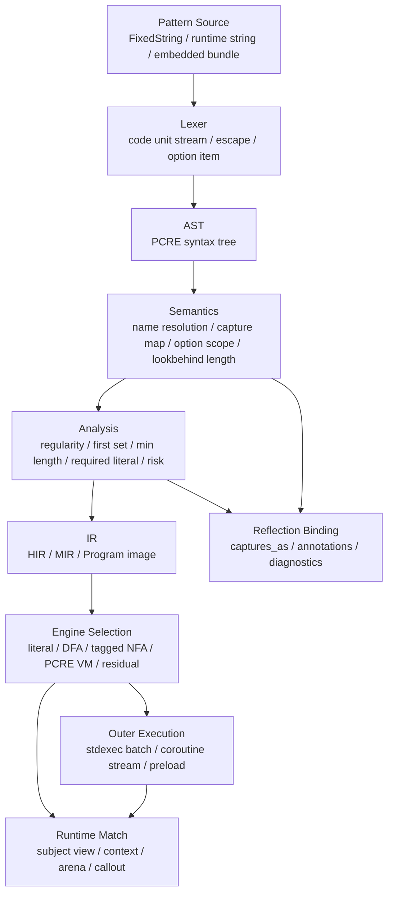
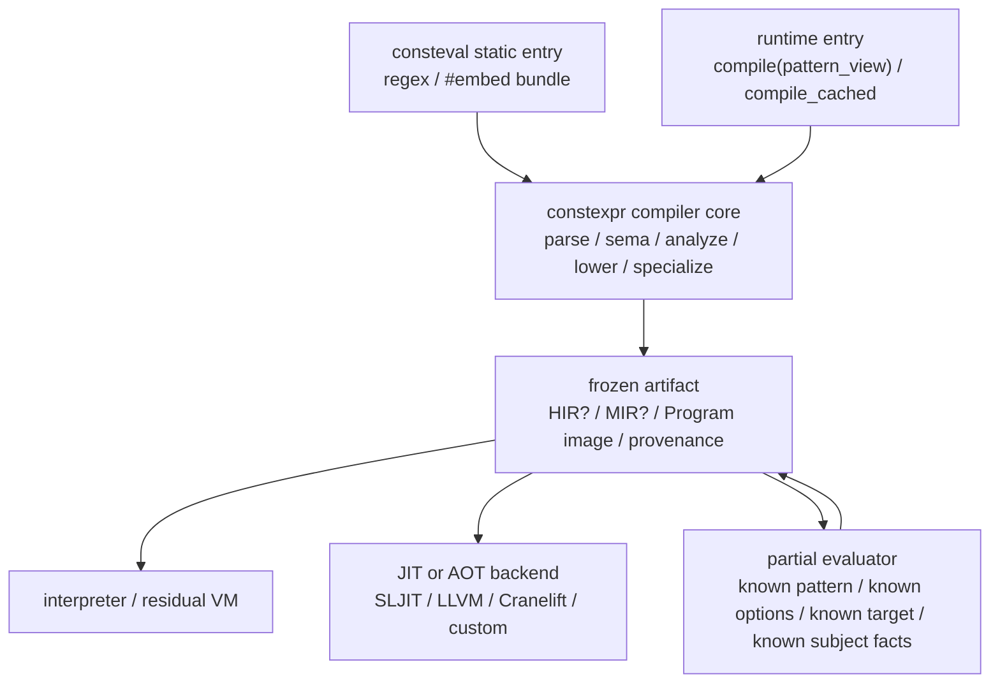

# C++26 编译期 PCRE-Compatible Regex 库架构设计

调研日期：2026-07-07。

本文面向一个暂名为 `Mashiro::Regex` 的 C++26 正则表达式库。目标不是重写一个只覆盖
regular language 的玩具库，也不是把 `std::regex` 包一层模板外壳，而是在 PCRE2 语义边界内
建立一套编译期优先、运行期热路径可预测、可做完整差分验证的正则系统。本文中的 PCRE 默认指
PCRE2。PCRE1 已停止主动维护，新项目应以 PCRE2 10.47 语义为规范目标，同时提供 PCRE1 兼容
开关处理历史差异。

PCRE 的名字包含 regular expression，但完整 PCRE 语言不是正则语言。Backreference、
subroutine recursion、conditional、callout、backtracking control verb 等特性把匹配语义推到
上下文相关甚至用户回调参与的层次。因此本库的核心立场是：能静态化的全部静态化，能自动机化
的全部自动机化，但不得为了性能把 PCRE 的左优先回溯语义替换成 DFA 语义。

## 1. 设计结论

此库的架构命题有十一条。

1. PCRE2 兼容性以 `pcre2_match()` 的 Perl-compatible 深度优先语义为规范目标。`pcre2_dfa_match()`
   是独立 API，不参与默认匹配语义。
2. 编译期正则分为三类：纯正则子集、带捕获但仍可线性化的子集、完整 PCRE 子集。三类走不同
   引擎，API 保持同一抽象。
3. `consteval` 负责编译 pattern、校验语义、生成 IR、选择引擎、构造只读表。运行期只消耗
   subject、start offset、match context、callout state、arena 与 resource limit。
4. `constinit` 只承载已经完成的 program image、Unicode 表、预分析结果与 specialization cache。
   不允许用全局静态构造函数注册 pattern。
5. 编译器本体必须是 `constexpr` 可求值的单源 staged compiler。`consteval` 是强制静态求值的外壳，
   不是另写一份编译器。
6. Runtime compile、runtime JIT、AOT bundle 和偏计算都消费同一套 HIR/MIR/Program image。差异只在
   storage policy、diagnostic carrier、artifact retention 和 backend emission。
7. Reflection 不进入字符匹配热循环。Reflection 用于用户类型绑定、capture schema、annotation
   驱动配置、错误诊断与测试生成。
8. `std::execution` 不进入单次匹配核心。它用于多 subject 批处理、异步流扫描、JIT/AOT 预热、
   外部文件扫描等外层调度。
9. Coroutine 不替代匹配机。它用于 `find_all()`、streaming partial match、substitution pipeline
   等惰性结果流。
10. Unicode 是一等语义层。UTF-8/16/32、UCP、case folding、`\X`、`\R`、`\C`、invalid UTF policy
   都必须显式建模，不得退化为字节匹配。
11. 零技术债的含义是语义和性能分层互不污染：PCRE VM 保证正确性，自动机快路径保证可测性能，
   优化 pass 只能在证明不改变 PCRE 观测行为时启用。

## 2. 规范边界

### 2.1 以 PCRE2 而非 PCRE1 为规范目标

PCRE 官方主页说明：当前版本为 PCRE2，PCRE1 8.45 已停止主动维护，新项目应使用 PCRE2。PCRE2
官方文档把 pattern 语义、matching algorithms、JIT、Unicode、limits、callout、substitution、
serialization 分为独立章节。此结构直接决定本库的模块边界。

规范目标采用如下层次：

| 层次 | 目标 | 说明 |
|---|---|---|
| `compat::pcre2_latest` | PCRE2 10.47 | 默认目标，跟随 PCRE2 当前文档和测试集 |
| `compat::pcre2_strict<Version>` | 指定 PCRE2 版本 | 用于发行版绑定、可复现实验和差分测试 |
| `compat::pcre1_legacy` | PCRE1 历史差异 | 只作为显式兼容模式，不污染默认语义 |
| `compat::perl_delta` | PCRE2 与 Perl 差异报告 | 不承诺完全等价 Perl，只报告已知差异 |

### 2.2 PCRE2 的两种匹配算法必须分离

PCRE2 官方 `pcre2matching` 文档区分两种算法：标准算法对应 `pcre2_match()`，执行与 Perl 相同的
深度优先搜索；替代算法对应 `pcre2_dfa_match()`，执行广度优先搜索，并且不是 Perl-compatible。
这不是实现细节，而是可观测语义差异。

默认 API 只能返回标准算法的第一个匹配。DFA API 可暴露全部候选匹配，但必须使用独立函数名和
独立 result type：

```cpp
auto m0 = rx.search(subject);      // PCRE leftmost-first / depth-first semantics.
auto ms = rx.dfa_search(subject);  // Breadth-first alternatives, explicitly non-default.
```

### 2.3 全特性覆盖的三条硬约束

| 约束 | 结论 |
|---|---|
| Backreference 与 recursion 非正则 | 不得声称所有 pattern 都可 DFA 化 |
| Callout 具有用户可见副作用 | 优化 pass 不得跳过应执行 callout，除非兼容 PCRE2 start optimization 规则 |
| 控制动词改变回溯树 | `(*PRUNE)`、`(*SKIP)`、`(*THEN)`、`(*COMMIT)`、`(*ACCEPT)` 必须进入 VM 语义层 |

PCRE2 自身也承认某些优化会影响 callout 是否执行，并提供 `PCRE2_NO_START_OPTIMIZE` /
`(*NO_START_OPT)` 抑制这类优化。本库必须把这一点建模为 observable optimization policy。

## 3. 总体架构

库分为八层。前五层属于编译期主路径，后三层属于运行期或外部调度边界。



八层职责如下：

| 层 | 代表模块 | 一等对象 | 是否进入热路径 |
|---|---|---|---|
| Source | `Source.h` | `fixed_string`、`pattern_view`、encoding tag | 否 |
| Parser | `Parse.h` | token、AST node、source span | 否 |
| Semantics | `Sema.h` | capture table、option scope、subroutine graph | 否 |
| Analysis | `Analyze.h` | regularity proof、length set、first set、risk report | 否 |
| IR | `IR.h` | HIR、MIR、program image、opcode stream | 部分 |
| Engine | `Engine/*.h` | literal scanner、DFA、tagged NFA、PCRE VM | 是 |
| Unicode | `Unicode/*.h` | property table、case fold table、grapheme table | 是 |
| Binding | `Reflect.h` | capture schema、typed result、annotation policy | 否 |

## 4. 单源 staged compiler

编译期是本库的规范路径，但编译器内核不能写成只允许编译期调用的封闭 `consteval` 代码。正确结构是
`constexpr` compiler core + `consteval` static entry + runtime entry 三层。



核心函数采用阶段参数和存储策略参数，而不是复制两套前端：

```cpp
enum class compile_phase { static_pattern, runtime_pattern, jit_warmup, aot_bundle };
enum class retain_level { program_only, mir_for_jit, hir_for_debug, full_provenance };

template <compile_phase Phase, class Storage, class Diagnostics>
constexpr auto compile_core(pattern_source src, compile_options opt, Storage& st, Diagnostics& diag)
    -> expected<compile_artifact, compile_error>;

template <fixed_string Pattern, compile_options Options = {}>
consteval auto compile_static() {
    consteval_storage st;
    static_diagnostics diag;
    return force_value(compile_core<compile_phase::static_pattern>(Pattern, Options, st, diag));
}

inline auto compile_runtime(pattern_view pattern, compile_context ctx)
    -> expected<compiled_regex, compile_error> {
    arena_storage st{ctx.resource};
    runtime_diagnostics diag{ctx.diagnostics};
    return compile_core<compile_phase::runtime_pattern>(pattern, ctx.options, st, diag);
}
```

此结构有三条约束。

1. `compile_core` 不访问全局 mutable state，不依赖 RTTI，不使用虚派发，不把临时分配逃逸到返回值。
2. `consteval` 入口只负责强制求值、冻结 artifact、把错误提升为编译期诊断。
3. Runtime/JIT 入口只更换 storage、diagnostic 和 retention policy，不重新实现 grammar、sema 或 optimizer。

### 4.1 阶段偏序与偏计算

偏计算不是 JIT 的附属功能，而是编译期架构自然延伸出来的 binding-time analysis。Regex 的静态信息
形成如下偏序：

| 层 | 已知事实 | 可做优化 |
|---|---|---|
| L0 | pattern bytes | parse、capture numbering、语法错误 |
| L1 | compile options、encoding、newline、UCP | character class lowering、Unicode policy |
| L2 | target profile、SIMD width、cache line、backend capability | engine selection、table layout、prefilter |
| L3 | callout set、capture binding type、resource policy | typed capture frame、callback dispatch elimination |
| L4 | subject length、anchoring、known prefix/suffix、batch shape | start guard、length guard、scanner specialization |
| L5 | hot runtime feedback | JIT block ordering、superinstruction selection、cache key refinement |

`regex<Pattern>` 通常至少拥有 L0-L3。Runtime compile 通常拥有 L0-L2。JIT warmup 可在运行期补齐 L3-L5。
偏计算 pass 消费 `compile_artifact` 并产生更专门化的 `compile_artifact`，而不是绕过前端直接生成机器码。

### 4.2 Artifact retention policy

为避免维护两套代码，JIT 和偏计算必须依赖同一套 artifact。差异只在保留多少中间信息：

| retention | 内容 | 用途 |
|---|---|---|
| `program_only` | Program image + minimal metadata | 最小二进制体积、解释执行 |
| `mir_for_jit` | Program image + MIR facts + control-flow graph | 运行时 JIT、superinstruction、block layout |
| `hir_for_debug` | Program image + MIR + HIR source mapping | 诊断、coverage、callout event audit |
| `full_provenance` | AST/HIR/MIR/Program 全量 provenance | differential test、IDE tooling、规范研究 |

静态 pattern 默认 `program_only`，但可通过 policy 请求 `mir_for_jit`，使程序启动后能以最小成本把已编译
Program image 提升为机器码。Runtime compile 默认 `mir_for_jit`，服务端可按内存预算降级。

### 4.3 JIT 是 backend，不是第二编译器

JIT backend 的输入是 `compile_artifact`，不是 pattern string。JIT 只负责三类转换：

1. Program image 到 threaded interpreter superinstruction。
2. MIR control-flow graph 到机器码 basic block。
3. Unicode/class/literal table 到 target-specific readonly data。

JIT 不负责 parsing、capture numbering、lookbehind legality、subroutine graph、option scope、PCRE verb
语义。若 JIT backend 缺少某个 opcode 或 effect，必须回退到同一 artifact 的 VM path。

```cpp
struct jit_backend {
    expected<jit_code, jit_error> emit(compile_artifact const& a, target_profile const& t);
};
```

`jit_error::unsupported_feature` 是正常结果，不是 correctness failure。正确性只由 compiler core 和 VM
共同保证。

### 4.4 Pattern 的绑定时间

| 输入 | 编译阶段 | 运行期对象 | 适用场景 |
|---|---|---|---|
| `regex<R"(...)"_rx>` | 全 consteval | `inline constinit Program` | 源码中固定 pattern |
| `regex_from_embedded<"patterns.bin", Id>` | consteval + `#embed` | `constinit Bundle` | 大量固定 pattern |
| `compile(pattern_view)` | runtime compile | heap 或 arena program | 用户输入 pattern |
| `compile_cached(pattern_view, ctx)` | runtime compile + cache | LRU / persistent cache | 服务端动态 pattern |

静态 pattern 的基本路径如下：

```cpp
template <fixed_string Pattern, regex_options Options = {}>
struct regex {
    static consteval auto build() {
        auto ast = parse<Pattern, Options>();
        auto sem = check_semantics(ast);
        auto ana = analyze(sem);
        return lower_and_select(sem, ana);
    }

    inline static constinit Program program = build();

    constexpr match_result match(subject_view subject, match_context ctx = {}) const;
};
```

`build()` 只能返回可静态存储的值类型。任何 `std::vector`、诊断字符串、临时 AST arena 都必须在
consteval 期间消亡，最终 program 使用 `std::array`、`std::span` 到静态数组、紧凑整数索引和
POD table 表达。

### 4.5 `consteval` block 的使用位置

类作用域 `consteval { ... }` 用于三类场景：

1. 在 `regex<Pattern>` 定义现场立即校验 pattern，失败时报编译期错误。
2. 为 capture schema 生成 `define_aggregate` 结果或等价的反射描述。
3. 为 pattern bundle 生成跨 TU 可复用的 `constinit` program image。

示意结构：

```cpp
template <fixed_string Pattern>
struct regex {
    struct captures;

    consteval {
        auto sem = detail::compile_sema<Pattern>();
        detail::define_capture_aggregate(^^captures, sem.capture_schema);
        detail::verify_resource_bounds(sem);
    }

    inline static constinit auto program = detail::compile_program<Pattern>();
};
```

P3294 token injection 不在 C++26 范围内，因此本库不依赖任意源码注入。需要生成类型时使用
`define_aggregate`。需要选择模板特化时使用 `std::meta::substitute` 或常规模板分发。

### 4.6 编译期诊断

编译期错误不是字符串拼接。诊断对象应保留四个字段：

| 字段 | 内容 |
|---|---|
| `kind` | parse error、semantic error、resource error、unsupported extension |
| `span` | pattern 中的 code unit range |
| `primary` | 主要错误事实 |
| `notes` | 捕获定义位置、引用位置、option scope 等辅助事实 |

静态 pattern 使用 constexpr exception 或 consteval diagnostic 触发编译错误。动态 pattern 返回
`std::expected<compiled_regex, compile_error>`。

## 5. 语义模型

### 5.1 AST 不等于执行 IR

AST 保留用户源码结构，IR 表达执行结构。二者不能合并。

| 结构 | 职责 | 示例 |
|---|---|---|
| AST | 还原 pattern 语法和 source span | `Group(Alternation(...))` |
| HIR | 消除语法糖，保留 PCRE 语义 | named capture 归一到 capture id |
| MIR | 适合优化和引擎选择 | first set、length interval、nullable |
| Program | 可执行 image | opcode、charclass table、jump table |

AST 保留 `(?<name>...)`、`(?P<name>...)`、`(?'name'...)` 等语法差异。HIR 中它们统一为同一
capture declaration，并保留原始 spelling 供诊断使用。

### 5.2 Capture 是 effect，不是附属字段

捕获会改变 backreference、condition、substitution、callout 和 typed binding 的语义，因此 capture
必须作为 effect 建模。

```text
Node : consumes input + emits capture writes + emits control effects + may call user code
```

Capture effect 包括：

1. `open(id, pos)` 与 `close(id, pos)`。
2. duplicate named groups 的 name -> id list 映射。
3. recursion 和 subroutine 调用中的 capture lifetime。
4. branch-reset `(?|...)` 对 capture numbering 的影响。
5. `\K` 对 reported match start 的影响。

### 5.3 Option scope 是词法作用域

PCRE 的 option item 可在 pattern 开头或局部 group 内改变语义。语义层要把 option scope 降为
显式环境：

| option | 影响 |
|---|---|
| `i` | literal、class、backreference 的大小写匹配 |
| `m` | `^`、`$` 的行边界语义 |
| `s` | dot 是否匹配 newline |
| `x` / `xx` | lexer 对空白与注释的处理 |
| `U` | 贪婪默认方向 |
| `J` | duplicate named groups |
| UTF/UCP | code unit 解码、property、word boundary |

Parser 不应在缺乏 option scope 的情况下提前解释所有字符类。正确做法是 lexer 处理最低层转义，
Sema 在已知 option environment 后构造语义 class。

## 6. PCRE2 特性覆盖矩阵

| 特性族 | 示例 | 语义层 | 引擎约束 |
|---|---|---|---|
| literal / quoting | `\Q...\E`、escaped non-alnum | Lexer/HIR | 可进入 literal scanner |
| character class | `[]`、POSIX class、property | Unicode/Class | 可进入 SIMD class scanner |
| anchors | `^`、`$`、`\A`、`\Z`、`\z`、`\G` | Assertion | 需要 subject boundary model |
| newline / BSR | `(*CRLF)`、`\R`、`(*BSR_UNICODE)` | Compile context | 影响 scanner 与 assertion |
| quantifier | greedy、lazy、possessive、bounded | MIR | possessive 可削减回溯 |
| alternation | `a|b` | HIR/MIR | 需要 PCRE branch order |
| capture | numbered、named、duplicate、branch reset | Sema/Effect | tagged NFA 或 VM |
| atomic group | `(?>...)`、possessive | Control | 改变回溯栈 |
| lookaround | lookahead、lookbehind、non-atomic assertion | Assertion | variable lookbehind 需长度界 |
| backreference | `\1`、`\k<name>` | Capture effect | 非正则，进入 VM |
| subroutine | `(?1)`、`(?&name)`、recursive | Call graph | 进入 VM，需 recursion limit |
| conditional | `(?(1)yes|no)`、assertion condition | Control | 依赖 capture/assertion state |
| control verb | `(*PRUNE)`、`(*SKIP)`、`(*THEN)`、`(*COMMIT)` | Backtracking control | VM 原语 |
| mark / accept / fail | `(*MARK:x)`、`(*ACCEPT)`、`(*FAIL)` | Match state | VM 原语 |
| callout | `(?C)`、`(?C42)`、`(?C"str")` | External effect | 优化需保持 PCRE 可观测规则 |
| partial match | soft / hard partial | Match mode | Program 有 mode-specific entry |
| substitution | `$1`、`${name}`、case transform | Replacement IR | 独立 replacement compiler |
| serialization | precompiled code image | ABI image | 需 version / endian / Unicode 版本 |
| invalid UTF | `PCRE2_MATCH_INVALID_UTF` | Input policy | 解码器与 VM 共同处理 |

完整覆盖不意味着所有特性都在最优引擎中运行。完整覆盖意味着每个 pattern 都能被分配到保持语义的
引擎，并且每个优化都有可证明的 preserve-observation 条件。

## 7. IR 设计

### 7.1 HIR

HIR 是语义化正则树。它删除表面语法差异，但保留 PCRE 观测行为。

```cpp
enum class hir_kind : uint16_t {
    empty,
    literal,
    char_class,
    concat,
    alternate,
    repeat,
    capture,
    assertion,
    backref,
    subroutine,
    conditional,
    callout,
    control_verb,
};
```

HIR node 使用紧凑索引引用子节点。静态 pattern 下，所有 node 进入 `std::array<hir_node, N>`。动态
pattern 下，使用 arena vector，但 program image 仍可被压缩成同一 ABI。

### 7.2 MIR

MIR 是优化和引擎选择层。每个 MIR node 伴随 analysis facts：

| fact | 类型 | 用途 |
|---|---|---|
| `nullable` | bool | 判断空匹配和 repeat 风险 |
| `min_len/max_len` | bounded integer / infinity | lookbehind、start optimize、partial |
| `first_set` | charclass summary | 起始扫描 |
| `required_literals` | small vector | fail-fast 与 SIMD search |
| `regularity` | enum + proof | 引擎选择 |
| `capture_effect` | effect summary | tagged NFA 可行性 |
| `control_effect` | bitset | VM 必要性 |
| `callout_effect` | bitset + positions | 优化可观测性 |

### 7.3 Program image

Program image 是最终执行对象。它必须可 `constinit`，可序列化，可 mmap，且与 runtime allocator 解耦。

```cpp
struct program_header {
    uint32_t magic;
    uint16_t abi_version;
    uint16_t code_unit_bits;
    uint32_t unicode_version;
    uint32_t option_bits;
    uint32_t opcode_count;
    uint32_t capture_count;
    uint32_t name_table_offset;
    uint32_t class_table_offset;
};
```

Opcode 使用 SoA 布局而非 AoS 布局：

```text
op_kind[]      : uint16_t
arg0[]         : uint32_t
arg1[]         : uint32_t
next[]         : uint32_t
source_span[]  : uint32_t, only in debug/provenance build
```

SoA 使解释器主循环按 opcode kind 和参数流做连续读取，利于 cache 和分支预测。Debug provenance 可被
裁剪，不进入 release 热路径。

## 8. 引擎选择

### 8.1 引擎族

| 引擎 | 适用 pattern | 时间特性 | 语义限制 |
|---|---|---|---|
| `literal_engine` | 单 literal、literal set、anchored literal | 近似 `memchr/memmem` | 无捕获或 trivial capture |
| `simd_class_engine` | 简单 class scan | 每 code unit 向量化 | 无复杂控制流 |
| `dfa_engine` | 无 capture/backref/callout/control 的纯正则子集 | 线性 | 不保留 PCRE 捕获路径 |
| `tagged_nfa_engine` | 有 capture 但无非正则特性 | 线性或近线性 | 需证明 leftmost-first capture 可恢复 |
| `onepass_engine` | 一义性可证明 pattern | 线性 | 分支选择不能依赖未来回溯 |
| `pcre_vm_engine` | 完整 PCRE2 | 最坏指数，受 limit 控制 | 规范保底 |
| `residual_engine` | 静态 pattern 的专门化 VM | 等价于所选语义 | 由模板实例化生成，不依赖源码注入 |
| `jit_backend` | 已冻结 Program/MIR artifact | 取决于 backend | 不参与语义判定，只做 artifact emission |

默认路径是先证明可降级，再优化。若证明失败，进入 `pcre_vm_engine`。这比“先 DFA 化，失败再补丁”
更符合零技术债原则。

### 8.2 PCRE VM

PCRE VM 是 correctness kernel。它不使用 C++ 递归，而使用显式 frame stack：

```cpp
struct backtrack_frame {
    uint32_t pc;
    uint32_t subject_pos;
    uint32_t capture_snapshot;
    uint32_t verb_state;
};
```

Frame storage 分三层：

1. `std::inplace_vector<backtrack_frame, Small>`：小 pattern 和短 subject 的无堆路径。
2. monotonic arena：正常大匹配。
3. user-provided allocator / memory resource：服务端隔离和资源限制。

Capture snapshot 使用 copy-on-write log，而不是每个 frame 复制完整 ovector。典型 pattern 捕获数不高，
但服务端输入可能构造出大量回溯点，log 结构能显著降低 memory bandwidth。

### 8.3 Residual engine

Residual engine 是编译期偏计算路径。C++26 没有标准 token injection，也没有标准运行期机器码生成，
因此 residual engine 不生成机器码。它把静态 pattern 的 program image 作为非类型模板参数或静态对象
参与模板实例化，使解释器在编译期选择 superinstruction、固定 capture frame 形状、去掉未使用分支。

示例：

```cpp
template <auto& Program>
struct residual_matcher {
    static constexpr auto traits = analyze_program<Program>();

    constexpr match_result operator()(subject_view s, match_context c) const {
        if constexpr (traits.has_no_callout && traits.capture_count <= 4) {
            return detail::small_capture_vm<Program>(s, c);
        } else {
            return detail::generic_vm(Program, s, c);
        }
    }
};
```

这条路径不会引入不标准的 computed goto，也不要求外部代码生成器。它与 runtime JIT 的关系是同源
分叉：residual engine 在 C++ 编译器内做偏计算，JIT backend 在程序运行期对同一 artifact 发射机器码。

### 8.4 JIT 与偏计算共用 artifact

Runtime JIT 的最低维护成本来自一个约束：JIT 不解析 pattern，不重建 capture table，不重新做 option
scope，也不重新实现 PCRE verb。JIT 只读取 `compile_artifact`。

```text
pattern
  -> constexpr compiler core
  -> compile_artifact { Program image, MIR facts, provenance policy }
       -> PCRE VM
       -> residual_engine<artifact>
       -> jit_backend.emit(artifact, target_profile)
```

偏计算 pass 与 JIT pass 共享同一组 IR rewrite：

| pass | 编译期 residual | runtime JIT |
|---|---|---|
| opcode superinstruction | 模板分支裁剪 | basic-block fusion |
| capture frame specialization | 固定 `capture_count` 与 storage shape | stack frame / register allocation |
| literal prefilter lowering | 生成静态 scanner 类型 | 发射 target-specific scanner |
| Unicode table specialization | 选择 ASCII/UCP table view | 固化 table pointer 与 fast path |
| option/callout specialization | 去掉未使用 effect branch | 直接绑定 callback thunk |

因此 `RegexJit` 是 emission backend，不是第二编译器。JIT backend 缺失能力时，artifact 保持可解释；
JIT 生成的代码错误时，差分测试可把同一 artifact 分别喂给 VM 与 JIT，对比 match result、capture、
mark、callout event 序列。

## 9. Unicode 与字符模型

### 9.1 Code unit、code point、grapheme 三层分离

| 层 | 对象 | 例子 |
|---|---|---|
| code unit | `char8_t`、`char16_t`、`char32_t`、byte | `\C`、offset、ovector |
| code point | Unicode scalar value | `.` in UTF mode、property |
| grapheme cluster | extended grapheme cluster | `\X` |

PCRE2 在非 UTF 模式下默认按 code unit 处理；UTF 模式下 quantifier 和 dot 作用于完整 UTF 字符；
`\C` 仍按单 code unit 匹配，并可能破坏多 code unit 字符。此差异必须进入类型层。

```cpp
template <class CU>
concept CodeUnit = same_as<CU, char8_t> || same_as<CU, char16_t> || same_as<CU, char32_t> ||
                   same_as<CU, std::byte>;
```

### 9.2 Unicode 表

Unicode 表来源不应在运行期解析文本文件。推荐路径：

1. 构建期下载或固定 Unicode Character Database。
2. 生成压缩二进制表。
3. 用 `#embed` 嵌入表数据。
4. consteval 校验版本、表头、CRC、property 索引一致性。
5. 运行期以只读 table view 查询。

UCP 对 `\b`、`\d`、`\s`、`\w`、POSIX class 的语义和性能都有影响。默认 ASCII-fast path 必须保留，
UCP 仅在 option 或 pattern item 显式要求时启用。

### 9.3 Case folding

Case-insensitive matching 分三类：

| 模式 | 路径 |
|---|---|
| ASCII literal | 直接表 lookup 或 bit trick |
| UTF/UCP simple case | Unicode simple fold table |
| 特殊多等价类 | sigma、Kelvin sign、long s 等特殊表 |

PCRE2 的 case 等价不是完整 locale-sensitive 转换。Substitution 中的 `\U` / `\L` case transform 是
另一套用户可见转换，允许通过 substitute case callout 替换。两者必须分离。

## 10. 优化体系

### 10.1 优化 pass 的分类

| pass | 条件 | 语义影响 |
|---|---|---|
| literal prefix | 不跨 callout / verb 观测点 | fail-fast |
| required literal | 不跨 `(*SKIP)`、`(*PRUNE)` 的可见语义 | fail-fast |
| min length | 始终安全，但 callout policy 可要求禁用 start optimize | fail-fast |
| auto possessification | 证明后继 first set 不相交 | 削减回溯 |
| branch trie factoring | 不改变 branch order 与 capture numbering | 减少比较 |
| class bitmap compression | 等价表示转换 | 降低 cache footprint |
| bounded repeat lowering | 不复制巨大子树，使用 counted loop | 降低 program size |
| one-pass detection | 分支一义性证明 | 选择线性引擎 |

PCRE2 `pcre2perform` 文档指出，bounded quantified group 在 PCRE2 解释码中可能被展开，导致大 pattern
占用异常内存。本库不应机械复制这种内部表示。语义层仍等价于 PCRE2，IR 层应使用 counted repeat
和独立 backtrack point 表达，避免编译产物膨胀。

### 10.2 Catastrophic backtracking 风险报告

完整 PCRE 必须允许用户写出指数级 pattern。库不能静默改语义，但可以在编译期报告风险：

| 风险 | 检测 |
|---|---|
| nested nullable repeat | repeat body nullable 且外层可重复 |
| ambiguous nested repeat | 内外 first set 重叠且后继无 fail-fast literal |
| backreference over wide capture | capture length unbounded |
| recursive subroutine without progress | recursion cycle 的 min consumed length 为 0 |
| callout-heavy loop | loop body 包含 callout |

静态 pattern 默认产生 warning-level diagnostic，可由 policy 提升为 error。动态 pattern 返回
`analysis_report`，由调用方决定处理策略。

### 10.3 SIMD 与 cache

热路径优化以访存为第一变量：

1. 起始扫描使用 `std::simd` 扫描首字符、首字符集合或 required literal 的首 code unit。
2. ASCII class 使用 256-bit bitmap。UTF property 使用多级表，尽量把 ASCII fast path 独立出来。
3. Opcode stream 使用 SoA。VM frame 使用紧凑索引，避免 pointer chasing。
4. Capture log 使用连续 arena。ovector 仅在匹配成功或 callout 需要时物化。
5. 多 pattern 搜索可选择 Aho-Corasick 或 Teddy-style literal prefilter，但 prefilter 只作为 fail-fast，
   不能改变 PCRE 匹配顺序。

## 11. Reflection 与 annotation 的职责

### 11.1 Typed capture binding

Reflection 最自然的用法是把 capture group 映射到用户结构体。

```cpp
struct date_record {
    [[=rx::capture<"year">]]  int year;
    [[=rx::capture<"month">]] int month;
    [[=rx::capture<"day">]]   int day;
};

static constexpr rx::regex<R"((?<year>\d{4})-(?<month>\d{2})-(?<day>\d{2}))"> date_rx;

auto rec = date_rx.match("2026-07-07"sv).and_then(rx::captures_as<date_record>);
```

`captures_as<T>` 的 consteval verifier 检查：

1. 每个 annotation 引用的 capture name 存在。
2. duplicate name 必须显式选择策略：first、last、all、error。
3. 目标字段类型存在 `rx::from_capture<T>` 转换。
4. optional 字段对应可缺失 capture；非 optional 字段必须在所有成功路径上定义。

### 11.2 Pattern annotation

当 regex 作为结构字段的约束时，可用 annotation 直接绑定：

```cpp
struct route {
    [[=rx::pattern<R"(^/user/(?<id>\d+)$)">]]
    std::string path;
};
```

这种 annotation 不负责运行期验证本身，而负责生成 schema、文档、测试样本和编译期约束描述。运行期
是否自动验证由上层 serialization 或 routing framework 决定。

### 11.3 Reflection 不承担 parser 职责

Pattern 文本是 DSL，不是 C++ 语法结构。Reflection 不能替代 PCRE parser。正确分工是：

| 工具 | 职责 |
|---|---|
| Parser | 理解 PCRE DSL |
| Reflection | 理解 C++ 用户类型、annotation、字段布局 |
| `define_aggregate` | 生成 capture result type 或 schema proxy |
| `template for` | 展开静态 capture field、opcode specialization、table build |

## 12. Concepts 与 public API

### 12.1 核心 concepts

```cpp
template <class S>
concept SubjectView =
    ranges::contiguous_range<S> && CodeUnit<remove_cvref_t<ranges::range_value_t<S>>>;

template <class E>
concept RegexEngine =
    requires(E e, subject_view s, match_context c) {
        { e.match(s, c) } -> same_as<match_result>;
    };

template <class C>
concept Callout =
    requires(C c, callout_context ctx) {
        { c(ctx) } -> same_as<callout_action>;
    };
```

Concept 只表达真实依赖，不用 trait 偏特化堆叠。类型选择通过 consteval function 返回
`std::type_identity`。

### 12.2 API surface

```cpp
namespace Mashiro::Regex {

template <fixed_string Pattern, regex_options Options = {}>
class regex;

expected<compiled_regex, compile_error>
compile(pattern_view pattern, compile_context ctx = {});

match_result search(compiled_regex const& re, subject_view subject, match_context ctx = {});

generator<match_result> find_all(compiled_regex const& re, subject_view subject, match_context ctx = {});

expected<std::string, substitute_error>
substitute(compiled_regex const& re, subject_view subject, replacement_view replacement, substitute_context ctx = {});

}
```

静态与动态 API 共享 result model。差异只在 compile error 的出现阶段：静态 pattern 编译失败，动态
pattern 返回 `expected`。

### 12.3 Result model

`match_result` 保存三类信息：

1. reported match range：受 `\K`、partial、start offset 影响。
2. capture ovector：PCRE-compatible offset 对。
3. marks/callout side data：`(*MARK)`、callout 可见状态。

Ovector 使用 code unit offset，而不是 code point offset。Typed binding 可在 UTF 模式下提供额外的
code point view，但 PCRE 兼容层必须保持 code unit offset。

## 13. `std::execution` 与 coroutine 边界

### 13.1 批处理与异步预热

`std::execution` 的合理使用点有四个：

1. 对大量 subject 并行运行同一已编译 regex。
2. 对 pattern bundle 做后台 compile/JIT/preload。
3. 对日志文件、网络分片、GPU buffer 做分块扫描。
4. 对 persistent cache 做异步加载和淘汰。

示意 API：

```cpp
auto sender = rx::bulk_search(pool.scheduler(), date_rx, subject_batch)
            | std::execution::then([](rx::batch_result r) {
                  return summarize(r);
              });
```

单次 `match()` 不暴露 sender。若用户要一个字符串匹配结果，同步函数最直接，且没有调度开销。

### 13.2 Coroutine result stream

`find_all()` 可用 `std::generator<match_result>` 或库内 generator 表达。Streaming subject 需要 partial
match 状态机：

```cpp
rx::stream_matcher m{date_rx};
for co_await (auto chunk : input_stream) {
    for (auto match : m.feed(chunk)) {
        co_yield match;
    }
}
```

Coroutine 只管理输入输出流和背压，不改变匹配机状态表示。匹配机内部仍是显式 state + arena。

## 14. Callout、substitution 与外部 effect

### 14.1 Callout

Callout 是 PCRE 语义中的外部 effect。接口应同时支持静态 callout map 和动态 callback：

```cpp
struct my_callouts {
    static callout_action on_42(callout_context&);
    static callout_action on_name(fixed_string<"check">, callout_context&);
};

using re = rx::regex<R"(a(?C42)b(?C"check")c)", rx::with_callouts<my_callouts>>;
```

动态 pattern 使用 `std::function_ref<callout_action(callout_context&)>`，不默认持有 `std::function`。若调用方
需要拥有 callback，可在 match context 中显式提供 owning wrapper。

### 14.2 Substitution

Substitution 不是简单 replace。Replacement string 有独立语法、capture 引用、case transform、global
policy、substitute callout 与 buffer overflow length 计算。因此 substitution 应有独立编译器：

```text
replacement string -> replacement AST -> replacement program -> apply(match_result)
```

静态 replacement 同样可 consteval 编译。动态 replacement 返回 `expected<replacement_program, error>`。

## 15. Resource limit 与安全性

完整 PCRE 需要显式资源模型。默认无限制在服务端是不合格设计。

| limit | 对应风险 | 默认策略 |
|---|---|---|
| `match_steps` | catastrophic backtracking | 高默认值，可配置 |
| `heap_bytes` | frame/capture arena 膨胀 | match context 限制 |
| `recursion_depth` | subroutine recursion | compile + runtime 双限制 |
| `capture_count` | ovector 和 frame 膨胀 | compile context 限制 |
| `pattern_size` | 动态 pattern 滥用 | compile context 限制 |
| `lookbehind_max` | variable lookbehind 成本 | compile context 限制 |

公共 API 使用 contracts 表达不可恢复的前置条件，例如 subject view 的连续性、program ABI 版本匹配。
可恢复错误使用 `std::expected` 或 `match_error` 返回。

## 16. Serialization 与 ABI

Program image 必须可序列化，但不能把 C++ 指针写入序列化数据。序列化 header 包含：

```text
magic
abi_version
code_unit_bits
endianness
unicode_version
pcre_compat_version
option_bits
table_offsets
crc
```

反序列化后可选择：

1. 直接 mmap 只读 program image。
2. 复制到 aligned arena。
3. 触发 backend-specific residual/JIT cache。

PCRE2 官方 serialization 文档指出，serialized data 是二进制数据，并且可能因 code unit size、版本、
endianness 不匹配而失败。本库应采用同样的显式失败模型。

## 17. 测试与验证

### 17.1 差分测试

PCRE-compatible 声明必须由差分测试支撑：

| 测试 | Oracle |
|---|---|
| 官方 pattern 行为 | PCRE2 `pcre2test` corpus |
| 随机 pattern | PCRE2 native API |
| Unicode property | Unicode UCD + PCRE2 |
| substitution | PCRE2 `pcre2_substitute()` |
| callout | 自定义 callback 事件序列 |
| serialization | encode/decode roundtrip + ABI mismatch |
| limits | PCRE2 limit 行为与本库 limit 行为对照 |

静态 pattern 还需要 compile-fail 测试。每个错误样例应检查错误位置和错误类别。

### 17.2 Metamorphic tests

可用如下等价变换构造补充测试：

1. `a++` 与 `(?>a+)` 在无 capture 观测时等价。
2. `(?:a|b)` 与 `[ab]` 在 ASCII literal 下等价。
3. 明确 anchor 与 start optimize 的结果等价，但 callout 事件可能不等价。
4. UTF mode 下 code unit offset 与 decoded code point view 的映射一致。
5. `find_all()` 与重复 `search(start = previous_end)` 在 zero-length match 规则下等价。

### 17.3 性能基准

性能基准至少分七类：

| 类别 | 指标 |
|---|---|
| literal search | throughput、startup latency |
| ASCII class | SIMD width、branch miss |
| UTF/UCP | property lookup cost |
| capture-heavy | ovector materialization cost |
| backtracking-heavy | limit behavior、arena allocation |
| substitution | output allocation、case transform |
| batch search | scheduler overhead、scaling |

每条性能结果记录 compiler、flags、CPU、Unicode 版本、pattern hash、engine kind、input distribution。
不允许写无条件“比 PCRE2 快”。所有性能声明必须绑定 workload。

## 18. 文件布局建议

```text
Mashiro/include/Mashiro/Regex/
  Regex.h
  Source.h
  Options.h
  Error.h
  Parse.h
  Sema.h
  Analyze.h
  IR.h
  Program.h
  Match.h
  Substitute.h
  Reflect.h
  Unicode/
    Tables.h
    Decode.h
    Property.h
    CaseFold.h
  Engine/
    Literal.h
    Dfa.h
    TaggedNfa.h
    PcreVm.h
    Residual.h
  Execution/
    Batch.h
    Stream.h

Mashiro/src/Regex/
  Compile.cpp
  RuntimeCompile.cpp
  UnicodeTables.cpp
  Serialize.cpp

Mashiro/tests/Regex/
  RegexCompileFail/
  RegexDifferentialTest.cpp
  RegexUnicodeTest.cpp
  RegexSubstituteTest.cpp
  RegexCalloutTest.cpp
  RegexBenchmark.cpp
```

Parser、sema、analysis 与 lowering 构成的 compiler core 以 header-only 为主。Runtime compile、
serialization、大型 Unicode table 可放入
`.cpp`，避免每个 TU 承担完整表和动态编译器成本。

## 19. 实施路线

### M0：规范夹具与最小 PCRE VM

目标：建立单源 `constexpr` compiler core 与 correctness kernel，而不是先写快路径。

交付：

1. PCRE2 官方测试语料接入。
2. AST/HIR/MIR 基础结构与 frozen `compile_artifact`。
3. `compile_core<Phase, Storage, Diagnostics>`，同时支持 consteval storage 与 runtime arena storage。
4. 最小 PCRE VM：literal、class、concat、alt、repeat、capture、backref、lookaround。
5. 动态 compile API 只是 `compile_core` 的 runtime wrapper。
6. 差分测试跑通第一批 pattern。

### M1：完整 PCRE2 语义面

目标：覆盖语义难点。

交付：

1. named capture、duplicate name、branch reset。
2. subroutine、recursion、conditional。
3. control verb、mark、accept/fail。
4. callout 与 callout enumeration。
5. partial matching。
6. resource limit。

### M2：Unicode 与 substitution

目标：补齐文本语义。

交付：

1. UTF-8/16/32 decoder。
2. UCP property table、case folding、`\X`、`\R`。
3. invalid UTF policy。
4. replacement compiler。
5. substitute callout 与 case callout。

### M3：编译期 static regex

目标：让源码固定 pattern 通过同一 `compile_core` 全部 consteval。

交付：

1. `regex<fixed_string>`。
2. `consteval` static entry wrapper。
3. `constinit Program`。
4. compile-fail tests。
5. typed capture binding。

### M4：快路径引擎

目标：在证明安全的 pattern 上取得线性或近线性性能。

交付：

1. literal / SIMD class engine。
2. regularity proof 与 DFA engine。
3. tagged NFA / one-pass engine。
4. auto possessification。
5. required literal prefilter。

### M5：serialization、bundle 与 batch execution

目标：面向真实工程部署。

交付：

1. program serialization。
2. `#embed` pattern bundle。
3. persistent cache。
4. `std::execution` batch search。
5. coroutine streaming API。

### M6：可选 JIT/AOT 后端

目标：把机器码生成和偏计算作为 `compile_artifact` 的可替换 emission path，而不是核心语义依赖。

交付：

1. backend ABI。
2. SLJIT/LLVM/Cranelift 实验后端之一。
3. partial evaluator：known target、known callout set、known subject facts 的 specialization。
4. JIT fallback 与 feature unsupported matrix。
5. benchmark provenance。

## 20. 技术债禁令

1. 不得把 DFA 结果作为默认 PCRE match 结果。
2. 不得用 `std::regex` 作为 fallback。
3. 不得把 PCRE parser 写成 ad hoc 字符串扫描后到处补丁。
4. 不得用全局 locale 或全局 mutable Unicode state。
5. 不得用静态构造函数注册 pattern 或 Unicode 表。
6. 不得把 callout 当成 debug hook；它是语义 effect。
7. 不得把 capture offset 从 code unit 改为 code point。
8. 不得用宏表达 pattern metadata；宏只能用于 toolchain feature fallback。
9. 不得在热路径使用 owning `std::function`。
10. 不得把 JIT 作为 correctness 依赖；JIT 失败必须回退到等价解释路径。
11. 不得无界展开 bounded repeat 导致 program image 爆炸。
12. 不得为 runtime compile、JIT 或 AOT 维护第二套 parser/sema/analyzer/lowerer。
13. 不得让 JIT backend 直接消费 pattern string；JIT 的唯一输入是 `compile_artifact`。
14. 不得发布无 workload 约束的性能结论。

## 21. 风险与对策

| 风险 | 影响 | 对策 |
|---|---|---|
| PCRE2 语义边角过多 | 兼容性声明失真 | 官方测试 + 差分 fuzzing + 版本化 compat policy |
| consteval 编译时间膨胀 | 开发体验下降 | pattern budget、bundle 预编译、dynamic compile fallback |
| Unicode 表体积大 | binary size 增大 | `#embed` 压缩表、按 feature 裁剪、ASCII fast path |
| 回溯最坏指数 | 服务端风险 | resource limit、risk diagnostic、possessive rewrite 建议 |
| Callout 阻断优化 | 快路径覆盖下降 | effect-aware optimizer、可见性 policy |
| JIT 平台差异 | 部署复杂 | JIT 后端可选，Program image 与解释器为规范路径 |
| 单源 compiler core 过度抽象 | 编译期和运行期都变慢 | 阶段参数限于 storage、diagnostic、retention、backend，不把热路径虚化 |
| C++26 reflection 实现变化 | 工具链适配成本 | `MetaAdapter` 隔离底层反射 API |
| 动态 pattern cache 污染 | 内存不可控 | capacity、TTL、pattern hash、tenant-aware cache |

## 22. 首个实现切口

首个实现切口应是 M0 + M1 的 correctness kernel，而不是 SIMD 或 JIT。理由是：若没有完整 PCRE VM，
所有快路径都缺少 oracle；若没有官方测试差分，任何“支持 PCRE 所有特性”的声明都只是纸面承诺。

建议按如下顺序启动：

1. 拉取 PCRE2 测试语料并建立差分 harness。
2. 实现 AST/HIR/MIR、错误 span 与 frozen `compile_artifact`。
3. 实现单源 `compile_core`，动态 compile 只是 runtime wrapper。
4. 覆盖 capture/backreference/lookaround/verb/callout。
5. 把同一 pipeline 提升到 `regex<fixed_string>` 的 consteval 路径。
6. 建立 artifact retention policy，为 JIT 和偏计算保留 MIR facts。
7. 最后做 regularity proof、快路径引擎、JIT backend 和 partial evaluator。

这个顺序保留正确性单调性：每个优化都可回退到 PCRE VM，每个静态编译失败都可由动态编译器复现，
每个性能改动都可被差分测试约束。

## 23. 参考资料

1. PCRE official site: <https://www.pcre.org/>
2. PCRE2 documentation index: <https://www.pcre.org/current/doc/html/>
3. PCRE2 pattern syntax and semantics: <https://pcre.org/current/doc/html/pcre2pattern.html>
4. PCRE2 syntax summary: <https://www.pcre.org/current/doc/html/pcre2syntax.html>
5. PCRE2 matching algorithms: <https://www.pcre.org/current/doc/html/pcre2matching.html>
6. PCRE2 JIT: <https://www.pcre.org/current/doc/html/pcre2jit.html>
7. PCRE2 performance notes: <https://www.pcre.org/current/doc/html/pcre2perform.html>
8. PCRE2 limits: <https://www.pcre.org/current/doc/html/pcre2limits.html>
9. PCRE2 Unicode and UTF support: <https://www.pcre.org/current/doc/html/pcre2unicode.html>
10. PCRE2 callout: <https://www.pcre.org/current/doc/html/pcre2callout.html>
11. PCRE2 native API and substitution: <https://www.pcre.org/current/doc/html/pcre2api.html>
12. PCRE2 serialization: <https://www.pcre.org/current/doc/html/pcre2serialize.html>
13. WG21 P2996R13, Reflection for C++26: <https://www.open-std.org/jtc1/sc22/wg21/docs/papers/2025/p2996r13.html>
14. WG21 P3289, consteval blocks: <https://wg21.link/P3289>
15. WG21 P3394, Annotations for Reflection: <https://wg21.link/P3394>
16. WG21 P2300R10, `std::execution`: <https://wg21.link/P2300>
17. WG21 P3687, final adjustments to C++26 reflection: <https://wg21.link/P3687>
