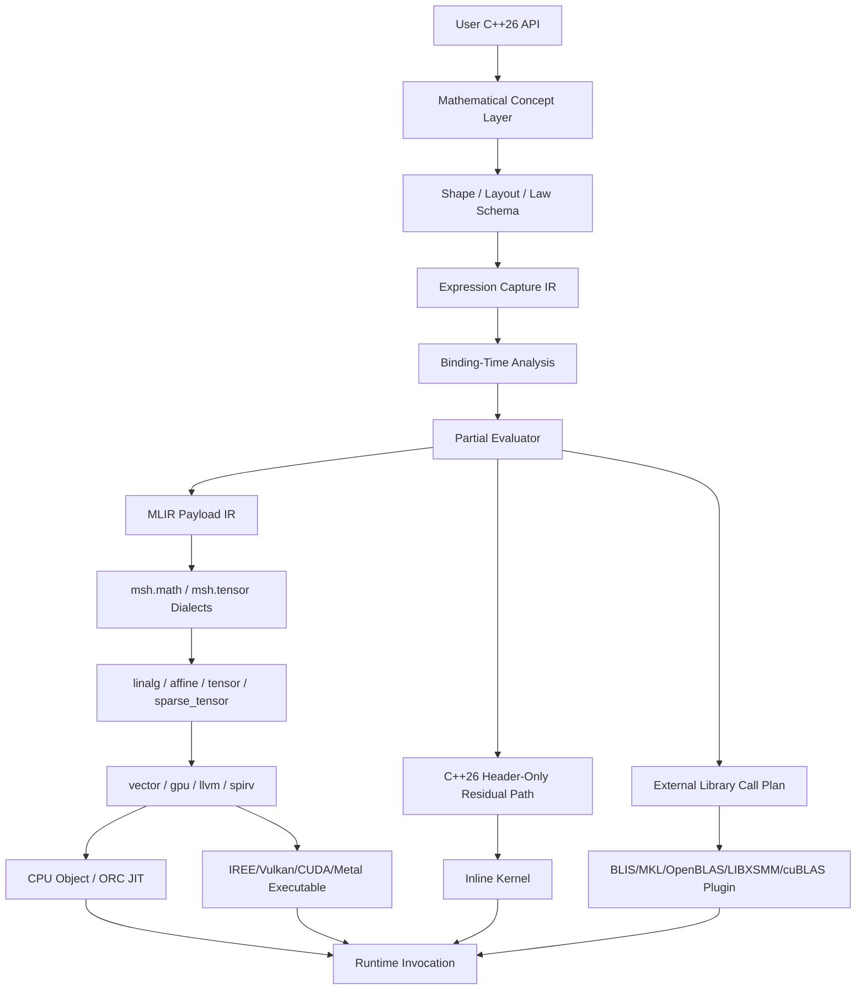
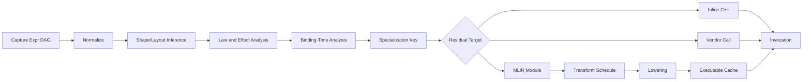

# MLIR、偏计算与 C++26 高性能数学计算库架构设计

调研日期：2026-06-30。

本文面向 `Mashiro::Math` 的下一代数学计算层。目标不是把 Eigen 重新写一遍，而是建立一个由数学概念、
C++26 编译期推导、偏计算、MLIR 渐进式 lowering、后端特化和可验证性能工程共同支撑的计算系统。若
把“超越 Eigen”理解为所有尺寸、所有算法、所有平台都严格胜出，这个目标不成立。可成立的目标是：
在固定小维度、表达式融合、大张量收缩、稀疏张量、GPU/Vulkan 后端、可微计算、领域结构特化这些
Eigen 非核心强项上取得可测优势，同时在常规 dense linear algebra 上至少不劣化到不可接受范围。

当前仓库已经具备若干前置条件：`Mashiro::Math::Vec` 和 `Mat` 使用 C++26 `template for` 写固定维度
运算，`Algebra.h` 已按数学结构建 concept 层，`SOA.h` 已尝试用 P2996 reflection 生成 SoA 布局，
`EigenOracleTest.cpp` 以 Eigen 作为数值 oracle。下一步不应退回“模板表达式树 + 少量 SIMD intrinsic”
的旧路线，而应把数学语义、数据布局、调度策略、后端 lowering 和验证系统分离成五个可组合层。

## 1. 结论先行

此架构的核心命题有七条。

1. 数学对象不是 C++ 类模板的别名，而是携带代数律、形状、布局、误差模型、可微性和执行策略的
   typed computation object。
2. C++26 的 `consteval`、static reflection、annotations、`template for`、contracts、`std::simd`
   负责在翻译阶段完成可静态决定的结构推导；运行时只保留数据指针、动态 extent、真实数值和设备
   选择。
3. 偏计算负责把“通用数学程序 + 静态上下文”特化为 residual kernel。residual kernel 可以是内联
   C++ 模板代码、MLIR module、AOT object、JIT 函数、IREE executable 或 vendor library call。
4. MLIR 不应进入每个小表达式的热路径。小维度 `vec2/3/4`、`mat2/3/4`、图形 affine 变换继续走
   C++26 header-only path；中大规模 tensor、GPU、稀疏、自动微分、可调度 kernel 才进入 MLIR path。
5. 性能超越来自“全程序视野”：跨表达式融合、跨 layout 优化、跨设备 lowering、跨 batch 调度、
   跨 AD primal/adjoint 联合优化。Eigen 的 expression templates 主要在单个赋值表达式内部工作。
6. 数值正确性必须成为类型系统的一部分。浮点数不满足实数域的结合律；任何重排、融合、fast-math、
   contraction、reassociation 都必须由显式 policy 或 error model 授权。
7. 零技术债的含义不是写最大系统，而是每个层次都保留清晰语义边界：数学层不依赖 MLIR，IR 层不依赖
   Vulkan，调度层不依赖具体 tensor 类型，后端层不反向污染用户 API。

## 2. 前沿项目和研究脉络

### 2.1 MLIR：多层 IR 与 dialect 生态

MLIR 的关键价值是允许多个抽象层共存，并通过 dialect 定义领域操作、类型和属性。官方 dialect 列表
包含 `affine`、`linalg`、`memref`、`tensor`、`vector`、`gpu`、`sparse_tensor`、`llvm` 和
`transform` 等核心组件。此结构说明 MLIR 不是一个单一 IR，而是一个 IR 族与转换基础设施。

对数学库最直接相关的是五个 dialect。

| Dialect | 对数学库的意义 | 设计启发 |
|---|---|---|
| `linalg` | 表达 structured tensor computation、matmul、conv、generic indexing maps | 数学表达式应先落到结构化算子，而不是立即降到 loop |
| `affine` | 表达 affine loop、affine map、polyhedral-friendly 分析边界 | 静态 shape 和 layout 应转化为 affine map，供 loop 变换使用 |
| `vector` | 表达 n-D vector、transfer read/write、mask、contract、outerproduct | SIMD 不是 intrinsic 层问题，而是 vector IR 到目标指令的 lowering 问题 |
| `sparse_tensor` | 把 sparse encoding 作为 IR 类型属性，并自动生成稀疏迭代结构 | 稀疏性应是数学对象属性，不应泄漏为用户手写 CSR 循环 |
| `transform` | 用独立 transform IR 控制 payload IR 的 tiling、fusion、vectorization | schedule 应是可组合程序，不是 pass pipeline 字符串 |

MLIR `linalg.generic` 的重要语义是：operand 定义 iteration space，indexing maps 定义 loop 与数据的
可逆映射，iterator types 显式声明 parallel/reduction 等结构，payload 用 region 表达。这与数学库
中的 tensor contraction 完全同构：爱因斯坦求和给出 index space，输入输出张量给出访问映射，重复
指标给出 reduction，元素计算 region 给出 scalar algebra。

### 2.2 IREE：从 MLIR 到可部署运行时

IREE 是基于 MLIR 的端到端 compiler/runtime。官方文档强调其同时编译 scheduling logic 和 execution
logic，并能面向 CPU、Vulkan、ROCm/HIP、CUDA、Metal、WebGPU、bare metal 等目标。对本项目最有价值的
不是“机器学习模型部署”本身，而是如下工程结构：

1. 高层模型经 MLIR 降到统一 IR。
2. 编译产物同时包含计算 kernel 和调度逻辑。
3. 设备 API 后端（如 Vulkan）被纳入 compiler/runtime 边界。
4. AOT 与运行时调用接口分离。

这与 Vulkan 仓库的长期方向一致：数学库不应把 GPU path 视为手写 shader 的旁路，而应让可编译数学
表达式 lowering 到 Vulkan/IREE-like runtime。若未来需要在 Vulkan compute 中运行张量表达式，IREE
比手写每个 compute shader 更符合零技术债原则。

### 2.3 StableHLO 与 OpenXLA：稳定算子集和互操作边界

StableHLO 是高层 ML operation set，用作 ML framework 与 ML compiler 之间的 portability layer。
它强调 fully specified ops、兼容性保证、reference interpreter、dynamic/quantized program 测试、
到 linalg/tosa 等上游 MLIR dialect 的转换。这给通用数学库两个启发：

1. 若表达式要跨框架、跨进程、跨版本持久化，必须定义稳定 IR 或 schema，而不能直接序列化 C++ 模板
   实例名。
2. reference interpreter 和 gold result suite 是 IR 生态的必要组成部分。没有解释器和兼容性测试的
   IR 只是内部优化细节，不能成为公共 ABI。

本项目可以借鉴 StableHLO 的稳定性策略，但不应直接把一般数学概念硬塞进 StableHLO。StableHLO 适合
ML tensor operator 互操作；本库还需要几何、李群、稀疏线性代数、物理单位、有限域或自定义 semiring。

### 2.4 Halide：算法与 schedule 分离

Halide 的核心思想是算法定义不包含 storage/order，schedule 单独指定 tiling、vectorization、parallel、
compute_at 等计算组织方式。官方示例中，box filter 算法和 schedule 明确分离：算法描述 `blur_x`、
`blur_y`，schedule 再定义 tile、vectorize、parallel、compute_at。

数学库应继承此思想：用户表达 `C = A * B + D` 或 `einsum("ij,jk->ik", A, B)` 时，只表达数学语义。
tile size、pack format、SIMD width、GPU block shape、shared memory staging、fusion boundary 均属于
schedule。把 schedule 塞进数据类型，例如 `Matrix<Blocked<16, 8>>`，会把执行策略污染为数学对象身份。
正确做法是：layout 是数据表示属性，schedule 是计算组织属性，二者可互相约束但不能混为一体。

### 2.5 TVM：TensorIR、MetaSchedule 与 BYOC

TVM 文档把系统拆为 Relax、TensorIR、Target、Runtime、Pass Infrastructure、MetaSchedule、BYOC 等层。
TensorIR 负责 tensor program abstraction，MetaSchedule 负责 search-based auto-tuning，BYOC 允许外部
codegen 参与。对本库而言，TVM 的经验可归纳为三点。

1. 高性能 tensor 系统需要显式 tensor program IR，而不是仅靠 C++ optimizer。
2. schedule search 需要数据库、目标描述、测量协议和重放能力。
3. 外部库调用是后端策略之一，而不是与编译器路线冲突的例外。

因此本库不应在“自己生成所有 kernel”和“调用 BLAS/oneDNN/cuBLAS”之间二选一。正确结构是多后端选择：
小 kernel 内联生成，中大 GEMM 可调用 vendor/BLIS path，融合表达式或自定义 contraction 走 MLIR/TVM-like
路径，稀疏与图结构走 sparse compiler path。

### 2.6 Enzyme：优化后自动微分

Enzyme 在 LLVM IR 层对已有代码自动求导，并把 AD 与 LLVM 优化流水线结合。官方说明强调：它可以处理
C、C++、Swift、Julia、Rust、Fortran、TensorFlow 等来源的 LLVM IR；通过在优化后求导，生成的 derivative
可明显快于先在源层求导再优化的方案。

这给数学库的 AD 设计划出边界：不要只做模板级 dual number。dual number 适合小表达式和 forward-mode，
但 reverse-mode、GPU kernel、稀疏 kernel、loop-level adjoint 需要 IR 级 AD。理想系统应有三条 AD path。

| AD path | 适用场景 | 实现位置 |
|---|---|---|
| 编译期 symbolic/forward AD | 固定小表达式、低维参数、图形/几何函数 | C++26 constexpr expression IR |
| MLIR-level AD | tensor program、linalg op、fusion kernel | 自定义 `msh.diff` 或外接 Enzyme/MLIR AD |
| LLVM/Enzyme AD | 已 lowered 的 CPU/GPU kernel、第三方代码 | LLVM pass 或 Enzyme integration |

### 2.7 Sparse compiler、TACO 与 MLIR sparse tensor

MLIR `sparse_tensor` 文档明确把 sparsity 视为 tensor 类型属性，并引用 TACO 的 sparse iteration theory。
其 lowering 不是把 CSR/COO 当作用户容器循环，而是构造 iteration graph、iteration lattice，再生成
for/while/if 组合。此路线应成为本库稀疏部分的基础。

稀疏张量库若暴露给用户的是“手写 CSR 遍历”，则已经在语义层失败。用户应写：

```cpp
auto y = spmv(A, x);
auto z = einsum<"ij,jk->ik">(A_sparse, B_dense);
```

编译器根据 `A_sparse` 的 encoding、layout、索引单调性、重复利用模式和目标设备决定迭代结构。若用户需要
选择 CSR、CSC、COO、blocked-CSR、ELL、HYB，也应通过 storage policy 或 annotation 表达，而不是改写算法。

### 2.8 DaCe、Tiramisu、Exo 与用户可调度语言

DaCe 的 SDFG 把程序定义和优化分离，以 dataflow graph 捕捉数据依赖和控制流，再通过 graph rewriting、
tiling、double-buffering 等变换获得性能可移植性。Tiramisu 强调四层 IR：algorithm、loop transformations、
data layouts、communication。Exo/Exo 2 则强调 user-schedulable language，用户可以通过安全的 scheduling
primitive 构建 microkernel 级优化。

这些系统共同指向一个结论：高性能数学库不能把编译器当黑箱。性能工程师必须能精确表达“对这个 contraction
做 tiling、把这个 buffer 放入 shared memory、把这个 microkernel 映射到 AMX 或 AVX-512、把这个 reduction
split 后并行归约”。MLIR Transform dialect 正适合成为这种控制接口。

### 2.9 BLIS、LIBXSMM 与 microkernel 传统

BLIS 系列工作说明：高性能 GEMM 的核心是 packing、cache/register blocking 和 microkernel。GEMMFIP 这类
近期研究进一步说明，小矩阵和大矩阵之间不应有割裂的两套路由，packing 与首次计算 pass 可以融合。LIBXSMM
一类 JIT 小矩阵库则说明，运行时或安装时根据 shape 生成 microkernel 对深度学习和科学计算小块矩阵有价值。

因此，本库若要在 dense GEMM 上挑战 Eigen，不能只靠表达式模板。必须具备：

1. CPU ISA 描述和 microkernel registry。
2. 静态/动态 shape 分流。
3. packing/layout 策略。
4. 小矩阵 specialized kernel。
5. 中大矩阵 vendor/BLIS-compatible fallback。
6. auto-tuning 和性能数据库。

## 3. “偏计算”在本架构中的精确定义

本文中的偏计算覆盖 partial evaluation、multi-stage programming、staging 和 residualization 四个概念。
设通用数学程序为：

```text
P : StaticContext x DynamicInput -> Output
```

其中 `StaticContext` 包含 scalar type、shape、rank、layout、algebraic laws、sparsity encoding、target、
schedule policy、precision policy、alias policy、boundary condition、constant operands 等翻译期或编译
期已知信息。偏计算器把：

```text
<P, StaticContext>
```

特化为 residual program：

```text
P* : DynamicInput -> Output
```

`P*` 比 `P` 更快，因为它已经消除了 shape 分支、layout 分派、operator 分类、调度选择、部分常量表达式、
无效维度循环、零块、单位块、稀疏结构、可证明的边界检查和不必要临时对象。

在 C++26 中，偏计算有三种载体。

| 载体 | 静态信息来源 | residual 形态 | 适用范围 |
|---|---|---|---|
| `consteval`/template path | 类型、NTTP、annotation、reflection | 内联 C++ 函数体 | 小维度、固定 shape、低编译成本 |
| MLIR path | C++ frontend emission、runtime specialization key | MLIR module -> object/JIT/IREE executable | tensor、GPU、sparse、AD、auto-tune |
| Runtime JIT path | 首次调用观察到的 dynamic shape/layout/device | machine code 或 backend executable | 批量重复 shape、动态模型、未知设备 |

偏计算不是“把所有东西放到编译期”。编译期过度计算会带来编译时间爆炸、代码体积膨胀、cache pressure 和
ABI 不稳定。判断标准只有一个：该信息是否在足够多次运行中保持不变，并且移除它能降低热路径成本。

## 4. 目标工作负载与胜出边界

### 4.1 工作负载分类

| 类别 | 示例 | Eigen 强项 | 本库目标优势 |
|---|---|---|---|
| 固定小维度 | `vec3`、`mat4`、affine3、quat、ray/box transform | 已有 unroll 和 vectorization | 更强概念约束、GPU layout、几何语义、zero wrapper |
| 中小矩阵批处理 | 大量 3x3、4x4、6x6、12x12 block | 需要用户手动组织 batch | shape-specialized batch kernel、SoA/tiled layout、JIT microkernel |
| Dense GEMM | `MxK * KxN` | 可调用优化路径，成熟 | vendor/BLIS fallback，不盲目硬拼 |
| 表达式融合 | `Y = relu(A*B + bias) * scale + residual` | 单表达式内有 lazy/cost model | 跨 assignment、跨 kernel、跨 AD primal/adjoint 融合 |
| Tensor contraction | `einsum`、batched matmul、attention-like contraction | 非核心能力 | MLIR linalg lowering、Transform schedule、GPU path |
| Sparse tensor | CSR/COO/blocked sparse、SpMM、Graph kernels | 支持有限 | sparse_tensor/TACO-like sparsifier、format-specialized code |
| 可微计算 | optimization、simulation gradient、geometry fitting | 非核心能力 | symbolic/MLIR/Enzyme 三层 AD |
| 异构设备 | Vulkan/CUDA/Metal/WebGPU | 不是 Eigen 目标 | IREE-like executable、backend runtime、AOT cache |

### 4.2 “超越 Eigen”的可测定义

性能目标必须写成 workload-specific contract。

| 指标 | 验收方式 |
|---|---|
| 固定小维度延迟 | `vec3`、`mat3`、`affine3` 单次和批量 benchmark，不低于当前 Mashiro，不低于 Eigen |
| 临时对象数量 | 编译器 IR/LLVM IR 检查，融合表达式不得产生非必要 materialization |
| SIMD 利用 | AVX2/AVX-512/NEON/SVE/AMX 路径下检查 vector op、FMA、load/store pattern |
| cache 行为 | L1/L2 miss、bandwidth、roofline 位置，批处理矩阵必须优于 AoS baseline |
| 大矩阵吞吐 | GEMM 与 BLIS/MKL/OpenBLAS/Eigen 对照，若调用 vendor backend，记录 dispatch 成本 |
| 稀疏性能 | 按 nnz、结构、format 维度比较 Eigen sparse、SuiteSparse 或自定义 baseline |
| GPU 性能 | Vulkan/IREE path 与手写 shader、IREE baseline、可选 CUDA baseline 对比 |
| 编译成本 | 模板实例数量、编译时间、object size、JIT cache 命中率 |

不允许用单个漂亮 benchmark 宣称全局胜出。文档、CI 和 release note 必须按 workload 声明性能边界。

## 5. 总体架构



系统分为八层。

| 层 | 责任 | 禁止事项 |
|---|---|---|
| API 层 | 提供自然数学表达式、`einsum`、linear operator、solver、AD API | 暴露后端类型、暴露 MLIR 类型 |
| Concept 层 | 定义代数结构、形状结构、误差模型、可微性、layout contract | 把 concept 写成空标签或 trait 偏特化堆 |
| Schema 层 | 用 reflection/annotation 生成 field、shape、layout、law 描述 | 依赖 ImGui/Vulkan/MLIR runtime |
| Capture IR 层 | 捕捉表达式 DAG、别名、常量、effect、region | 用 C++ 类型名作为稳定 IR |
| 偏计算层 | binding-time analysis、specialization、residualization | 不受控代码膨胀、不记录 specialization key |
| MLIR 层 | dialect emission、canonicalization、lowering、transform dialect schedule | 小表达式无条件进 MLIR |
| Backend 层 | CPU/GPU/sparse/vendor/JIT/AOT | 后端反向改变数学语义 |
| Verification 层 | 数值 oracle、property test、IR verifier、benchmark provenance | 只测功能不测性能、只测性能不测误差 |

## 6. 用户侧 API 形态

### 6.1 固定小维度继续保持值类型

```cpp
using namespace Mashiro;

constexpr vec3 n = Math::Normalize(vec3{1.0f, 2.0f, 3.0f});
constexpr affine3<> t = Math::MakeTranslation(vec3{1.0f, 0.0f, 0.0f});

vec3 p = t * vec3{2.0f, 3.0f, 4.0f};
```

这一层应继续编译成直接寄存器代码。MLIR 不参与。

### 6.2 Tensor 和 contraction 使用显式编译对象

```cpp
using namespace Mashiro::Math;

Tensor<float, shape<dynamic, dynamic>, layout::row_major> A;
Tensor<float, shape<dynamic, dynamic>, layout::row_major> B;
Tensor<float, shape<dynamic, dynamic>, layout::row_major> C;

auto expr = einsum<"ik,kj->ij">(A, B) + C;

auto kernel = compile(expr, target::native_cpu{},
    schedule::auto_tune{
        .objective = objective::min_latency,
        .budget = tune_budget::quick,
    });

kernel(A, B, C);
```

`compile` 的返回值不是“优化过的表达式模板”，而是携带 specialization key、backend executable、ABI
描述和验证 metadata 的 kernel object。

### 6.3 静态 shape 触发编译期 residualization

```cpp
using Mat6 = Tensor<float, shape<6, 6>, layout::row_major>;
using Vec6 = Tensor<float, shape<6>, layout::contiguous>;

constexpr auto expr = matvec(Mat6{}, Vec6{});
constexpr auto kernel = compile_static(expr, target::native_cpu{});
```

此时 `shape<6, 6>`、layout、scalar type 和操作拓扑均为静态信息。偏计算器应生成完全 unrolled 或
microkernel-specialized 代码，而不是保留动态 loop。

### 6.4 数学属性显式进入类型或 annotation

```cpp
struct [[=math::positive_definite{}]]
       [[=math::symmetric{}]]
       [[=math::layout_hint{layout::packed_upper}]]
StiffnessMatrix {
    mdspan<float, extents<dynamic_extent, dynamic_extent>, layout_right> values;
};

auto x = solve(K, b, solver::auto_select{});
```

`positive_definite` 和 `symmetric` 不是装饰。它们改变 solver search space：Cholesky 可用，LU pivoting 可
降级为备选，存储可以用 packed triangular layout，AD rule 可以复用 symmetric adjoint。若用户标注错误，
contracts、debug verifier 和 property tests 应能在开发期捕获。

## 7. 数学概念层

### 7.1 代数结构偏序

当前 `Algebra.h` 已有 `AdditiveGroup -> VectorSpace -> InnerProductSpace -> NormedSpace -> MetricSpace`
方向。下一代层应扩展为更完整的结构偏序。

```text
Magma
  -> Semigroup
    -> Monoid
      -> Group
        -> AbelianGroup

Semiring
  -> Ring
    -> Field

Module<R>
  -> VectorSpace<Field>
    -> InnerProductSpace<Field>
      -> NormedSpace<Field>
        -> MetricSpace<Field>

LinearOperator<V, W>
  -> MatrixRepresentation<Layout>
  -> SparseLinearOperator<Encoding>

Manifold
  -> LieGroup
    -> SO<N>, SE<N>, QuaternionUnitSphere
```

这些 concept 的作用不是制造学术分类，而是决定合法重写。

| 数学结构 | 可启用优化 | 不可默认启用的优化 |
|---|---|---|
| Monoid | identity elimination、tree reduction | operand reorder |
| CommutativeMonoid | reduction reorder | floating strict mode 下的 reassociation |
| Semiring | generalized matmul、graph algebra | additive inverse |
| Field | division、Gaussian elimination | 数值稳定性保证 |
| InnerProductSpace | dot/norm/projection | 正交性假设 |
| OrthogonalMatrix | inverse = transpose | 对近似正交矩阵无条件使用 |
| SPDMatrix | Cholesky、CG | 非 SPD 输入下 silent fallback |
| LieGroup | exp/log、composition、adjoint | 普通 vector space 加法替代 group operation |

### 7.2 浮点数法律的显式策略

实数域中的 `(a + b) + c = a + (b + c)` 在 IEEE 浮点中不成立。若系统把 `float` 当作严格 field，会产生
不可审计的数值错误。因此需要 precision policy。

```cpp
enum class fp_contract {
    strict_ieee,
    allow_fma,
    allow_reassociation,
    allow_fast_math,
};

template <fp_contract P>
struct FloatingPolicy;
```

默认策略应为 `strict_ieee` 或 `allow_fma`，而不是 `fast_math`。涉及 reduction tree、parallel reduction、
tensor contraction reassociation、Kahan/Neumaier compensated summation 时，IR 必须保留 policy。

### 7.3 Shape 不是整数包

shape 系统至少需要四类 extent。

| Extent | 示例 | 编译器能力 |
|---|---|---|
| 静态整数 | `shape<3, 4>` | 完全展开、静态 layout、无 bounds check |
| 符号 extent | `shape<M, N>` | 跨表达式等式推理、specialization key |
| 动态 extent | `dynamic_extent` | runtime guard、JIT specialization |
| 依赖 extent | `shape<N, N + 1>` | affine constraint、layout 推导 |

C++26 层可用 NTTP 和 consteval constraint 表达 shape algebra。进入 MLIR 后应转为 ranked tensor、memref
或 affine symbol/dim。不要把 `std::array<int, Rank>` 作为唯一 shape 表示；那会丢失符号关系。

### 7.4 Layout 是可反射 schema

layout 至少包含：

1. order：row-major、column-major、blocked、tiled、Morton、AoSoA。
2. stride：静态、动态、affine、padded。
3. alignment：cache line、SIMD width、GPU std430/std140、shared memory bank。
4. ownership：owning、view、borrowed、device buffer。
5. address space：host、pinned host、Vulkan buffer、CUDA global、shared/local。
6. alias contract：noalias、may_alias、readonly、writeonly、inout。

本仓库已有 `SoA::Array<T>` 的反射生成方向。下一代 layout 系统应把 SoA 从容器特例提升为 layout algebra：

```text
AoS<T>
  -> fields reflected by P2996
  -> field grouping policy
  -> SoA / AoSoA / tiled SoA residual layout
```

## 8. 表达式捕捉 IR

### 8.1 不使用传统 expression templates 作为唯一 IR

Eigen 的 expression templates 能消除单个赋值表达式中的部分临时对象，并用 compile-time cost model 决定
何时 materialize。其边界在于：

1. IR 隐藏在 C++ 类型系统里，难以序列化、缓存、调试和跨语言互操作。
2. 跨 statement、跨 kernel、跨 AD primal/adjoint 的全局优化能力弱。
3. 编译器无法稳定观察“数学语义”，只能看到实例化后的 C++。
4. GPU、sparse、distributed lowering 不是 expression templates 的自然边界。

本库应使用显式 expression DAG。

```cpp
enum class op_kind {
    add,
    mul,
    matmul,
    contraction,
    map,
    reduce,
    transpose,
    inverse,
    solve,
    factorize,
    gather,
    scatter,
};

struct ExprNode {
    op_kind op;
    ShapeDesc shape;
    TypeDesc scalar;
    LayoutDesc layout;
    LawDesc laws;
    EffectDesc effects;
    SmallVector<NodeId, 4> inputs;
};
```

C++ API 可以仍然用自然运算符，但运算符返回的是可编译表达式对象。固定小维度可以在 `consteval` 中直接
消解为值级代码；大表达式则进入 DAG。

### 8.2 Effect 与 alias 必须进入 IR

数学表达式看似纯函数，但实际计算涉及内存写入、in-place update、view alias、device transfer 和随机数。
IR 必须区分：

| Effect | 示例 | 优化影响 |
|---|---|---|
| pure | `A + B` | 可 CSE、可重排 |
| read | `view(A, range)` | 需要 alias 分析 |
| write | `assign(C, expr)` | 决定 fusion 和 bufferization |
| reduction write | histogram、scatter_add | 需要 atomic 或 privatization |
| random | RNG fill | 不可随意 CSE |
| device transfer | host->gpu | schedule 边界 |

没有 effect 系统，fusion 会产生 silent miscompile。

## 9. 偏计算流水线



### 9.1 Binding-time analysis

| 信息 | 静态时机 | 处理方式 |
|---|---|---|
| scalar type | 编译期 | template/type descriptor |
| rank | 编译期 | concept + MLIR ranked type |
| static extent | 编译期 | unroll、affine map、specialization key |
| dynamic extent | 首次调用或每次调用 | guard + JIT/AOT variant |
| layout | 类型或 runtime view | static layout 直接 lowering，dynamic layout guard |
| target ISA | build/install/runtime | target feature query + cache |
| algebraic law | type/annotation | rewrite capability |
| constants | compile-time/runtime | constant fold 或 runtime specialization |
| sparsity pattern | 有时 runtime | inspector-executor 或 JIT sparse kernel |
| device | runtime | backend selection |

### 9.2 Specialization key

任何 residual kernel 都必须有可打印、可 hash、可复现的 specialization key。

```text
hash(
  op_graph_canonical_form,
  scalar_type,
  shape_signature,
  layout_signature,
  law_signature,
  precision_policy,
  alias_policy,
  target_triple,
  target_features,
  schedule_id,
  backend_version
)
```

没有 specialization key，就无法解释 benchmark、无法复现 bug、无法缓存 JIT、无法做 ABI 兼容。

### 9.3 Residual target 选择

| 条件 | residual target |
|---|---|
| rank <= 2、extent <= 4、无 dynamic shape | C++26 inline path |
| 中小固定 block、重复调用次数高 | generated microkernel 或 JIT path |
| 大 dense GEMM 且表达式可分离 | vendor/BLIS path 或 MLIR lowering |
| 融合 tensor op、elementwise + reduction | MLIR linalg + vector path |
| 稀疏表达式 | MLIR sparse_tensor path |
| GPU/Vulkan/CUDA/Metal | IREE-like executable 或 MLIR gpu/spirv path |
| 需要 reverse-mode AD | MLIR/Enzyme path |

## 10. MLIR dialect 设计

本库不应一开始定义庞大 dialect。建议先定义最小 `msh` dialect 族，保留向上扩展能力。

### 10.1 `msh.math`

表示数学语义和代数属性。

| Op/Attr | 作用 |
|---|---|
| `msh.math.law` attr | associative、commutative、identity、annihilator 等重写权限 |
| `msh.math.scalar_domain` attr | real、complex、integer、finite_field、custom semiring |
| `msh.math.error_model` attr | strict、fma、reassociate、fast、compensated |
| `msh.math.linear_operator` op | 不强制 materialize matrix |
| `msh.math.solve` op | solver intent，lowering 再选择 Cholesky/LU/CG |
| `msh.math.factorize` op | factorization intent |

### 10.2 `msh.tensor`

表达 tensor algebra。

| Op | Lowering |
|---|---|
| `msh.tensor.einsum` | `linalg.generic` 或 named linalg op |
| `msh.tensor.map` | `linalg.map`/`linalg.generic` |
| `msh.tensor.reduce` | `linalg.reduce`/custom reduction |
| `msh.tensor.transpose` | `linalg.transpose` 或 layout-only rewrite |
| `msh.tensor.broadcast` | `linalg.broadcast` 或 indexing map |

### 10.3 `msh.layout`

表达 layout 与 memory。

| Attr/Op | Lowering |
|---|---|
| `msh.layout.affine_map` | MLIR affine map/memref layout |
| `msh.layout.blocked` | `linalg.pack`/`unpack`、memref strided layout |
| `msh.layout.soa` | memref/tensor field split 或 generated struct |
| `msh.layout.address_space` | memref memory space、gpu address space |
| `msh.layout.alignment` | LLVM align、vector transfer in_bounds |

### 10.4 `msh.schedule`

`msh.schedule` 不应直接改变数学 payload。它应输出 Transform dialect 或转换成 Transform dialect。

```mlir
transform.sequence failures(propagate) {
^bb0(%arg0: !transform.any_op):
  %matmul = transform.match.structured %arg0
      { ops = ["linalg.matmul"] } : (!transform.any_op) -> !transform.any_op
  %tiled, %loops = transform.structured.tile_using_for %matmul
      [64, 64, 16] : (!transform.any_op) -> (!transform.any_op, !transform.any_op)
  transform.structured.vectorize %tiled : !transform.any_op
}
```

用户侧 schedule DSL 可以是 C++ 对象，但最终应可 dump 为 transform IR，便于审计和重放。

## 11. Lowering 路线

### 11.1 CPU dense 路线

```text
msh.tensor.einsum
  -> linalg.matmul / linalg.generic
  -> linalg pack/fuse/tile
  -> vector.contract / vector.transfer
  -> LLVM dialect
  -> object/JIT
```

关键优化：

1. shape-specialized tiling。
2. vector transfer `in_bounds` 标注。
3. reduction split。
4. pack/unpack sinking。
5. microkernel selection。
6. external library call fallback。

### 11.2 Fixed small object 路线

```text
C++ expression
  -> consteval normalize
  -> template for unroll
  -> std::simd or scalar register code
  -> inline
```

这里不需要 MLIR。对 `vec3`、`mat4` 这类对象，引入 MLIR 只会增加编译和链接复杂度。

### 11.3 GPU/Vulkan 路线

```text
msh.tensor / linalg
  -> tile to workgroups
  -> vector/gpu dialect
  -> SPIR-V or IREE executable
  -> Vulkan dispatch
```

本仓库处于 Vulkan 工程环境，GPU path 应优先把 Vulkan 视为后端 ABI。用户数学 API 不应出现 Vulkan
handle。设备 buffer、descriptor、queue、timeline semaphore 等属于 runtime lowering 和 invocation
层。

### 11.4 Sparse 路线

```text
msh.tensor.einsum with sparse encoding
  -> linalg.generic + sparse_tensor encoding
  -> sparsifier
  -> iteration graph/lattice
  -> loops + workspace or direct insertion
  -> vector/llvm or gpu
```

稀疏 kernel 的 specialization key 还必须包含 format、level types、coordinate order、nnz pattern
稳定性和 inspector 版本。

### 11.5 AD 路线

```text
primal expression
  -> differentiation policy
  -> symbolic/forward AD for small static expression
  -> MLIR AD for linalg/tensor expression
  -> Enzyme/LLVM AD for lowered kernel or external code
  -> joint optimization of primal and derivative
```

AD 不应在 API 层承诺所有函数可导。每个 op 需要 derivative rule、non-smooth policy、subgradient policy
和 checkpointing policy。

## 12. 优化体系

### 12.1 代数重写

| Rewrite | 前提 |
|---|---|
| `x + 0 -> x` | additive identity |
| `x * 1 -> x` | multiplicative identity |
| `x * 0 -> 0` | annihilator，且无 NaN/IEEE corner policy 冲突 |
| `transpose(transpose(A)) -> A` | pure transpose |
| `inverse(orthogonal(A)) -> transpose(A)` | orthogonal law verified |
| `solve(SPD, b) -> cholesky_solve` | SPD law + policy |
| `A * diagonal(d) -> scale_columns(A, d)` | diagonal structure |
| `blockdiag(A, B) * x -> concat(A*x0, B*x1)` | block structure |
| `einsum` contraction canonicalization | index alpha-renaming + semiring law |

每条 rewrite 必须记录 legality condition。对 floating point，重排类 rewrite 默认关闭，除非 policy 授权。

### 12.2 Fusion

Fusion 分三类。

| Fusion 类型 | 示例 | 难点 |
|---|---|---|
| elementwise fusion | `sin(A) + B * C` | vectorization、transcendental lowering |
| producer-consumer fusion | `relu(matmul(A,B)+bias)` | matmul tile 内 epilogue fusion |
| reduction fusion | `sum((A-B)^2)` | reduction tree、parallel reduction、数值误差 |

Eigen 能处理一部分 elementwise fusion，但对 matmul epilogue、跨 kernel fusion、AD 联合 fusion、GPU fusion
不是系统性架构目标。本库应把 fusion 作为 IR-level pass，而不是 operator overload 的副产物。

### 12.3 Layout 优化

Layout 优化以访存为第一目标。

1. 对批量小矩阵，优先 AoSoA/tiled SoA，使同一矩阵位置在 batch 维度连续，利于 SIMD。
2. 对 GPU tensor，优先按 coalescing 和 shared memory bank 设计 layout。
3. 对 affine transform，`mat3x4` compact layout 避免无意义 bottom row。
4. 对 symmetric/SPD，允许 packed triangular 或 block packed。
5. 对 sparse，format 是 lowering 决策，不能在算法层写死。

### 12.4 Microkernel

Microkernel 层应与数学层隔离。

```text
Math expression
  -> contraction descriptor
  -> microkernel query
  -> candidate kernels
  -> cost model / tuning
  -> selected implementation
```

候选来源：

1. C++26 generated kernel。
2. `std::simd` portable kernel。
3. handwritten intrinsic kernel。
4. MLIR generated vector kernel。
5. BLIS/LIBXSMM/vendor plugin。

### 12.5 Auto-tuning

Auto-tuning 不是随机尝试参数。需要四个持久对象：

| 对象 | 内容 |
|---|---|
| target profile | CPU model、ISA、cache、NUMA、GPU SM/CU、driver、compiler version |
| search space | tile size、vector width、unroll、pack、prefetch、workgroup shape |
| measurement protocol | warmup、iteration、affinity、clock、variance、counter |
| tuning database | specialization key -> schedule id -> measured result |

MLIR Transform dialect 可以作为 schedule 候选的可重放表示。调优结果必须能 dump 出 transform IR。

## 13. Runtime 与 ABI

### 13.1 Kernel object

```cpp
class Kernel {
public:
    [[nodiscard]] KernelSignature signature() const noexcept;
    [[nodiscard]] SpecializationKey key() const noexcept;
    [[nodiscard]] BackendKind backend() const noexcept;
    [[nodiscard]] ScheduleId schedule() const noexcept;

    expected<void, KernelError> operator()(span<Argument> args) const;
};
```

热路径可提供 typed wrapper，避免每次调用走 type-erased argument vector。

### 13.2 Cache

缓存分三层：

1. compile-time cache：模板实例和预生成 header path。
2. process cache：JIT executable、MLIR module、function pointer。
3. persistent cache：object file、IREE executable、tuning database。

缓存必须带版本：

```text
Mashiro version
MLIR/LLVM version
compiler flags
target triple
backend version
schedule id
source expression hash
```

### 13.3 错误模型

错误分为五类。

| 错误 | 阶段 | 示例 |
|---|---|---|
| static contract error | 编译期 | shape 不匹配、law 冲突、unsupported scalar domain |
| IR verifier error | 编译期/JIT | 非法 affine map、effect 冲突 |
| backend compile error | 编译期/JIT | target 不支持 required vector width |
| runtime guard failure | 运行时 | dynamic shape 与 specialization key 不匹配 |
| numeric contract failure | debug/test | SPD 标注不成立、误差超界 |

可恢复错误返回 `std::expected`，不可恢复编译期错误用 contracts 或 consteval diagnostic。

## 14. 与当前 Mashiro 数学层的关系

当前 `Mashiro::Math` 有三个应保留的方向。

1. 小维度 `Vec`/`Mat` 是 plain value type，适合继续作为零开销图形数学层。
2. `Algebra.h` 的 concept 层方向正确，但应扩展到 semiring、module、linear operator、manifold 和
   numerical policy。
3. Eigen oracle 测试方向正确，但性能目标要增加 microbenchmark、IR inspection 和 error-model test。

建议新增模块，而不是直接推倒现有文件。

```text
Mashiro/include/Mashiro/Math/
  Vec.h
  Mat.h
  Algebra.h
  ...

Mashiro/include/Mashiro/Calc/
  Concept.h
  Shape.h
  Layout.h
  Tensor.h
  Expression.h
  PartialEval.h
  Compile.h
  Kernel.h
  Backend.h
  Schedule.h
  AD.h

Mashiro/mlir/
  include/Mashiro/MLIR/Dialect/Math/
  include/Mashiro/MLIR/Dialect/Tensor/
  include/Mashiro/MLIR/Dialect/Layout/
  lib/Dialect/
  lib/Conversion/
  lib/Transforms/
```

`Math` 继续承担基础值类型和图形数学；`Calc` 承担可编译 tensor/math expression；`MLIR` 作为可选重后端。
这样现有用户不会因为引入 MLIR 而承担编译时间和链接复杂度。

## 15. 分阶段实施路线

### M0：基线与测量

目标：建立不可争辩的性能和正确性基线。

交付：

1. `MathBench`：Google Benchmark 或同等工具，覆盖 `vec3`、`mat4`、affine、batch mat4、small GEMM、dense GEMM。
2. `EigenOracle` 扩展：增加 random/property/differential test。
3. `IRInspection`：对关键函数输出 LLVM IR/assembly，检查临时对象、FMA、vectorization。
4. `Shape/Layout` 设计文档和最小类型。

验收：

1. 能回答当前 Mashiro 与 Eigen 在每个 workload 上的差距。
2. 能定位瓶颈来自调用开销、访存、临时对象、未向量化还是算法选择。

### M1：C++26 expression DAG 与偏计算器

目标：在不引入 MLIR 的前提下完成静态 shape 表达式融合。

交付：

1. `Expr<T>` DAG。
2. `shape<>`、`layout<>`、`ScalarDomain`。
3. binding-time analysis。
4. inline residual path。
5. elementwise fusion、small matmul、matvec、reduction。

验收：

1. 固定小维度表达式不产生非必要临时对象。
2. `A*B + C` 可在小矩阵上生成 fused residual kernel。
3. 编译时间和 object size 有测量上限。

### M2：CPU microkernel 与 batch layout

目标：在小矩阵批处理和中小 block 上取得相对 Eigen 的可测优势。

交付：

1. batch tensor layout：AoS、SoA、AoSoA、blocked。
2. `std::simd` portable microkernel。
3. ISA-specific plugin interface。
4. generated microkernel registry。
5. tuning database v0。

验收：

1. 批量 `mat3x3`、`mat4x4`、`6x6`、`12x12` 优于 Eigen baseline。
2. microkernel 选择过程可打印、可复现。

### M3：MLIR 最小集成

目标：把 expression DAG lowering 到 MLIR `linalg`/`affine`/`vector`。

交付：

1. `msh.tensor.einsum` 最小 op 或直接 emission 到 `linalg.generic`。
2. shape/layout 到 ranked tensor/memref 的转换。
3. CPU lowering pipeline。
4. MLIR verifier 和 FileCheck 测试。
5. AOT object 生成。

验收：

1. `einsum<"ik,kj->ij">` 可 lower 到 `linalg.matmul` 或等价 `linalg.generic`。
2. transform schedule 可控制 tile/vectorize。
3. 生成代码与 C++ path 数值一致。

### M4：Transform dialect 与 auto-tuning

目标：把 schedule 从 C++ policy 变为可重放 transform IR。

交付：

1. C++ schedule DSL -> Transform dialect emission。
2. search space 描述。
3. measurement harness。
4. persistent tuning database。
5. schedule provenance report。

验收：

1. 同一 specialization key 能重放相同 schedule。
2. tuning result 可导出为 transform IR。
3. benchmark 结果包含 variance 和 target profile。

### M5：Sparse 与 AD

目标：补齐 Eigen 非核心领域。

交付：

1. sparse encoding schema。
2. `sparse_tensor` lowering。
3. symbolic/forward AD path。
4. Enzyme/LLVM AD 实验集成。
5. gradient oracle 和 finite difference test。

验收：

1. CSR/COO SpMV、SpMM 与 Eigen/SuiteSparse baseline 对比。
2. 小表达式 forward AD constexpr 可用。
3. 至少一个 tensor kernel 的 reverse-mode AD 可运行并通过数值检查。

### M6：Vulkan/IREE-like 设备后端

目标：让数学表达式成为 Vulkan compute 可编译对象。

交付：

1. device tensor ABI。
2. Vulkan buffer/view/descriptor/runtime binding。
3. IREE executable import 或自研 minimal Vulkan path。
4. GPU benchmark。
5. timeline/profiling integration。

验收：

1. elementwise + matmul + reduction 的 GPU path 可用。
2. CPU/GPU 同一表达式使用同一数学 API。
3. profiling 可追踪 kernel、transfer、queue wait。

## 16. 验证体系

### 16.1 正确性

| 测试 | 工具/方法 |
|---|---|
| fixed examples | Catch2 static/runtime tests |
| oracle comparison | Eigen、BLAS、mpmath、symbolic reference |
| property tests | algebraic law under exact domain，floating domain 使用 tolerance |
| metamorphic tests | transpose/inverse/solve 等变换关系 |
| differential tests | random expression 与 naive interpreter 对照 |
| AD tests | finite difference、complex step、known gradients |
| sparse tests | dense materialization oracle、format conversion roundtrip |
| MLIR tests | verifier、roundtrip parser/printer、FileCheck |

### 16.2 性能

性能测试必须分层。

1. microbench：单 kernel latency/throughput。
2. batch bench：固定小矩阵批处理。
3. bandwidth bench：elementwise/fusion。
4. contraction bench：GEMM/einsum。
5. sparse bench：按 nnz、format、pattern 分类。
6. GPU bench：transfer 与 kernel 分离。
7. compile bench：C++ compile time、MLIR compile time、JIT time。

每个结果记录：

```text
commit hash
compiler and flags
target profile
specialization key
schedule id
input distribution
warmup count
iteration count
mean/median/p95/stddev
counter data if available
```

### 16.3 数值误差

数值测试不能只用 `Approx(1e-5)`。应按运算种类定义误差界。

| 运算 | 误差策略 |
|---|---|
| elementwise | ulp 或 relative/absolute mixed tolerance |
| dot/reduction | 与 reduction tree、compensation policy 绑定 |
| matmul | `O(n * eps)` 量级 tolerance |
| inverse/solve | residual `||Ax-b||`，condition number-aware |
| AD | finite difference step sensitivity report |
| geometry | invariant preservation，例如 rotation det、norm、orthogonality |

## 17. 技术债禁止清单

1. 不用宏表达数学 schema。宏只允许用于编译器兼容封装，不作为 DSL 主体。
2. 不用 SFINAE 和 trait 偏特化堆叠表达 concept。统一用 C++20/26 concepts、`requires` 和 consteval type
   function。
3. 不把 MLIR 作为 header-only 数学层的硬依赖。`Vec`、`Mat`、小维度图形数学必须可独立编译。
4. 不把 schedule 写进数学类型身份。`Matrix<T, N, M>` 是数学/数据对象，tiling 是 schedule。
5. 不默认 fast-math。任何浮点重排必须由 precision policy 授权。
6. 不允许不可解释 auto-tuning。每个调优结果必须有 specialization key、target profile、schedule IR 和测量数据。
7. 不把 vendor backend 硬编码进核心层。BLIS/MKL/cuBLAS/IREE 都是 plugin 或 backend target。
8. 不把 runtime type erasure 放入热路径。typed kernel wrapper 必须存在。
9. 不用字符串拼接生成 C++ 或 MLIR 作为长期方案。MLIR 生成使用 builder API，C++ 生成使用结构化 emitter。
10. 不在 debug/test 之外静默相信用户标注。`symmetric`、`SPD`、`orthogonal` 等必须有 verifier。
11. 不在 public ABI 暴露不稳定 C++ 模板实例名。需要稳定 schema 和 version。
12. 不把“比 Eigen 快”写成无条件宣传语。所有性能声明必须绑定 workload、target 和 commit。

## 18. 风险与对策

| 风险 | 影响 | 对策 |
|---|---|---|
| C++26 reflection 实现变化 | 编译期 schema API 受影响 | 建立 `MetaAdapter`，业务代码不直接依赖底层函数名 |
| 编译时间膨胀 | 开发体验下降 | 小核静态化，大核 MLIR/AOT/JIT；显式实例化常用 shape |
| MLIR 集成复杂 | 构建系统和调试成本上升 | M3 以后引入，先完成 C++ path 和 benchmark |
| Auto-tuning 不稳定 | benchmark 不可复现 | 固定测量协议、记录 target profile、使用 schedule provenance |
| 数值重排错误 | silent wrong result | precision policy + oracle + residual test |
| 用户 annotation 错误 | solver 选错、优化非法 | debug verifier、runtime guard、可选 runtime validation |
| 后端碎片化 | 维护成本升高 | backend interface 稳定，核心只定义 ABI 和 capability query |
| 代码体积增大 | instruction cache 和链接成本 | specialization budget、JIT cache、cold path out-of-line |
| 与现有 Math 冲突 | 迁移困难 | 新增 `Calc` 层，保留 `Math` 小值类型 |

## 19. 建议的首个实现切口

首个切口不应是“接入完整 MLIR”。正确顺序是：

1. 建立 benchmark 和 oracle。
2. 抽象 shape/layout/law schema。
3. 写 C++26 expression DAG。
4. 做 binding-time analysis。
5. 生成 fixed-size residual kernels。
6. 在 batch small matrix 上对 Eigen 建立第一组可测优势。
7. 再把同一 expression DAG lowering 到 MLIR。

理由很直接：若没有基准和 C++ residual path，MLIR 集成会变成重基础设施先行，性能问题无法归因。若没有
shape/layout/law schema，MLIR lowering 只是在搬运无语义的操作树，不能产生真正优于 Eigen 的结构优势。

## 20. 参考资料

1. MLIR Dialects overview: <https://mlir.llvm.org/docs/Dialects/>
2. MLIR Linalg dialect: <https://mlir.llvm.org/docs/Dialects/Linalg/>
3. MLIR Affine dialect: <https://mlir.llvm.org/docs/Dialects/Affine/>
4. MLIR Vector dialect: <https://mlir.llvm.org/docs/Dialects/Vector/>
5. MLIR Transform dialect: <https://mlir.llvm.org/docs/Dialects/Transform/>
6. MLIR Sparse Tensor dialect: <https://mlir.llvm.org/docs/Dialects/SparseTensorOps/>
7. IREE overview and architecture: <https://iree.dev/>
8. StableHLO overview: <https://openxla.org/stablehlo>
9. Halide overview and publications: <https://halide-lang.org/>
10. Apache TVM documentation: <https://tvm.apache.org/docs/>
11. Enzyme AD overview: <https://enzyme.mit.edu/>
12. DaCe SDFG paper: <https://arxiv.org/abs/1902.10345>
13. Tiramisu paper: <https://arxiv.org/abs/1804.10694>
14. Exo 2 paper: <https://arxiv.org/abs/2411.07211>
15. MLIR composable tensor codegen paper: <https://arxiv.org/abs/2202.03293>
16. Eigen lazy evaluation documentation: <https://libeigen.gitlab.io/eigen/docs-nightly/TopicLazyEvaluation.html>
17. BLIS mixed-datatype GEMM paper: <https://arxiv.org/abs/1901.06015>
18. GEMMFIP/BLIS paper: <https://arxiv.org/abs/2302.08417>
19. Exo microkernel generation paper: <https://arxiv.org/abs/2310.17408>
