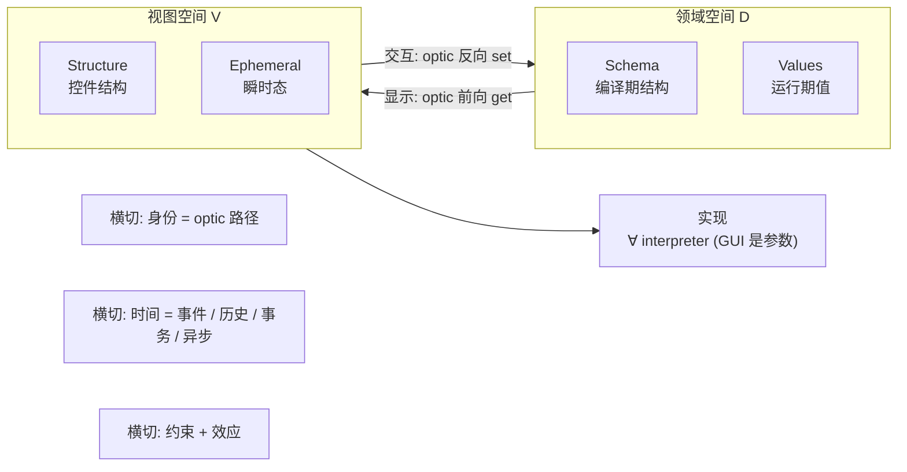
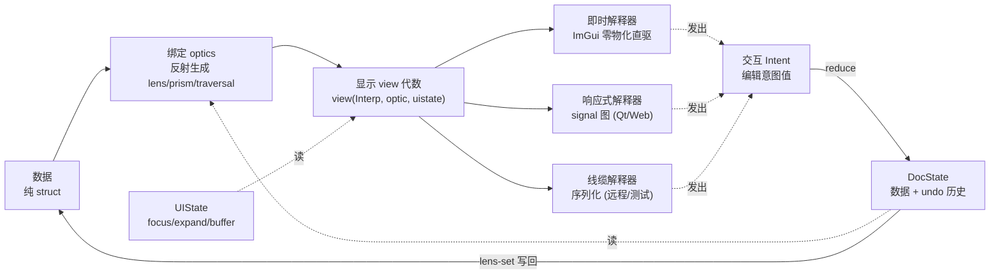

# C++26 反射驱动的属性检视系统设计

本文设计一套属性检视系统:以 C++26 静态反射与注解为前端,把任意 data struct 投影为可编辑、可校验、可持久化、可远程控制的界面。它不是 ImGui 的包装层,ImGui 只是若干可替换实现之一。

文档分两层叙述,互为索引。第一部分是抽象层,从问题建模出发,给出一个不依赖任何 GUI 库、可被数学推理的最小模型,并论证为何 C++26 与 C++20/23 是第一套能原生承载该模型的语言设施。第二部分是工程层,把最小模型展开为六个可落地的关注点,逐层给出 schema 管线、optics、view 代数、解释器、Intent、状态、时间与效应、性能模型。抽象层供推理,工程层供实现;每个工程关注点都回指它在最小模型中的位置。

本文不复用 `docs/cpp/cxx26-imgui-attribute-system-design.md` 的结构与结论。

# Part I · 抽象层:问题建模

## 1. 立场与核心论断

论断一,问题的本质不是画控件,而是在两个空间之间维持一致对应。领域空间 D 是 (Schema, Values),视图空间 V 是 (Structure, EphemeralState)。系统的全部工作是:沿时间维,在编辑作用下,以可插拔实现,维持 D 与 V 的一致对应。GUI 框架不是这个问题的一个维度,而是维持对应的一个实现参数。最小模型见第 2 节。

论断二,D 与 V 的对应是一组由反射生成的 optics (lens / prism / traversal)。显示是 optic 的正向 (D 投影为 V),交互是 optic 的反向 (编辑回写 D),二者不是两个独立关注点,而是同一双向变换的两个方向。`object.[:member:]` 成员 splice 是 lens 的语言级原语,反射在编译期免费合成整套 optics 并复合为稳定路径。

论断三,显示是一个对解释器多态的 view 代数。view 把字段结构描述为对解释器方法的一串调用 (finally-tagless),不物化为对象。ImGui 是零物化的即时解释器,signal 图是响应式解释器,序列化是线缆解释器。可替换性由此成为代数推论:换后端即换解释器,view 与 schema 不动。展开见第 7 节。

论断四,状态按来源与生命周期分裂,时间是一等概念。持久的 DocState (数据加编辑历史) 与瞬时的 UIState (focus、展开、编辑缓冲) 生命周期不同;派生态不存储,由 signal 计算。交互不直接 mutate 数据,而是产生 Intent 值,经唯一 reducer 归约,使事务、撤销、异步提交、协作坍缩为对 Intent 流沿时间维的操作 (第 11、12 节)。

这四条论断的共同点是把 GUI 从中心移除。下面先给出不含 GUI 的最小模型,再论证 C++26 是第一个能原生承载它的语言,最后由设计目标导出关键抉择并给出两层之间的索引。

## 2. 问题的最小模型

把"数据、显示、GUI、交互、状态"这一朴素分类还原到最小正交基,问题由四个一等概念加两个横切关注点刻画,GUI 退出为参数。



四个一等概念:领域空间 D = (Schema, Values),视图空间 V = (Structure, Ephemeral),连接二者的双向 optic (前向即显示,反向即交互),时间维 (编辑为事件,历史为 fold,事务为分组,异步为交错)。两个横切关注点:身份 (把 D 位置、V 位置、历史目标、远程地址粘合为一条 optic 路径) 与约束加效应 (跨字段不变量 validity,以及提交边界的副作用 effect,如写盘或通知 renderer)。

这个模型有三个被多数 inspector 忽略的精确点。其一,显示与交互共享同一 optic,读写路径因而不会漂移;把它们当两个独立层是经典 bug 源。其二,状态按来源分四类,混为一谈会同时引入两类 bug。其三,身份与时间不是可选功能,而是一等概念,却几乎从不出现在朴素分类里。

| 状态类别 | 定义 | 正确处置 | 误处置的后果 |
|---|---|---|---|
| 本质 essential | 数据本身 | 即 Values | 与数据重复计数 |
| 派生 derived | 数据的纯函数 (校验、格式化) | 计算不存储 (computed signal) | 存储则与数据不一致 |
| 瞬时 ephemeral | focus / scroll / expand / 编辑缓冲 | 存 V 域,按身份寻址 | 塞进数据则污染 preset |
| 历史 historical | undo 栈 | 数据迁移序列上的 fold | 当普通字段则无法回放 |

每个要素都有可推理的数学对应物:optic 范畴的 lens/prism/traversal 与 get/put 律、historical fold 的 catamorphism、view 代数的 object algebra/finally-tagless、effect 的 structured concurrency。这使读写一致、undo 可逆、提交原子等性质可被证明,而非靠测试覆盖。第 6 节把这六要素展开为可落地的六关注点。

## 3. 为什么 C++26/23 是第一个能原生承载此模型的语言

最小模型的每个要素,历史上都只能靠宏、代码生成器、运行期反射库或外部 schema 模拟,从未被单一语言以零开销原生统一。C++26 与 C++20/23 第一次让每个要素都有语言级、编译期、零运行期开销的表达。

| 模型要素 | 历史实现 (有开销/有外部依赖) | C++26/23 原生承载 |
|---|---|---|
| Schema (D 的结构) | 宏、代码生成器、RTTR、Boost.PFR | P2996 `nonstatic_data_members_of` / `bases_of` / `enumerators_of` |
| optic (D↔V) | 手写 getter/setter、lens 库、JS proxy | `object.[:member:]` 成员 splice + `substitute` 编译期合成 |
| 注解 (语义标注) | 字符串 attribute、外部 JSON schema | P3394 强类型注解 `[[=expr]]` + `annotations_of` |
| view 解释器多态 | 虚函数、访问者、运行期分发 | finally-tagless + C++23 deducing this + concepts (零虚表) |
| 派生态/瞬时态 | 手写脏标记、运行期依赖发现 | signals (computed),依赖图由 optic 在编译期给出 |
| 时间 (历史/事务/异步) | 手写 command 栈、裸线程 | `std::execution` senders/receivers (P2300) |
| 身份 | 字符串 key、手写 ID 栈 | optic 路径哈希,编译期稳定 |

一个能集中说明 C++26 独特性的对照:2026 年前端的 SolidJS `createStore` 用 `setStore("user","count",v)` 做路径级细粒度更新,只刷新该字段依赖的节点。那条路径就是一个运行期 optic,而依赖图由 proxy 在运行期发现,代价是代理对象与运行期开销。C++26 反射把同一条 optic 路径与同一张依赖图整体移到编译期:成员 splice 直接产生 lvalue,`substitute` 在编译期把每个字段实例化为一个具体 optic 类型,signal 的依赖边在编译期即确定。结果是其他语言尚需运行期反射或代理才能达到的细粒度响应式,在 C++26 下是零运行期反射、零代理、可内联的静态结构。

C++23 的 deducing this 让递归 view 与解释器无需 CRTP 样板即可表达 (反射驱动的 `clap` 命令行库已用此法做泛型遍历);concepts 让解释器多态在编译期约束而非运行期虚调用;senders/receivers 让时间与效应有了结构化并发的标准载体。换言之,最小模型的抽象不再需要为 C++ 的表达力做任何妥协。须注意一个边界:P3294 token 注入不在 C++26 内,故系统建立在 splice 与 `template for` 之上,不依赖代码生成。

## 4. 设计目标、关键抉择与两层索引

系统服务于 Mashiro/Nova 的编辑器基础设施:为 renderer、resource、debugger、profiler、shader 参数与实验配置提供共同的检视与编辑底座。由此定下五个设计目标,它们决定了第 2 节最小模型的取舍,并约束第二部分的每个工程决策。

| 设计目标 | 含义 | 架构落点 |
|---|---|---|
| 单一事实源 | data struct 即 schema,序列化 / CLI / 文档 / GUI 全部从它派生,永不失同步 | 反射 schema (第 8 节)、多投影 (第 15.2 节) |
| 热路径零开销 | 即时模式调参等价于手写 ImGui 加一次哈希,运行期无反射、无代理、无虚调用 | optic 编译期合成 (第 8.5 节)、性能模型 (第 14 节) |
| 后端可替换 | GUI 框架是参数而非中心,换后端不改 schema 与 view | view 代数 + 可插拔解释器 (第 7 节) |
| 强默认 + 全自由 | 默认覆盖多数场景,任意层级可覆盖默认而非取消默认 | 注解 lattice + 覆盖格 (第 9 节) |
| 领域纯净 | 领域类型零 UI 依赖,UI 语义可离线声明 | 离线注解:trait 特化 / 程序化 (第 9.4 节) |

这些目标隐含四个不平凡的设计抉择,它们是同类系统 (Unity `[SerializeField]`、Unreal `UPROPERTY`、RTTR、Qt `Q_PROPERTY`、各类 ImGui 反射插件) 常常回避或处理不彻底的难点,本架构对每个给出明确解。

抉择一,注解不得污染领域类型。把 `[[=ui::slider{...}]]` 直接写在业务 struct 字段上会让 renderer 核心数据结构依赖 UI 词汇表,且同一类型无法承载两套界面 (美术面板与调试面板)。正确解是注解三来源等价:内联、trait 特化、程序化 `annotate`,使领域类型保持纯净 (第 9.4 节)。

抉择二,编辑器内核而非配置窗口才是工程主体。把 `float` 画成 slider 是平凡的;真正困难的是事务边界 (immediate / deferred / transactional)、跨字段不变量校验、撤销重做、多对象联合编辑与混合值显示、稳定身份。这些无法从 attribute 到 widget 的朴素映射自然导出,须单独建模 (第 11 节)。

抉择三,强默认与全自由不是对立而是分层。若一切都须显式指定,系统退化为带语法糖的手写 ImGui;故以强默认推导覆盖多数场景,以四级覆盖格提供逃生舱口,自由体现为可在任意层级覆盖默认 (第 9.5 节)。

抉择四,后端解耦的真正障碍不是接口而是即时模式与保留模式的语义鸿沟。把这道鸿沟吸收进"解释器选择"而非强加统一控件树,是解耦可行的关键 (第 7 节)。

下表把第 2 节抽象层的最小模型要素、第 6 节工程层的六关注点与具体章节逐项对齐,作为两层之间的索引。

| 最小模型要素 (第 2 节) | 六关注点 (第 6 节) | 工程落点 |
|---|---|---|
| Schema (D 的结构) | 数据 | 第 8.1–8.4 节 反射 schema 管线 |
| optic 双向变换 | 绑定 | 第 8.5 节 profunctor optics |
| optic 前向 (get) | 显示 | 第 7 节 view 代数 |
| optic 反向 (set) | 交互 | 第 11 节 Intent + reducer |
| 瞬时态 / 派生态 | 状态 | 第 11 节 DocState/UIState + signal |
| 时间 (横切) | 贯穿交互与状态 | 第 12 节 senders/receivers |
| 身份 (横切) | 贯穿全局 | 第 13 节 optic 路径 |
| 约束 + 效应 (横切) | 贯穿校验与提交 | 第 9 节 注解校验 + 第 12 节 effect |
| ∀ interpreter | 实现 | 第 7.2–7.4 节 三解释器 |

# Part II · 工程层:六关注点框架

## 5. 工程边界:P2996.md 与本 fork 的能力

设计必须建立在 fork 实际支持的特性之上，而非 P2996 论文的完整愿景。依据 `bloomberg/clang-p2996` 的 `P2996.md` 与 P3394R1 的实现经验章节，本 fork (启用 `-freflection-latest`) 的能力边界如下。

| 提案 | 特性 | 状态 | 在系统中的作用 |
|---|---|---|---|
| P2996 | `^^`、`std::meta::info`、splicer `[: :]`、全部元函数 | 完整 | 成员遍历、类型推导、成员/基类访问、枚举枚举 |
| P3394 | 注解 `[[=expr]]`、`annotations_of`、`annotation_of<T>`、`has_annotation<T>`、`annotate` | 支持 | 承载 UI 语义，首选 DSL |
| P3096 | 参数反射 `parameters_of` | 支持 (`-fparameter-reflection`) | 函数转命令表单 (第 15.1 节) |
| P1306 | expansion statement `template for` | 部分支持 | 零开销字段展开 |
| P3289 | consteval block | 支持 | 编译期 schema 校验与诊断 |
| P3385 | attribute 反射 | 支持 (`-fattribute-reflection`) | 读取既有 `[[deprecated]]` 等驱动 UI |
| P3491 | `define_static_{string,object,array}` | 支持 | 跨常量求值边界固化 schema |
| TBD | `define_enum` | 支持 | 由枚举生成静态枚举数据 |
| P3294 | token sequence 代码注入 | 不支持 | 系统不得依赖代码注入 |

四条工程约束直接源于上述边界，违反任一条都会编译失败。

第一，注解值必须是 structural type。P3394 经 `std::meta::info` 返回注解，而反射值当前要求 structural。承载 UI 语义的注解对象只能是含 public 成员、无自定义拷贝控制的字面类型。谓词应以 captureless lambda 的形式作为非类型模板参数传入注解，而非作为 `std::function`。

第二，`template for` 不支持对 constexpr range 的直接展开。fork 文档明确声明 expansion 只覆盖 expansion-init-list 与可解构表达式，不覆盖 constexpr range。遍历成员序列时须先用 `std::define_static_array` 将 `nonstatic_data_members_of` 的结果固化为静态存储，再对其展开。

第三，元函数返回的容器只在常量求值内瞬时有效。`members_of`、`nonstatic_data_members_of`、`enumerators_of`、`bases_of`、`annotations_of` 返回的 `vector<info>` 不能逃出 consteval 边界，跨边界一律经 `define_static_array` 或 `define_static_object` 固化。

第四，`identifier_of` 只适用于确有 identifier 的实体，调用前须 `has_identifier` 检查；任意类型的显示名用 `display_string_of`，且不得用作稳定 key。指针、引用、cv 组合、匿名类型、模板特化均无通用 identifier。

## 6. 架构总览:六关注点

第 2 节的最小模型供推理,本节把它展开为六个可落地的工程关注点供实现,二者的逐项映射见第 4 节索引表。前三者描述静态结构,后三者描述动态行为;关注点之间以纯数据契约连接,可独立替换。第 7 节起逐层展开。

| 关注点 | 职责 | 最优表达 | 归属 |
|---|---|---|---|
| 数据 Data | 领域模型的值 | 纯 struct，零 UI 依赖 | 应用 |
| 绑定 Binding | data ↔ view 的双向通道 | 反射生成的 optics:lens / prism / traversal | 编译期 |
| 显示 Display | 字段结构到控件树的映射 | finally-tagless view 代数 | 编译期 |
| 交互 Interaction | 编辑意图的产生与归约 | Intent 值 + 中央 reducer | 运行期 |
| 状态 State | dirty / undo / focus / selection | DocState (持久) + UIState (瞬时) 双 store | 运行期 |
| 实现 Realization | 控件树的最终呈现 | 可插拔解释器:即时 / 响应式 / 线缆 | 后端 |

三个建模决策值得点出。其一，显示与交互不是两个独立关注点，而是绑定 optic 的正反两向：显示是 data 投影为控件 (lens 的 get)，交互是编辑回写 data (lens 的 set)，共享同一 optic 保证读写路径不漂移。其二，GUI 框架不是关注点而是实现关注点的一个参数，它是 view 代数的解释器，可插拔。其三，状态按来源分裂为持久 DocState 与瞬时 UIState，二者生命周期不同，混淆是多数 inspector 的 bug 源。



数据单向下行 (data 经 optic 与 view 抵达解释器)，编辑意图反向回环 (解释器产生 Intent，reducer 归约进 DocState，再经 optic 写回 data)。

| 层 | 输入 | 输出 | 依赖 | 可替换性角色 |
|---|---|---|---|---|
| 数据 + 绑定 + 显示 | C++ 类型与值 | view 代数调用 | `<meta>` | 后端无关，全后端共享 |
| 交互 + 状态 | Intent 与编辑历史 | DocState / UIState | 标准库 | 后端无关 |
| 实现 (解释器) | view 调用 | 像素 / signal 图 / 字节流 | 各 GUI 框架 | 可插拔，多实例并存 |

前两层 (五个 GUI 无关的关注点) 不依赖任何 GUI 库，是可替换性的物理边界。新增后端只需实现一个解释器。

## 7. 显示:view 代数与三解释器

显示是把字段结构映射为控件树。系统不把控件树物化为对象，而是以 finally-tagless 形式把它表达为对解释器的一串调用。同一段 view 代码，喂给不同解释器即得不同后端：即时模式直驱 ImGui、响应式模式建 signal 图、线缆模式序列化为协议帧。可替换性由此从工程接口问题降为代数问题：换后端即换解释器。

这一节先论证即时与保留两种求值范式的对偶，再给出 view 代数的契约，最后说明三个解释器。

### 7.1 两种求值范式的对偶

| 维度 | 即时模式 (ImGui) | 保留模式 (Qt / Web DOM) |
|---|---|---|
| 控件生命周期 | 每帧重建，无持久对象 | 持久节点，显式创建销毁 |
| 状态归属 | 应用持有数据，GUI 几乎无状态 | GUI 节点持有状态 |
| 更新模型 | 每帧全量遍历 | 增量 diff / 信号槽 |
| 身份 | 由 ID 栈隐式推导 | 由对象指针显式持有 |
| 适用 | 工具、调试、游戏内 overlay | 桌面应用、复杂表单 |

二者并非简单优劣关系，而是对偶。即时模式把状态外置到应用，换取代码简单与无同步开销；保留模式把状态内置到控件，换取增量更新与复杂交互能力。强行统一会损失一方优势。

### 7.2 契约即 view 代数 (finally-tagless)

契约不是一棵被物化的控件树，而是一个对解释器多态的 view 函数。这是 finally-tagless (亦称 object algebra) 编码：view 把控件树表达为对解释器方法的调用，解释器决定这些调用是直接画像素、建响应式节点，还是写字节流。其对偶 (initial 编码) 是先建一棵 AST 值再遍历，但那会在即时场景引入无谓的每帧分配。finally-tagless 让即时解释器零物化，同时不剥夺保留与远程解释器物化的能力。

view 对解释器模板多态，字段经绑定 optic 下降：

```cpp
template <class T, Interpreter Ip>
EditResult view(Ip& ip, Lens auto root, UiState& ui) {
    return ip.group(root.id(ui.parent), label_of(root), [&]{
        EditResult acc{};
        template for (constexpr auto m : members_of_static<T>())
            acc.merge(view_field(ip, root | Lens<m>{}, ui));   // optic 复合
        return acc;
    });
}
```

`Interpreter` 是一个 concept，view 对满足它的任意类型多态;解释器之间无继承、无虚表，分发在编译期完成,调用经内联消解。递归 view (group 内对子字段再调用 view) 用 C++23 deducing this 表达，无需 CRTP 样板——这正是反射驱动的 `clap` 命令行库做泛型遍历的同一手法。`view` 是无状态自由函数，UiState 显式穿入而非内嵌，故同一 view 可被多个解释器、多个对象实例并发复用。

即时解释器的接口即下面的 DrawSurface concept。它是 view 代数在即时模式下的具体解释器，只描述控件原语与编辑结果，不描述布局像素，布局策略由 view 层下发。一个后端实现这组原语，即可被全部 view 驱动。

```cpp
namespace Mashiro::UI {

// 即时模式下每次调用返回本控件的状态变化
struct EditResult {
    bool edited     = false;  // 本帧 UI 值被改动
    bool committed  = false;  // 用户完成一次编辑事务 (失焦 / 回车 / 拖拽结束)
    bool activated  = false;  // 控件刚获得交互焦点
};

// DrawSurface 是即时解释器接口。响应式 / 线缆解释器实现同名原语的不同语义。
template <class Sf>
concept DrawSurface = requires(Sf& s, FieldId id, std::string_view label) {
    { s.scalar_f32(id, label, std::declval<float&>(), ScalarStyle{}) } -> std::same_as<EditResult>;
    { s.scalar_i64(id, label, std::declval<std::int64_t&>(), ScalarStyle{}) } -> std::same_as<EditResult>;
    { s.boolean(id, label, std::declval<bool&>()) } -> std::same_as<EditResult>;
    { s.text(id, label, std::declval<std::string&>(), TextStyle{}) } -> std::same_as<EditResult>;
    // 选择原语 (枚举 / variant active index)
    { s.select(id, label, std::declval<int&>(), std::span<const std::string_view>{}) } -> std::same_as<EditResult>;
    // 结构原语:返回容器是否展开,后端负责 ID 栈 push/pop
    { s.begin_group(id, label, GroupStyle{}) } -> std::convertible_to<bool>;
    s.end_group();
    { s.begin_array(id, label, std::declval<std::size_t&>()) } -> std::convertible_to<bool>;
    s.end_array();
    // 动作原语 (按钮 / 命令)
    { s.action(id, label) } -> std::convertible_to<bool>;
    s.tooltip(std::string_view{});
    s.same_line();
};

}
```

`FieldId` 是后端无关的稳定身份 (第 13 节)，后端负责将其翻译为自身的身份机制：ImGui 推入 ID 栈，Qt 用作 `objectName` 与节点缓存键，Web 用作 DOM `id`。`begin_group` 与 `begin_array` 的返回值表达折叠状态，使遍历可在折叠时跳过子树，对所有解释器语义一致。

### 7.3 响应式解释器:signal 图优先，调和器次之

保留模式后端不能每帧重建控件树。2026 年前端的结论是细粒度 signals 取代 virtual DOM 的 diff (SolidJS、Svelte 5 runes、Vue Vapor、Angular 20、Slint 均已收敛于此)，这一结论同样适用于保留模式后端。首选的响应式解释器从字段 optic 建一张 signal 图：每个字段 optic 映为一个 signal cell，派生值与校验是 computed signal，只有变动的字段触发局部更新，无需全树 diff。

本系统与 JS 框架的关键差别在依赖发现的时机。SolidJS 的 `createStore` 用 proxy 在运行期追踪每个 computed 读了哪些 signal 来连边,代价是代理对象与运行期 read-tracking。本系统的 view 在编译期就以 optic 显式声明读了哪些字段,signal 图的拓扑因此完全静态,运行期只流动值。

```cpp
// 每个 optic 路径一个 signal cell;cell 身份即 FieldId,无需运行期 read-tracking
template <Optic O>
SignalCell& cell_of(SignalGraph& g) { return g.cell(O::path()); }

// computed 的依赖集 = 它读取的 optic 集合,编译期已知
auto valid = computed(g, /*deps=*/optic_set<ExposureLens>, [&]{
    return in_range(cell_of<ExposureLens>(g).get());
});
```

结果是:无 proxy 对象、无运行期依赖发现、cell 按 `FieldId` 直接寻址,更新传播是一次按拓扑序的窄前沿计算。这把第 3 节所述的编译期依赖图落到解释器实现上,得到其他语言尚需运行期反射或代理才能达到的细粒度响应式。

当目标框架缺乏响应式原语时，退化到调和器：把每帧的原语调用序列与上一帧缓存的控件树做 diff，新出现的 `FieldId` 创建控件，消失的销毁，存在的复用并仅更新值。这与 React 的虚拟 DOM 调和同构，`FieldId` 充当 React 的 key。两种响应式解释器对前端与 view 完全透明，前端仍以即时模式方式发起调用。

```cpp
// 调和器 (无 signal 原语时的退路):把即时调用映射到持久 QWidget 树
class QtSurface {
    std::unordered_map<FieldId, QWidget*> live_;   // 上一帧存活的控件
    std::unordered_set<FieldId> visited_;          // 本帧已访问

    EditResult scalar_f32(FieldId id, std::string_view label, float& v, ScalarStyle st) {
        auto* w = ensure<QDoubleSpinBox>(id, label);  // 不存在则创建,存在则复用
        visited_.insert(id);
        if (!w->hasFocus()) w->setValue(v);           // 无焦点时同步模型值
        return drain_result(id);                      // 信号槽累积的编辑结果
    }
    // 帧末:销毁 live_ 中未被 visited_ 命中的控件
};
```

由此得到结论：可替换性可行，且不必牺牲任一范式的优势。解耦的正确切面是 view 代数加可插拔解释器：即时解释器零物化直驱，响应式解释器用 signal 图做细粒度更新，缺乏响应式原语的框架退化到调和器。可替换性的正确实现不是把抽象控件树强加给所有后端，而是把即时/保留的阻抗失配吸收进解释器选择。

### 7.4 后端矩阵

| 后端 | 模式 | 用途 | 额外成本 |
|---|---|---|---|
| ImGui | 即时 | 引擎内调试、工具、overlay | 零，直通契约 |
| ImGui + ImPlot/ImGuizmo | 即时 | 曲线、变换 gizmo | 扩展原语 |
| Qt / Slint | 保留 | 独立桌面编辑器 | signal 图 (首选) / 调和器 |
| HTML / Web | 保留 | 远程浏览器面板 | signal 图 + 序列化传输 |
| TUI (notcurses) | 即时 | 无图形环境调参 | 直通契约 |
| 无头 / RPC | 无渲染 | 自动化、远程控制、回放 | 记录原语流 |
| golden-test | 无渲染 | 快照测试 schema 投影 | 序列化原语流为文本 |

线缆解释器是一个被低估的能力：它不渲染像素，只把 view 调用序列序列化为结构化日志或网络协议。同一 view 因此天然获得远程控制与可重放测试能力，无需额外协议设计 (第 15.3 节)。

## 8. 数据与绑定:反射 schema 与 profunctor optics

前端把类型 `T` 编译为静态 schema 与一组绑定 optics，核心是一个 consteval 管线与一个 `template for` 展开。

### 8.1 schema 构建管线

```text
reflect T
  -> nonstatic_data_members_of(^^T, ctx)        收集字段
  -> bases_of(^^T, ctx)                          收集基类 (继承字段并入)
  -> 对每个成员 annotations_of(member)           收集字段注解
  -> annotations_of(^^T)                         收集类型注解
  -> 推导默认 widget (按 type category)
  -> 合并显式注解覆盖 (annotation lattice)
  -> consteval 校验注解相容性 (P3289 consteval block)
  -> define_static_array 固化为静态 schema
```

字段身份与标签的推导规则，区分稳定 key 与显示文本两个正交概念。

```text
stable_key = annotation_of<ui::id>(member)               若显式指定
          or identifier_of(member)                        若 has_identifier(member)
          or fnv1a(type_key(^^T) ++ field_index)          兜底,不依赖显示文本

label = annotation_of<ui::label>(member)                  若显式指定
     or humanize(identifier_of(member))                   下划线转空格、首字母大写
     or display_string_of(member)                         仅作诊断,不入稳定路径
```

### 8.2 零开销字段展开

绘制路径完全模板化，不在运行期保留 `std::meta::info`。`template for` 对固化后的成员数组展开，每个字段的 widget 在编译期选定。

```cpp
template <class T, DrawSurface Sf>
EditResult draw_struct(Context& ctx, Sf& surface, T& object, FieldId parent) {
    EditResult acc{};

    template for (constexpr auto member :
        std::define_static_array(
            std::meta::nonstatic_data_members_of(
                ^^T, std::meta::access_context::current()))) {

        constexpr FieldDescriptor fd = describe_field<T, member>();  // consteval
        FieldId id = child_id(parent, fd.stable_key);

        if (visible<member>(object)) {
            acc.merge(draw_field<member>(ctx, surface, id, object.[:member:], fd));
        }
    }
    return acc;
}
```

`describe_field` 是 consteval 函数，在编译期完成注解读取、widget 选择与约束提取，产出 `FieldDescriptor` 字面值。运行期只剩一次 `child_id` 哈希与一次 widget 调用，无反射开销。

### 8.3 枚举与基类

枚举经 `enumerators_of` 展开为 select 原语的候选表。继承场景下 `bases_of` 给出基类反射，基类字段以独立分组并入派生类 schema，分组标签取基类显示名。

```cpp
template <class E> requires std::is_enum_v<E>
EditResult draw_enum(Sf& surface, FieldId id, std::string_view label, E& value) {
    static constexpr auto names = enum_names<E>();   // consteval: enumerators_of -> identifier_of
    int index = enum_index(value);
    auto r = surface.select(id, label, index, names);
    if (r.edited) value = enum_value<E>(index);
    return r;
}
```

### 8.4 访问控制

默认以 `access_context::current()` 遍历，只暴露当前上下文可见字段，尊重封装。私有字段进入 UI 需显式选择以下策略之一，避免无意泄漏内部状态。

| 策略 | 行为 |
|---|---|
| `public_only` | 默认，仅当前上下文可访问字段 |
| `friend_reflect` | 类型 `friend struct Mashiro::UI::Reflect<T>`，授权访问私有字段 |
| `opt_in` | 私有字段须带 `[[=ui::expose]]` 才进入 schema |
| `unchecked` | 仅 devtools，使用 `access_context::unchecked()` |

### 8.5 绑定层:反射生成的 profunctor optics

绑定是 data 与 view 之间的双向通道，被建模为 optics。一个字段是 lens (聚焦到成员)，variant 的一支是 prism (聚焦可能失败)，容器是 traversal (聚焦到多个元素)。反射在编译期免费合成整套 optics，`object.[:member:]` 是 lens 的语言级实现。

```cpp
// lens 聚焦到一个成员;focus 返回引用,赋值即 set
template <std::meta::info Member>
struct Lens {
    static constexpr auto& focus(auto& owner) { return owner.[:Member:]; }
    static constexpr FieldId id(FieldId parent) { return child_id(parent, stable_key<Member>); }
};

// optic 复合:嵌套字段路径即 lens 链,既是聚焦也是稳定地址
template <Optic Outer, Optic Inner>
constexpr auto operator|(Outer, Inner) { return Composed<Outer, Inner>{}; }

// prism:聚焦 variant 的活动支,聚焦可能失败
template <class V, std::size_t I>
struct Prism { static constexpr auto* focus(V& v) { return std::get_if<I>(&v); } };

// traversal:聚焦容器全部元素
template <std::ranges::range R>
struct Traversal { static constexpr auto each(R& r) { return std::views::all(r); } };
```

一个 optic 同时承担四个本来分散的职责，这是把绑定独立成层的收益。

| 职责 | optic 如何承担 |
|---|---|
| 嵌套寻址 | optic 复合 `compose(root, Lens<a>, Lens<b>)` 聚焦到任意深度 |
| 可逆编辑 | lens-set 配旧值即 undo 单元 (第 11 节 Intent) |
| 序列化 key | optic 路径即 preset 与配置文件的稳定 key (第 13 节) |
| 远程地址 | optic 路径即 RPC 寻址 (第 15.3 节) |

显示与交互由此统一：显示是沿 optic 正向把值投影为控件，交互是沿同一 optic 反向把编辑写回，二者共享 optic，不会出现读写路径不一致。

lens、prism、traversal 表面上是三种东西，profunctor 表述把它们统一为一个概念:一个 optic 是对任意 profunctor `p` 的自然变换 `p a b -> p s t`。换不同的 `p` 就得到不同操作——`p = (->)`(函数) 给出 get/set,`p = Forget`(常函子) 给出折叠,`p = Star f`(Kleisli) 给出带效应的遍历。这一点直接服务本系统:同一条 optic 路径,喂给"读"profunctor 就是显示,喂给"写"profunctor 就是交互回写,喂给"序列化"profunctor 就是第 15.3 节的线缆投影,喂给"校验"profunctor 就是第 9 节的约束求值。optic 复合是 profunctor 变换的复合,满足结合律,因此嵌套路径可任意拼接而不破坏任一操作。lens 须满足 get/put 两律 (set 后 get 得 set 的值;get 后 set 原值不变),这两律是 undo 可逆 (第 11.2 节 `invert`) 与多对象写入一致 (第 11.4 节) 的证明前提。

optic 的类型由反射在编译期合成,不手写。对每个成员反射 `m`,`substitute` 把 `Lens` 模板实例化为该成员的具体 optic 类型;`template for` 把整张 optic 表在编译期铺开。

```cpp
// 由成员反射在编译期合成该字段的 optic 类型 (P2996 substitute)
template <std::meta::info Member>
using lens_for = [: std::meta::substitute(^^Lens, {std::meta::reflect_constant(Member)}) :];

// 整棵 optic 表是编译期常量,运行期不持有 std::meta::info
template <class T>
consteval auto optics_of() {
    // 对 nonstatic_data_members_of(^^T) 逐个 substitute,固化为静态数组
}
```

零开销在此层是可论证的而非口号。`Lens`、`Prism`、`Composed` 都是无非静态成员的空类型 (stateless),`focus` 全是 `static constexpr`;optic 复合 `Outer | Inner` 产生的仍是空类型,其 `focus` 是成员 splice 的链式调用,经内联坍缩为单次地址计算,与手写 `obj.a.b.c` 生成相同的机器码。换言之,绑定层在运行期不分配、不存储 optic 对象、不做虚调用,全部结构在编译期消解。这正是第 3 节所述、其他语言需运行期 proxy 才能达到的细粒度绑定在 C++26 下的零开销形态。

## 9. 注解代数

注解被设计为一个带类型的代数系统。每个注解是一个语义原子，resolver 以确定的合并规则把同一字段上的多个注解归约为一个 `FieldDescriptor`。

### 9.1 注解原子的形态

注解是 structural 字面类型，含 public 成员。谓词以 captureless lambda 作为非类型模板参数携带。

```cpp
namespace Mashiro::UI::anno {

struct label   { std::string_view text; };
struct tooltip { std::string_view text; };
struct group   { std::string_view path; };   // 支持 "Exposure/Advanced"
struct order   { int value; };

struct slider  { double min; double max; double speed = 0.0; bool logarithmic = false; };
struct drag    { double speed = 0.01; double min = 0; double max = 0; };
struct range   { double min; double max; };   // 硬约束,提交前校验

template <auto Predicate>
struct visible_if {};                          // Predicate: 接收 owner const& 的 captureless lambda

template <auto Predicate>
struct validate {};                            // Predicate: 接收字段值的 captureless lambda

struct id { std::string_view key; };           // 稳定身份覆盖

}
```

### 9.2 widget 选择的偏序

widget 由偏序决定，高优先级覆盖低优先级。该偏序在叠加运行期策略后扩展为完整 lattice (第 9.5 节)。

```text
字段 widget 注解
  > 类型 widget 注解
  > TypeAdapter<T> 特化
  > 内置类型类别默认
  > 反射 struct 递归
  > 只读兜底显示
```

### 9.3 合并语义

resolver 对每类注解定义合并幺半群。展示类注解 (label / tooltip) 取最后一个，约束类注解 (range / validate) 取交集 (全部满足)，布局类注解 (group / order) 取最具体者。冲突在编译期由 consteval block 拒绝，给出字段路径诊断。

```cpp
consteval void check_field_annotations(std::meta::info member) {
    bool has_slider = has_annotation<anno::slider>(member);
    bool has_combo  = has_annotation<anno::combo>(member);
    if (has_slider && has_combo)
        throw "field has conflicting widget annotations: slider and combo";
    // throw 在 consteval 中即编译错误,诊断含被求值的字段
}
```

### 9.4 离线注解:解除领域类型污染

针对第 4 节指出的高严重度不足，注解不强制内联。系统提供三种等价的注解来源，按优先级合并，使领域类型可保持零 UI 依赖。

| 来源 | 形态 | 适用 |
|---|---|---|
| 内联注解 | 字段上 `[[=ui::slider{...}]]` | UI 与领域同源、快速原型 |
| trait 特化 | `template<> struct UiSchema<T>` 集中描述 | 领域类型须纯净、第三方类型 |
| 程序化注解 | consteval 中 `annotate(^^member, value)` | 由外部规则批量生成 |

trait 特化形态使一个领域类型可拥有多套界面：

```cpp
// 领域类型保持纯净,无任何 UI 词汇
struct RendererSettings { bool hdr; float exposure; Vec3 tint; };

// UI 描述在领域之外,可有多套
template <> struct Mashiro::UI::Schema<RendererSettings, profile::artist> {
    static constexpr auto fields = std::tuple{
        field<&RendererSettings::exposure>(anno::slider{-10, 10, 0.01}),
        field<&RendererSettings::tint>(anno::color{.hdr = true}),
        // hdr 字段在美术 profile 下隐藏
    };
};
template <> struct Mashiro::UI::Schema<RendererSettings, profile::debug> {
    // 调试 profile 暴露全部字段,含 hdr
};
```

### 9.5 运行期覆盖 lattice

为兑现最大自由度，注解不是唯一配置源。运行期 Theme 维护一个覆盖格，运行期策略可覆盖编译期默认，使同一 data struct 在不同界面呈现不同形态。

```text
运行期 session 覆盖
  > 用户 preset 覆盖
  > 项目 theme 覆盖
  > TypeAdapter 覆盖
  > 字段注解
  > 类型注解
  > 内置默认
```

```cpp
Theme theme;
theme.for_type<float>().default_widget = WidgetKind::drag;               // 项目级: float 默认拖拽
theme.for_path("RendererSettings/exposure").widget = WidgetKind::slider; // 字段级覆盖
```

## 10. Widget 分发

分发不写成单一巨型 `if constexpr`，而是 CPO 加类型类别派发，与 `Mashiro/Core/ToString.h` 的 CPO 模式一致 (见 `docs/cpp/adl_and_cpo.md`)。这保证库命名空间内类型与外部类型的定制路径统一，且不产生自指递归。

### 10.1 内置类别

```text
bool                 -> boolean
integral             -> scalar_iN (input / drag / slider)
floating_point       -> scalar_fN (input / drag / slider)
enum                 -> select (combo / radio / flags)
string               -> text
Vec<N> / Mat<R,C>    -> 标量组 / color / 矩阵表 / gizmo (按注解)
optional<T>          -> 使能 boolean + 嵌套 T
variant<Ts...>       -> active select + 嵌套编辑
range / container    -> begin_array + 逐元素递归
aggregate / class    -> begin_group + 递归 draw_struct
```

### 10.2 三层定制点

第三方类型不可改源码时写 TypeAdapter；字段需特殊控件时在字段上指定 widget 对象；保留 ADL 兜底但非首选。分发优先级：

```text
字段 widget 注解
  > TypeAdapter<T>
  > ADL draw_imgui(DrawTag, ...)
  > 内置类别
  > 反射 struct 递归
  > 只读兜底
```

```cpp
template <> struct Mashiro::UI::TypeAdapter<glm::vec3> {
    template <DrawSurface Sf>
    static EditResult draw(Context&, Sf& s, FieldId id, std::string_view label, glm::vec3& v) {
        return s.vector_f32(id, label, std::span{&v.x, 3}, {});
    }
};
```

TypeAdapter 仍以 DrawSurface 为参数，不直接调 ImGui，因此自定义控件对所有后端可用。这是解耦在扩展点上的贯彻：用户扩展也必须经契约，不得旁路绑定具体后端。

## 11. 交互与状态

即时模式控件每帧返回 `edited` 不足以支撑引擎配置。交互与状态是第 4 节指出的编辑器内核，占工程量主体。两个建模决策是：交互产生 Intent 值而非直接 mutate，状态按来源分裂为两个 store。

### 11.1 状态分裂:DocState 与 UIState

状态按来源与生命周期分裂为两个 store。混淆二者是多数 inspector 的 bug 源：把展开状态写进数据会污染 preset，把编辑缓冲塞进数据会导致每帧抖动。

| store | 内容 | 生命周期 | 是否入 preset |
|---|---|---|---|
| DocState | 数据 + 编辑历史 + 校验结果 | 持久，可撤销，可序列化 | 是 |
| UIState | focus / expand / scroll / 文本编辑缓冲 / selection | 瞬时，按 FieldId 寻址 | 否 |

派生状态 (校验结果、格式化文本) 不存储，由数据经纯函数计算，避免与数据不一致。这对应响应式解释器中的 computed signal。

### 11.2 交互即 Intent:编辑不直接 mutate

后端解释器不直接写数据，而是发出 Intent 值，由唯一的 reducer 归约进 DocState。编辑成为值，于是事务、撤销、多对象编辑、远程同步全部坍缩为对 Intent 流的操作，这比直接经 splicer 写回严格更强。

```cpp
struct SetField   { OpticPath path; std::any before, after; };
struct InsertElem { OpticPath path; std::size_t at; std::any value; };
struct RemoveElem { OpticPath path; std::size_t at; std::any removed; };
using Intent = std::variant<SetField, InsertElem, RemoveElem /* ... */>;

DocState& reduce(DocState&, Intent const&);   // 唯一可变 DocState 的入口
Intent     invert(Intent const&);             // 逆 intent 即 undo,无需手写 command
```

`OpticPath` 是 optic 复合得到的稳定路径 (第 8.5、第 13 节)，它既定位被编辑字段，又作为 undo 目标与远程地址，三者共用一条路径。

### 11.3 三种事务模式

事务边界由模式决定，模式选择本身就是一种自由度：纯调参场景走最轻的 immediate，编辑器走 transactional。

| 模式 | 行为 | Intent 流向 | 适用 |
|---|---|---|---|
| immediate | 改动立即经 lens-set 写回 | 不记录 | 相机、实时 shader 参数 |
| deferred | 改 UIState 副本，Apply 后写回 | commit 时一次性归约 | 资源导入、昂贵重建 |
| transactional | 每次 commit 产生 Intent 入历史 | 全程记录，可逆 | 编辑器、material authoring |

### 11.4 多对象联合编辑

选中 N 个同类型对象时，沿同一 optic 聚焦 N 个值：全部相等则正常显示，不等则显示混合态，编辑则产生一组 `SetField` 统一写入。手写 ImGui 极难维护，而 optic 把字段访问统一后几乎免费。

```cpp
template <Optic O, class T, Interpreter Ip>
EditResult view_field_multi(Ip& ip, O optic, std::span<T*> objs, UiState& ui) {
    auto& first = O::focus(*objs.front());
    bool mixed = std::ranges::any_of(objs, [&](T* o){ return O::focus(*o) != first; });
    auto r = mixed ? ip.scalar_mixed(O::id(ui.parent)) : ip.scalar_f32(O::id(ui.parent), first);
    if (r.committed) for (T* o : objs) emit(SetField{O::path(), O::focus(*o), first});
    return r;
}
```

## 12. 时间与效应:senders/receivers

第 2 节把时间列为一等概念,把效应列为横切关注点的一半。编辑本质是时序的:一次拖拽产生上百次 `edited`、跨字段校验昂贵且可能涉及 IO、提交会触发写盘或通知 renderer、协作场景下远端 Intent 异步抵达。C++26 的 `std::execution` (P2300) senders/receivers 是这四件事的标准载体,它给出可组合、可取消、错误结构化上抛的异步原语,无需自造线程与回调。

核心不变量保持不变:reducer 同步且纯,是 DocState 的唯一变更点 (第 11.2 节);一切异步与副作用被推到边缘,表达为 sender。提交边界因此是一条 sender 管线——同步归约在前,异步校验与效应在后,彼此可组合。

```cpp
// 提交是一条 sender 管线:同步 reduce 在前,异步校验与效应在后
ex::sender auto commit(DocState& doc, Intent i) {
    return ex::just(std::move(i))
         | ex::then    ([&](Intent x){ return reduce(doc, x); })        // 同步纯归约
         | ex::let_value([&](DocState& d){ return validate_async(d); }) // 跨字段校验(可在线程池)
         | ex::let_value([&](DocState& d){ return notify_renderer(d); });// 副作用:重建管线
}

// 拖拽期间多次 edited 合并为一次 transactional 提交
ex::sender auto debounced = edits
    | ex::stop_when(drag_ended)     // 拖拽结束触发
    | coalesce_into(history);       // 合并为单个可逆 Intent (第 11.3 节)
```

| 时序需求 | sender 模式 |
|---|---|
| 异步校验 | 校验放线程池,`let_value` 串接,失败经 `set_error` 上抛到字段诊断 |
| 防抖 / 合并提交 | 拖拽期 `edited` 流经 `stop_when(commit)`,合并为一个 transactional Intent |
| 后台 apply | 提交后 `notify_renderer` / 写盘为 sender,由结构化并发 scope 管生命周期 |
| 远程 / 协作 | 远端 Intent 作为异步流并入 reducer,与本地编辑同序归约 (第 15.3 节) |

结构化并发的价值在生命周期:校验与后台 apply 的 sender 挂在一个绑定到 inspector 生命周期的 scope 上,inspector 关闭或字段销毁即级联取消,不留悬挂任务。effect 推到边缘后,undo 仍只回放 Intent,副作用经其逆 sender 补偿,核心的可逆性 (第 11.2 节) 不被破坏。这一层对应第 2 节最小模型中"时间"维与"效应"横切,是把交互从"每帧布尔"提升为"时序事件流"的关键。

## 13. 身份与稳定路径

### 13.1 为何身份不能依赖显示文本

ImGui 的 ID 栈、preset 的字段 key、撤销 command 的目标、远程协议的寻址，都需要跨帧、跨进程、跨重命名稳定的身份。label 与 `display_string_of` 都不满足：label 随本地化变化，display string 随 fork 版本变化。身份必须独立于显示。

### 13.2 optic 路径即身份

身份不是独立机制，而是绑定 optic 的副产物。一条 optic 复合链 (Lens / Prism / Traversal 的序列) 就是一条稳定路径，FieldId 是它的哈希。同一条路径同时充当 ImGui ID、preset key、undo 目标、远程地址，四者不会漂移。

```text
OpticPath = [type_key, field_stable_key, (prism_tag | element_key)...]
FieldId   = fnv1a(OpticPath)
```

`type_key` 优先取 `ui::type_id` 注解，其次 `identifier_of(^^T)` (仅命名类型)，避免对匿名类型与模板特化误用 identifier。容器元素以元素内显式 key 字段定位，无 key 时退化为索引 (索引随增删变化，故仅作退路)。把身份绑定到 optic 而非显示文本或位置，是 preset 与 undo 跨重命名、跨重排稳定的根本原因。

## 14. 性能模型:编译期与运行期

设计目标是"尽可能编译期、运行期高性能",本节把每层的成本拆开,论证热路径零开销,并诚实标出唯一的运行期类型擦除点与编译期代价。

| 层 | 编译期工作 | 运行期工作 | 运行期分配 | 分发方式 |
|---|---|---|---|---|
| schema 构建 (第 8 节) | 全部 consteval | 无 | 无 | — |
| optic 绑定 (第 8.5 节) | `substitute` 类型合成 | 单次地址计算 | 无 | 静态内联 |
| view 代数 (第 7 节) | 解释器单态化 | 原语调用 | 无 | 编译期 concept |
| 即时解释器 ImGui | — | 每帧重画 | 无 | 直调 |
| 响应式解释器 | signal 图拓扑静态确定 | 窄前沿更新 | 建图一次 | 静态边 |
| Intent / reduce (第 11 节) | Intent 类型 | variant 分派 | undo 历史按需 | switch |
| 身份 FieldId (第 13 节) | 路径常量 | 编译期常量或一次 fnv1a | 无 | — |

热路径 (即时模式 ImGui 调参) 的零开销是可论证的:运行期不持有任何 `std::meta::info`,不构造 optic 对象,不做虚调用,字段访问经成员 splice 内联为直接地址,整条路径等价于"手写 ImGui 调用 + 一次哈希"。反射、注解解析、widget 选择、optic 合成全部在编译期完成,运行期只剩值与控件原语。

代价诚实标注两处。其一是编译期成本:大 struct 的反射展开与解释器单态化拖慢编译,缓解手段是 schema 缓存、分模块显式实例化、`define_static_array` 固化中间结果、不实例化未用到的解释器 (第 16 节)。其二是 Intent 中的 `std::any` (第 11.2 节) 是唯一的运行期类型擦除点,会引入一次潜在分配;对高频 transactional 路径,可用按字段类型参数化的 `Intent<T>` 或小缓冲优化消除该分配,代价是 reducer 需对类型集合展开。两处代价都局限在明确边界内,不污染热路径。

## 15. 超越配置窗口:C++26 对 ImGui 的重新赋能

前面各节构成一个完备的属性系统。本节论证 C++26 反射使 ImGui 的能力边界远超配置窗口，列举六类被朴素 attribute-to-widget 视角遗漏的能力。朴素视角止步于第一类，后五类是反射前端真正解锁的增量。

### 15.1 函数反射:从函数生成命令表单 (P3096)

参数反射使任意可反射函数转为一个 GUI 命令：按钮触发，参数由自动生成的表单填入。这把 ImGui 从数据编辑器扩展为行为调用器。

```cpp
// 任意函数 -> 一个带参数表单的命令面板条目
template <auto Fn, DrawSurface Sf>
void draw_command(Sf& surface, FieldId id) {
    static command_args_t<Fn> args{};            // 由 parameters_of(^^Fn) 合成的参数结构
    template for (constexpr auto p :
        std::define_static_array(std::meta::parameters_of(^^Fn))) {
        draw_param<p>(surface, id, args);        // 每个参数复用同一套 widget 分发
    }
    if (surface.action(id, display_name<Fn>()))
        args.apply([](auto&&... xs){ return [:^^Fn:](xs...); });
}
```

渲染管线的每个调试函数、每个 shader reload、每个 benchmark 入口因此自动获得 GUI，无需为每个函数手写面板。参数名依赖 `-fparameter-reflection`；若未启用，退化为按位置命名 `arg0 / arg1`。

### 15.2 一份 schema,多种投影

schema 不依赖 GUI，故同一类型可同时生成多种产物，全部从单一事实源派生，永不失同步。

| 投影 | 由 schema 派生的产物 |
|---|---|
| GUI | ImGui / Qt / Web 编辑面板 |
| CLI | argparse 风格命令行选项 (字段名转 `--flag`，range 转校验) |
| 配置文件 | JSON / TOML 读写，key 取稳定路径 |
| JSON Schema | 供外部工具校验的 schema 文档 |
| 文档 | 字段表:名、单位、范围、默认、说明 |
| RPC | 远程调用协议，字段路径即寻址 |

这一节直接回应第 4 节第二项不足之外的另一隐含收益：UI 系统与序列化、命令行、文档系统不再各写一套字段定义，三者坍缩为对同一 schema 的不同遍历。

### 15.3 无头与远程检视

线缆解释器把 view 调用序列序列化为协议帧，不渲染像素。这使远程控制与录制回放成为架构的自然推论：远程端发出 Intent 帧，本地 reducer 归约进 DocState 并经 optic 写回对象。无需为远程协议单独设计，因为 optic 路径即寻址、Intent 即协议。这对运行在无显示环境 (服务器、嵌入式、CI) 的渲染器调参尤其关键。

### 15.4 结构化差异与时间旅行

反射深拷贝使任意对象可被快照。两个快照经 schema 逐字段比较生成结构化 diff，可视化为差异视图 (改动字段高亮、显示前后值)。快照序列构成时间轴，支持时间旅行调试:把对象回滚到任一历史状态。这对渲染参数调试有直接价值:对比两组渲染配置的差异，或回放一次参数调整序列定位画质回归。

### 15.5 节点图与数据流编辑器

当 data struct 的字段类型本身是引用其他对象的句柄时，schema 遍历得到的不再是一棵树而是一张图。配合 imnodes 类后端，同一套 schema 可投影为节点图编辑器:对象为节点，句柄字段为连线端口，编辑即重连。渲染管线 (render graph)、材质图、后处理链都属此类，传统手写节点编辑器的样板代码可由 schema 消除。

### 15.6 既有 attribute 驱动 UI (P3385)

attribute 反射使系统能读取已有 C++ attribute 而非仅自定义注解。`[[deprecated]]` 字段在 UI 中以删除线与警告色显示，`[[maybe_unused]]` 字段折叠到 advanced 区。这让 UI 语义部分来自语言既有标注，减少重复声明。

### 15.7 能力跃迁总结

| 传统 ImGui | 反射属性系统 |
|---|---|
| 每窗口手写 Begin/End 与控件 | data struct 自动投影为界面 |
| UI 字符串散落各处 | 字段身份、label、本地化 key 统一 |
| 约束写在控件附近 | 约束是 schema 的一部分 |
| UI / 序列化 / 文档 / CLI 各一套 | 单 schema 多投影 |
| 调试面板是临时代码 | 调试面板是类型的自然视图 |
| 函数调用无 GUI | 函数经参数反射自动生成命令表单 |
| 绑定单一 GUI 库 | view 代数契约下后端可插拔 |

## 16. 风险、成本与诚实的局限

设计存在真实代价，不掩饰。

| 风险 | 影响 | 规避 |
|---|---|---|
| fork 实验特性演进 | 注解 API 随 fork 变动 | 封装 AnnotationReader，业务代码不直接依赖底层名 |
| 编译期成本 | 大 struct 反射展开拖慢编译 | schema 缓存、分模块实例化、显式实例化常用类型 |
| `template for` 约束 | 不支持 constexpr range 直接展开 | 一律经 `define_static_array` 固化后展开 |
| 注解须 structural | 谓词不能用 `std::function` | 谓词作为 captureless lambda NTTP |
| 解耦成本 | 保留后端需 signal 图或调和器 | 即时解释器零成本，响应式解释器一次性编写 |
| finally-tagless 成本 | view 对解释器模板多态，编译变慢 | 回报是即时解释器零物化；按需实例化解释器 |
| Intent 间接 | 纯调参场景过度设计 | 按事务模式分级，immediate 模式直接 lens-set |
| signal 误用 | 给 ImGui 引入无谓 signal 开销 | signal 仅用于保留后端，即时后端不用 |
| senders 复杂度 | 异步管线门槛高于回调 | 仅提交边界与异步校验用 sender，同步纯路径不碰 |
| Intent 类型擦除 | `std::any` 在高频路径引入分配 | 高频 transactional 路径用 `Intent<T>` 或小缓冲优化 |
| ID 稳定性 | 重命名或重排字段致 ImGui state 丢失 | FieldId 绑 optic 路径，不依赖显示文本与位置 |
| 即时/保留阻抗 | 强行统一损失一方优势 | 吸收进解释器选择，不污染 view 代数契约 |
| 私有字段泄漏 | 破坏封装 | 默认 `access_context::current()`，unchecked 仅 devtools |

一个须承认的边界:本系统在即时模式后端 (ImGui) 上是零开销最优解，在保留模式后端上多一层 signal 图同步开销 (无响应式原语时退化为调和开销)。若项目主力是 Qt 这类保留模式框架，直接用其原生属性系统 (`Q_PROPERTY` + model/view) 可能比经本系统更合适。本系统的最佳适用域是以 ImGui 为主、需要偶尔导出到其他后端的工具型与引擎型场景，这恰是 Mashiro/Nova 的定位。

## 17. 模块边界与路线

### 17.1 模块边界

```text
Mashiro/include/Mashiro/UI/
  Annotation.h     注解类型定义                依赖: 标准库
  Schema.h         反射收集与 schema 构建        依赖: <meta>
  Optics.h         反射生成 lens/prism/traversal  依赖: <meta>
  View.h           view 代数 + Interpreter 概念     依赖: Schema, Optics
  Dispatch.h       widget CPO 与 TypeAdapter         依赖: View
  Intent.h         Intent 类型与 reduce / invert     依赖: Optics
  State.h          DocState / UIState 双 store         依赖: Intent
  Effect.h         senders 管线:异步校验/提交/apply  依赖: std::execution
  backends/
    ImGuiInterp.h     即时解释器   依赖: imgui (+ implot / imguizmo)
    SignalInterp.h    响应式解释器  依赖: signal 库 (或 Qt 属性绑定)
    WireInterp.h      线缆解释器   依赖: 序列化
    GoldenInterp.h    快照解释器   依赖: 测试框架
```

`Schema.h`、`Optics.h`、`View.h`、`Intent.h`、`State.h`、`Effect.h` 均不依赖任何 GUI 库，是可替换性的物理边界。任何 `backends/` 下的解释器互不可见。

### 17.2 分阶段路线

| 阶段 | 目标 | 验收 |
|---|---|---|
| M0 | `SchemaOf<T>`、字段遍历、稳定路径，不接 GUI | 仅编译期 schema 测试 |
| M1 | view 代数 + ImGuiInterp 即时解释器标量控件 | 一个 struct 生成可交互窗口 |
| M2 | optics 层 + 注解 resolver:label/group/order/range/slider/combo | optic 路径稳定，注解改变 widget 与布局 |
| M3 | 嵌套数据:struct 递归、optional、variant (prism)、container (traversal)、enum | 嵌套对象形成稳定树/数组 |
| M4 | 交互与状态:Intent + reducer、DocState/UIState 分裂、undo、多对象、preset | preset 与撤销独立工作 |
| M5 | 第二解释器:WireInterp + GoldenInterp | 同 view 在线缆与快照下跑通,验证解耦 |
| M6 | 图形工具 + SignalInterp:texture preview、gizmo、ImPlot、函数命令表单 | 编辑 material/camera，调用反射函数，保留后端跑通 |

M5 是解耦的真正验收点:在不写一行 ImGui 的前提下让同一 view 在第二解释器跑通，证明 view 代数确实是后端无关的。建议尽早做 M5，因为它会暴露 view 代数中潜藏的 ImGui 泄漏。

## 18. 结论

系统的核心不是用反射少写几行 UI 代码，而是把 inspector 问题还原为一个不含 GUI 的最小模型——两个空间 D 与 V 由双向 optic 连接，沿时间维在编辑作用下维持一致对应，身份与约束效应横切，GUI 退为 ∀ interpreter 参数 (第 2 节)——再把它展开为六个可落地的工程关注点 (第 6 节)。抽象层供推理,工程层供实现,二者经第 4 节索引互为映射。

C++26 与 C++20/23 第一次让这个模型的每个要素都有零开销的语言原生表达，而非库模拟:P2996 反射与成员 splice 免费生成 schema 与 optic，`substitute` 在编译期合成绑定，P3394 注解承载强类型语义，C++23 deducing this 与 concepts 让 view 代数对解释器多态而无虚表，signals 把响应式依赖图静态化 (其他语言尚需运行期 proxy)，`std::execution` senders 承载时间与效应。热路径因此零开销:运行期不持有 `std::meta::info`、不构造 optic 对象、不做虚调用，等价于手写 ImGui 加一次哈希 (第 14 节)。

两个核心设计目标的达成是明确的。其一，最大自由度通过四级覆盖格 (运行期/preset/项目/类型) 加三类注解来源 (内联/trait/程序化) 加三种事务模式实现，自由体现为可在任意层级覆盖默认，而非取消默认。其二，ImGui 可替换且应当可替换:把契约定为对解释器多态的 view 代数，ImGui 是零物化的即时解释器，Qt/Web 用编译期 signal 图解释器，远程与测试用线缆解释器，换后端即换解释器。

须同时承认三处诚实局限。其一，注解内联会污染领域类型，故离线注解 (trait 特化与程序化) 是保持领域纯净的必需路径。其二，finally-tagless 与 Intent 间接在纯调参场景是额外复杂度，故事务模式分级，轻量场景走 immediate 直接 lens-set。其三，异步 senders 与编译期单态化分别抬高了认知与编译成本，故 senders 仅用于边缘、解释器按需实例化。在此边界内，反射式属性系统应被定位为 Mashiro/Nova 的编辑器基础设施，成为 renderer、resource、debugger、profiler、shader 参数与实验配置的共同元模型，而非一个 UI helper。

## 19. 附:与既有设计文档的关系

`docs/cpp/cxx26-imgui-attribute-system-design.md` 是更偏实操的一份姊妹文档,以 annotation 词汇表、widget 分发、Vulkan 专用注解为主。本文与之互补:本文给出抽象层最小模型与工程层六关注点的推理骨架,姊妹文档给出更细的 annotation 清单与 ImGui 落地细节。二者的稳定接口是同一套 `Mashiro::UI` 模块边界 (第 17.1 节) 与同一条 optic 路径身份 (第 13 节)。
