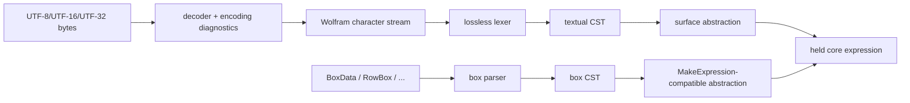

# Wolfram 语言兼容规范与 C++26 统一分阶段实现架构

调研基线：2026-07-15。目标命名空间：`Mashiro::WL`。工具链：COCA clang-p2996，
`-std=gnu++26 -freflection-latest`。

> 本文是一份兼容性规范与工程设计，不是 Wolfram Research 发布的官方语言标准。Wolfram Language 的公开资料
> 没有给出封闭、版本化、形式化的完整规范；本文以官方 CodeParser、官方在线文档、多个独立开源实现和真实
> Wolfram Kernel 的差分实验共同约束行为。凡无法由这些来源唯一确定之处，必须进入兼容 profile 或标为
> implementation-defined，不能凭直觉固化为“语言规则”。

## 1. 结论

这项工作的核心不是“写一个能读 `f[x]` 的解析器”，而是实现一个带输入变换、上下文解析、属性系统、模式语言、
有序定义数据库和可控副作用的符号计算语言。正确架构有以下十四条约束。

1. 前端必须分为 `bytes/boxes -> characters -> lossless tokens -> CST -> surface abstraction -> context resolution ->
   core expressions`。跳过 CST 会永久失去注释、空白、错误恢复和源码重写能力。
2. 规范目标必须版本化。默认 profile 建议为 `wl_15_0`；`latest` 只能是开发别名，不能写入持久化 artifact。
3. 语法应由声明式 operator schema 和少量专用 parselet 定义，而不是维护一份与实现脱节的 EBNF。
4. 表达式核心保持 Wolfram 的统一代数：`Atom | Expr(head, elements)`。不能为每个内建函数建立 C++ AST 子类。
5. 源码中的 `-`、`/`、隐式乘法、模式下划线、`;;` 和 `~f~` 都是表面构造；抽象后应归一到统一表达式。
6. 求值不是合流项重写系统，而是依赖顺序、定义历史、属性、上下文和副作用的状态化归约系统。
7. 定义环境至少分离 OwnValues、DownValues、SubValues、UpValues、NValues、DefaultValues、FormatValues、
   Messages、Options 和 Attributes；把它们压进一个规则向量会破坏优先级和失效粒度。
8. 模式是独立的可编译语言。`Flat`、`Orderless`、`OneIdentity`、序列空白、`Optional`、`Condition` 和
   `PatternTest` 必须进入 matcher IR，而不是散落在递归 `if` 中。
9. 编译期与运行期统一的是 grammar、schema、算法、IR 和语义，不是 owning container。静态固定容量对象与运行时
   arena 对象应共同投影为非拥有的 `ProgramView`。
10. 单源编译器内核用 `constexpr`；`consteval` 入口只负责强制常量求值、冻结 artifact 和提升诊断。
11. 编译期求值是带 effect 约束的 partial evaluation，结果为 `constant | residual | stage_error`，不是把完整交互式
    kernel 强塞进常量求值器。
12. 运行时表达式应不可变、结构共享并使用稳定整数句柄；热路径不使用递归 `std::variant`、虚函数和逐节点堆分配。
13. 只有经过 effect、类型、形状与数值语义证明的纯子图才能 lowering 到 Mashiro 数学 IR 或 MLIR；符号求值器
    不能被数值编译器反向污染。
14. 正确性的最终判据是对指定 Wolfram Kernel 版本的差分结果，并辅以开源实现测试、性质测试和覆盖引导 fuzzing。

## 2. 规范地位与兼容边界

### 2.1 规范性术语

本文使用下列证据等级。

| 等级 | 含义 | 处理方式 |
|---|---|---|
| `NORMATIVE` | 官方文档、官方 CodeParser 与目标 Kernel 结果一致 | 默认 profile 必须实现 |
| `OBSERVED` | 目标 Kernel 可重复观察，但公开文档缺失或错误 | 固定到具体 kernel profile，并保存 oracle case |
| `INFERRED` | 多个实现一致，尚未由目标 Kernel 充分覆盖 | 可实现，但必须保留差分测试和可替换策略 |
| `DESIGN` | Mashiro 的数据结构、API 或优化选择 | 不得冒充 Wolfram 语义 |
| `EXTENSION` | 超出 Wolfram 行为的显式扩展 | 默认关闭，语法和诊断必须可区分 |

文中的“必须”“应”“可以”分别对应不可违反的兼容要求、强烈建议和允许选择。公开文档与 Kernel 冲突时，以
目标 profile 的 Kernel 可观测行为为准，同时记录 discrepancy，不静默覆盖证据。

### 2.2 推荐兼容 profile

```cpp
enum class CompatibilityProfile : std::uint16_t {
    wl_13_1,
    wl_14_0,
    wl_14_1,
    wl_14_2,
    wl_15_0,
    mathics_compat,
    strict_mashiro
};
```

每个 profile 必须冻结以下内容：字符数据库版本、named character 映射、token 集、优先级、结合性、parselet 表、
表面抽象规则、context 规则、内建属性、系统定义快照、数字语义和已知 kernel quirks。`strict_mashiro` 只用于拒绝
含糊或历史遗留输入；它不是 Wolfram 兼容模式。

已知必须版本化的例子包括：`@@@` 在 13.1 起由 `Apply[..., {1}]` 攄象为 `MapApply`；`<->` 在 11.1/11.2/12.0
间经历名称和优先级变化；CodeParser 15.0 数据表还记录了 `Precedence[]` 返回值与真实解析行为不一致的操作符。

### 2.3 本规范覆盖什么

第一阶段规范对象是 textual InputForm 及其语义表达式；StandardForm Boxes 是独立输入通道，第二阶段纳入。覆盖范围：

| 子系统 | 本文状态 | 说明 |
|---|---|---|
| Unicode 字符、转义、named characters | 规范架构与分类 | 完整数据应由版本化表生成，不手抄到 C++ |
| textual lexer、CST、错误恢复 | 完整设计 | 保留所有 trivia 与损坏输入 |
| 操作符、函数调用、Part、Span、模式简写 | 完整核心规范 | 长名图形操作符由 operator schema 数据化 |
| symbol/context/package 名字解析 | 完整核心规范 | 与词法 symbol token 分离 |
| core expression、definitions、attributes | 完整架构 | 内建函数覆盖按阶段扩张 |
| pattern/rule/evaluation | 完整语义骨架 | 细节以 profile oracle corpus 逐步封闭 |
| Boxes/MakeExpression/MakeBoxes | 边界与主干设计 | 不承诺首期覆盖所有 notebook box |
| 数值塔与任意精度 | 表示和接口 | 算法库另行实现或接入成熟后端 |
| notebook front end、动态交互、云对象 | 不在首期 | 不属于 parser/runtime 核心 |

## 3. 开源实现调查

### 3.1 固定样本

| 实现 | 固定提交 | 许可证 | 本文采用的证据 | 不能照搬的部分 |
|---|---|---|---|---|
| WolframResearch/codeparser | `8c6f949`，2026-03-02 | MIT | 官方 token、precedence、parselet、lossless CST、恢复节点 | 主要是前端，不是完整 evaluator |
| Mathics3/mathics-core | `392a5b6`，2026-07-13 | GPL-3.0 | parser 说明、definitions、attributes、pattern/evaluator 顺序 | GPL 代码不得进入本项目；存在已知兼容 bug |
| Mathics3/Mathics3-scanner | `5e2f709`，2026-05-06 | GPL-3.0 | named characters、grouping、operator YAML 的覆盖审计 | 只提取事实并独立重建数据 |
| Symja | `6db632a`，2026-07-14 | 多许可证，相关模块需逐文件确认 | Java 大型 CAS、exact/pattern rule 分层、EvalEngine | 不能复制实现；语义覆盖偏向 Symja 自身 |
| Expreduce | `9c5d539`，2024-11-30 | MIT | 紧凑 head-first 表达式、Merkle hash、分配式 matcher | definition model 不完整，Orderless 路径组合爆炸 |
| Woxi | `4c4b927`，2026-07-14 | AGPL-3.0 | 活跃功能清单、WolframScript 差分 fuzzer、effect 分类 | 大型专用 AST enum 和巨型 evaluator 分派不宜采用 |
| mmaclone | `0a88646`，2016-10-19 | 未声明许可证 | 小型 Haskell 教学实现、架构反例 | 无许可证授权，不作为代码来源；作者亦承认扩展性问题 |

许可证规则是架构的一部分：MIT 样本可以在保留声明后复用；GPL/AGPL/LGPL/未声明样本只用于 clean-room 行为研究，
不得复制代码、表格排布或测试文本。语言事实不受代码版权保护，但具体实现表达受保护。每条导入数据都应记录 provenance、
生成脚本和许可证。

### 3.2 从实现比较得到的结论

CodeParser 的 C++ 前端采用 precedence climbing/Pratt 风格 parselet，输出保留 token 和错误的 CST，再由 Wolfram 层
aggregate/abstract。其 `Precedence.wl` 明言优先级“主要来自文档并按经验观察修正”，而且显式记录 discrepancy。
这证明公开的 `Precedence[]` 数字不能直接当作 parser 的全部真相。

Mathics parser 文档同样使用 precedence climbing，并明确指出隐式 `Times`、积分、Span 回溯和 Boxes 需要专门规则。
它记录了 `a;;!b` 应解析为 `Times[Span[a, All], Not[b]]`，而当时 Mathics 错误地解析为 `Span[a, Not[b]]`。因此，
“开源实现多数投票”不能替代真实 Kernel oracle。

Expreduce 把表达式实现为 head-first 有序数组并缓存 Merkle hash，证明统一表达式模型足够支撑实际 CAS；但其定义只有
DownValues 等有限字段，matcher 通过枚举 allocation 处理 Flat/Orderless，源码自身留下性能与完备性 TODO。Symja 的
`RulesData` 将无模式 exact rules 放入 hash table，将 pattern rules 按优先级保存，说明规则索引必须区分快速等值路径和
一般模式路径。Woxi 的差分 fuzzer 和 effect 分类值得采用，但其数千行功能增长最终集中到大型 enum 和分派函数，表明
“一个 builtin 一个 AST variant”没有可持续性。

## 4. 语言对象模型

### 4.1 三种不能混淆的对象

| 对象 | 例子 | 是否保留源码 | 是否可求值 |
|---|---|---|---|
| concrete syntax | token、注释、括号、缺失闭符、`a / b` 的斜杠 | 是 | 否 |
| surface expression | `DivideSurface(a,b)`、`PatternBlank(x,1,h)` | 可带 provenance | 仅用于抽象 |
| core expression | `Times[a, Power[b,-1]]`、`Pattern[x,Blank[h]]` | 通过 side table 关联 | 是 |

括号是 CST 节点而不是核心表达式；注释和空白是 token trivia 而不是 `Null`；语法错误是可恢复节点而不是 symbol；
`x_` 是表面模式简写，核心语义是 `Pattern[x, Blank[]]`。

### 4.2 统一表达式代数

语义域定义为最小不动点：

\[
\mathrm{Expr} = \mathrm{Atom} + \mathrm{Application}(\mathrm{Expr},\mathrm{Expr}^{*}).
\]

即任一非原子表达式都由一个任意表达式作为 head 和零个或多个 element 构成。`f[x,y]` 的 head 是 symbol `f`，但
`(g[a])[x]` 的 head 可以是表达式 `g[a]`；因此实现不能假定 head 总是 symbol。

语义原子至少包括：

| 原子族 | 典型值 | 说明 |
|---|---|---|
| `Symbol` | `System`Plus`、`Global`x` | 身份是完整 context name，不只是显示名 |
| `String` | `"abc"` | Unicode scalar sequence，保留源拼写在 CST |
| `Integer` | 任意精度整数 | 小整数可内联，溢出提升到 big integer pool |
| `Rational` | 既约有理数 | 语义原子；源码可能来自除法输入变换 |
| `Real` | machine 或 arbitrary precision | 必须保存 precision/accuracy 语义，不等同 `double` |
| `Complex` | 精确或近似复数 | 可用专用数值 payload，但逻辑 head 仍可观察为 `Complex` |
| `ByteArray` 等 opaque atom | 后续 profile | 必须由稳定 type tag 和受控外部资源表示 |

所有应用表达式保持 element 顺序。`Orderless` 的规范排序发生在求值步骤，不是容器自身无序。表达式不可变；任何重写
返回新根并复用未变化子树。

### 4.3 `SameQ`、结构相等与 hash

结构 hash 只能是快速拒绝条件，不能定义全部相等语义。要求：

1. 相同 profile 下，结构相等表达式必须有相同稳定 hash。
2. hash 必须包含 atom kind、数值精度、symbol 完整身份、head、arity 和有序 children。
3. `Real` 的 signed zero、NaN payload 与 arbitrary precision 语义按 profile 处理，不能直接依赖 C++ `==`。
4. 跨进程 artifact 使用固定算法和显式版本；进程内攻击面 hash table 使用独立随机 seed。
5. provenance、缓存标志和 arena 地址不得进入语义 hash。

## 5. 输入层与词法规范

### 5.1 输入通道



textual source 和 Boxes 不应在字符层强行统一。二者最终统一到 held core expression，但具有不同的分组、二维排版和
歧义规则。`SuperscriptBox[x,2]` 不是文本 `x^2` 的 token 序列；它通过 box semantics 变为表达式。

### 5.2 编码与字符

内部规范字符单位为 Unicode scalar value。解码器必须拒绝或产生 `UnsafeEncoding` 诊断：孤立 surrogate、超范围
code point、非法 UTF 序列和 profile 禁止的不可见控制字符。源 span 同时保存 byte offset 与 scalar/line-column 映射，
诊断不得用 UTF-8 byte offset 冒充用户列号。

Wolfram named character 形如 `\[Alpha]`。词法器应以版本化 perfect hash/trie 将名称映射到：code point、字符类别、
letterlike 属性、可能的 ASCII replacement、操作符 token 和 box 行为。完整长名表应由数据 artifact 生成，不能散落在
`switch(char32_t)` 中。

反斜杠输入还包括续行、字符编码和字符串转义。是否在字符串内、symbol 内或普通输入中决定其解释，因此转义处理是
lexer 状态的一部分，不能先做无上下文字符串替换。

### 5.3 trivia、注释与换行

空格、tab、内部换行、顶层换行和注释均进入 token stream。注释使用 `(* ... *)`，必须支持嵌套并对未闭合注释产生
覆盖到 EOF 的 error token。顶层换行可终止一条输入，而括号、方括号、花括号和未完成操作符内的换行一般是 trivia；
具体判定由 parser session 的 delimiter depth 与 operand expectation 共同决定。

隐式乘法依赖 token 邻接，但不能简单地把任意 whitespace 替换为 `*`。lexer 保留 trivia，parser 在“左侧可结束
operand 且右侧可开始 operand”的位置合成 `ImplicitTimes`，并排除 call、Part、operator continuation 和换行终止情形。

### 5.4 symbol 与 context token

symbol 的源拼写由一个或多个 context segment 和最终名称组成，反引号 `` ` `` 是 context 分隔符。词法阶段只验证
letterlike/digit 等字符结构并保留原文；名字解析阶段才结合 `$Context`、`$ContextPath`、显式绝对/相对 context 和已有
symbol 表决定完整身份。

必须区分：

```text
x                 当前 context 或 context path 中解析
System`Map        显式完整名
`Private`x        相对当前 context
Global`x          显式其他 context
```

同名显示不代表同一 symbol。symbol interning key 是规范化后的完整名称；源码拼写和解析路径保存在 provenance 中。

### 5.5 字符串

字符串由双引号界定，允许 profile 定义的反斜杠转义、named characters 和续行。lexer 输出单个 lossless string token，
payload 同时提供 raw slice 与延迟解码接口。未闭合字符串、非法 escape 和不安全编码是结构化诊断，不应吞掉后续整个文件。

字符串拼接 `<>` 是操作符，不在 lexer 中执行。字符串中的 `\!\( ... \)` 等历史线性语法应建模为独立 token/子语言，
首期可以诊断为 unsupported，但不得错误地当成普通字符。

### 5.6 数字

数字 scanner 至少识别：十进制整数、`base^^digits` 基数整数、小数点实数、`*^` 十进制指数、反引号 precision/accuracy
标记，以及相邻构造所需的最长匹配边界。推荐中间表示：

```cpp
struct NumberLexeme {
    SourceSpan raw;
    std::uint16_t radix;
    NumberClass category;
    SignificandSlice significand;
    std::int64_t exponent;
    PrecisionSpec precision;
};
```

lexer 不用 `strtod` 决定任意精度语义。十进制到 binary machine real、big real 和精度跟踪在 abstraction/numeric layer
完成。负号不是数字 token 的一部分；`-2` 是 prefix minus 表面节点。`1/2` 的斜杠也是操作符，随后可抽象或规范化为
有理数。任何 compile-time/runtime 路径必须共享同一 decimal conversion 算法，否则会出现阶段不一致。

### 5.7 其他叶输入

| 输入 | 初始 token/surface | 典型核心表达式 |
|---|---|---|
| `#`、`#2`、`#name` | slot | `Slot[1]`、`Slot[2]`、命名 slot |
| `##`、`##2` | slot sequence | `SlotSequence[1]`、`SlotSequence[2]` |
| `%`、`%%`、`%3` | output reference | `Out[-1]`、`Out[-2]`、`Out[3]` |
| `_`、`__`、`___` | blank family | `Blank[]`、`BlankSequence[]`、`BlankNullSequence[]` |
| `_.` | optional blank | `Optional[Blank[]]` |
| `<<file` | get surface | 依 profile 形成 `Get["file"]` |
| `expr >> file` | put surface | `Put[expr,"file"]` |

文件名 stringify 是 parser 专用规则，不应让一般 symbol/string lexer 猜测重定向语义。

## 6. 可执行表面语法

### 6.1 为什么不是一份孤立 EBNF

Wolfram textual grammar 同时包含数百个 named-character 操作符、不同 fixity 下复用的 token、隐式 `Times`、上下文相关
冒号、可省略端点的 Span、三元 `~`、积分的内外优先级和文件名 stringify。最精确且可测试的规范对象是：

```cpp
struct OperatorSpec {
    TokenKind token;
    Fixity fixity;
    BindingPower left;
    BindingPower right;
    Associativity associativity;
    SurfaceKind surface;
    ProfileRange profiles;
};
```

通用 Pratt 规则为：prefix parselet 产生左表达式；只要 lookahead 的 left binding power 不低于当前门槛，就调用对应
infix/postfix parselet；右结合操作符用较低的 right threshold，非结合操作符在同层重复时报错。所有表项在 consteval
block 中验证 token/fixity 唯一性、binding power 单调性、profile 覆盖和 lowering 完备性。

### 6.2 核心 textual grammar

下列 EBNF 只描述骨架，操作符集合与 binding power 由 operator schema 补全：

```ebnf
program       ::= trivia* top_expr? (top_separator top_expr?)* EOF ;
top_expr      ::= expression(min_binding_power) ;
expression(p) ::= prefix_or_primary (postfix_or_infix[p])* ;
primary       ::= atom | group | list | association | blank | slot | out_ref | integral ;
group         ::= '(' sequence? ')' ;
list          ::= '{' sequence? '}' ;
association   ::= '<|' sequence? '|>' ;
call          ::= expression '[' sequence? ']' ;
part          ::= expression '[[' sequence? ']]' ;
sequence      ::= expression (',' expression?)* ;
blank         ::= ('_' | '__' | '___') expression(high_binding_power)? ;
slot          ::= ('#' | '##') (integer | symbol_name)? ;
span          ::= expression? ';;' expression? (';;' expression?)? ;
infix_call    ::= expression '~' expression '~' expression ;
integral      ::= INTEGRAL expression(inner_bp) DIFFERENTIAL_D expression(outer_bp) ;
```

`expression?` 的缺省不是统一的 `Null`：Span 端点缺省为 `1`/`All`，trailing `;` 产生 `Null`，trailing comma 的行为
取决于所在 group 和 profile，缺失 operand 的恢复节点则不能偷偷变成语义值。

### 6.3 常用 ASCII 操作符层级

下表按由弱到强的真实绑定层级组织。数字取官方常见 `Precedence` 值作人类参考；parser 使用离散 binding power，且
profile 可修正文档数值与真实行为的 discrepancy。

| 层级/约值 | 输入 | fixity/结合 | 表面或核心含义 |
|---|---|---|---|
| 10 | `;` | infix/postfix，非右结合 | `CompoundExpression`，尾项缺省 `Null` |
| 30 | `>>`、`>>>` | infix | `Put`、`PutAppend`，右侧按文件名读取 |
| 40 | `=`、`:=`、`^=`、`^:=` | infix，右结合 | Set family |
| 介于 40 与 50 | `/:` | 专用三元/右结合 | tag assignment |
| 70 | `//` | infix | `Postfix[left,right]`，抽象为 `right[left]` |
| 75 | `//=` | infix，右结合 | `ApplyTo` |
| 80 | `:` | 上下文敏感 | Pattern/Optional/Colon |
| 90 | `&` | postfix | pure `Function` |
| 100 | `+=`、`-=`、`*=`、`/=` | infix，右结合 | in-place assignment family |
| 110 | `/.`、`//.` | infix | `ReplaceAll`、`ReplaceRepeated` |
| 120 | `->`、`:>` | infix，右结合 | `Rule`、`RuleDelayed` |
| 130 | `/;` | infix | `Condition` |
| 160 | `|` | flat-like infix | `Alternatives` |
| 170 | `..`、`...` | postfix | `Repeated`、`RepeatedNull` |
| 215--230 | `||`、`&&`、prefix `!` | infix/prefix | `Or`、`And`、`Not` |
| 250--305 | relation、`===`、`=!=`、`==`、`!=`、`<`、`<=`、`;;` | 多种 | 集合关系、SameQ、Inequality、Span |
| 310 | `+`、infix `-` | infix | `Plus`，减法 lowering 为加负项 |
| 400 | `*`、implicit Times | infix | `Times` |
| 470 | `/` | infix | divide surface，lowering 为 inverse product |
| 480 | prefix `+`、`-` | prefix | unary plus 消去；minus 变为 `Times[-1,x]` |
| 490--530 | `.`、`**` | infix | `Dot`、`NonCommutativeMultiply` 等 |
| 590 | `^` | infix，右结合 | `Power` |
| 600 | `<>` | infix | `StringJoin` |
| 610 | `'`、`!`、`!!` | postfix | `Derivative`、`Factorial`、`Factorial2` |
| 620 | `@@`、`@@@`、`/@`、`//@` | infix，右结合 | Apply/Map family |
| 630 | `a~f~b` | 专用三元 | `f[a,b]` |
| 640 | `@` | infix，右结合 | prefix application `f@x -> f[x]` |
| 更强 | `::`、`?`、`++`、`--`、call、Part | 混合 | MessageName、PatternTest、inc/dec、application |

完整 named-character 操作符不能靠这张摘要表实现。项目必须将 CodeParser 的
`Precedence.wl`、`PrefixParselets.wl`、`InfixParselets.wl` 与目标 Kernel oracle 转换为自有、版本化 schema；
导入过程只保留语言事实，并生成 provenance report。

### 6.4 必须专门实现的 parselet

| parselet | 原因 | 规范结果 |
|---|---|---|
| implicit Times | 没有显式 token，依赖 operand 边界 | 合成 provenance 标记的 `TimesSurface` |
| `:` | `x:default`、`patt:default`、named pattern 等上下文不同 | 根据左侧 surface category 选择 Pattern/Optional/Colon |
| Span `;;` | prefix/infix/postfix，端点可省略且需 lookahead/backtrack | `Span[start,end,step?]`，缺省 `1/All` |
| `~f~` | 两个同 token 分隔符，中间表达式成为 head | `CallSurface(f,{left,right})` |
| call/Part | `[` 和 `[[` 附着于任意左表达式 | application 或 `Part` |
| pattern blanks | `_h` 的 `h` 是 head constraint，不是隐式乘法 | Blank family + optional Pattern wrapper |
| integral | integrand 与 variable 使用不同 binding power | `Integrate[integrand,var]` 或相应 contour head |
| `/:` | tag、lhs、assignment operator 构成复合结构 | UpSet/TagSet family surface |
| `=.` | `=` 后的 dot 与一般 `.` 不同 | `Unset[lhs]` |
| `::` | 后续 name 具有 stringify 规则 | `MessageName[sym,"name"]` |
| top-level newline | 是否完成输入依赖 delimiter 和期待状态 | separator 或 trivia |
| recovery | closer/operand 缺失必须继续产生树 | 明确 Missing/Error CST node |

## 7. CST、抽象与输入变换

### 7.1 lossless green tree

CST 应采用不可变 green tree：token 和 node 只保存 kind、宽度、children、flags 与 hash；parent、绝对 offset 和语义查询
由按需 red view 提供。这样可同时支持 compile-time 全量 parse、runtime 增量 parse、IDE 重写和错误恢复。

建议节点族：

```text
TokenLeaf, TriviaRun, Group, Call, Part, Prefix, Infix, Postfix, Ternary,
CommaSequence, CompoundSequence, BlankForm, SlotForm, OutForm, IntegralForm,
MissingOperand, MissingCloser, UnexpectedCloser, Unterminated, Unsupported, ErrorRecovery
```

每个合成 token/node 带 `synthetic` 标志与零宽 insertion point；每个错误节点保存 expected token set、actual token、
recovery action 和 diagnostic id。parser 在错误后必须保证前进，不能无限重试同一 token。

### 7.2 recovery 策略

恢复按局部到全局排序：插入唯一可推断 closer；在 comma/semicolon/closer/top-level newline 同步；把意外 closer 包成节点；
最后消费一个 token 形成 error leaf。资源限制触发 `Aborted` diagnostic，而不是伪造 EOF。

恢复后的 CST 始终可遍历和重打印；只有无 fatal diagnostic 的 surface tree 才默认进入求值。IDE 可选择对含错误树做 best-effort
abstraction，但必须在结果上携带 taint，禁止静默执行。

### 7.3 关键 abstraction 规则

| source | held core expression |
|---|---|
| `f[x,y]` | `f[x,y]` |
| `(g[a])[x]` | `g[a][x]` |
| `{a,b}` | `List[a,b]` |
| `<|a->b|>` | `Association[Rule[a,b]]` |
| `a-b` | `Plus[a,Times[-1,b]]` |
| `a/b` | `Times[a,Power[b,-1]]` |
| `a b` | `Times[a,b]` |
| `a;` | `CompoundExpression[a,Null]` |
| `;;b` | `Span[1,b]` |
| `a;;` | `Span[a,All]` |
| `a;;b;;s` | `Span[a,b,s]` |
| `a~f~b` | `f[a,b]` |
| `f@x`、`x//f` | `f[x]` |
| `x_` | `Pattern[x,Blank[]]` |
| `x__h` | `Pattern[x,BlankSequence[h]]` |
| `x_.` | `Optional[Pattern[x,Blank[]]]` |
| `#1+#2&` | `Function[Plus[Slot[1],Slot[2]]]` |
| `f[[i,j]]` | `Part[f,i,j]` |
| `f''[x]` | `Derivative[2][f][x]` |

这些是 input transformation，不是一般 evaluator rewrite。若把它们延迟到普通规则系统，Hold、pattern 和 source mapping
都会得到错误行为。CST 保留原始写法，core 只保留规范形式，二者用 provenance map 关联。

### 7.4 parentheses 与 parse-time flattening

括号改变 grouping 并阻止某些 parse-time flattening，但它本身不进入 core。为了精确复现 `a+(b+c)` 与 `a+b+c` 在 held
状态下的结构差异，surface node 必须保留 `parenthesized` 标志，aggregate 只在操作符链没有显式分组边界时扁平化。
之后 evaluator 仍可依据 `Flat` 属性继续扁平化；这两个阶段不能混为一谈。

## 8. Context、名字与 package

名字解析输入为 surface symbol occurrence、当前 context、context path、已存在 symbol table 和 package scope。输出为稳定
`SymbolId` 及 resolution trace。推荐算法：显式完整名直接 intern；相对 context 展开；无 context 名依次检查当前 context 和
`$ContextPath` 中已存在 symbol；若均不存在，在当前 context 创建。精确顺序和 shadowing warning 进入 profile 测试。

`Begin`/`End`、`BeginPackage`/`EndPackage` 修改 session 的 context stack；`Needs`/`Get` 还涉及 IO 与 package registry，
属于 effectful runtime。编译期只能读取显式嵌入、内容寻址且列入构建依赖的 package，不允许隐式访问宿主文件系统。

symbol identity 与 definition ownership 分离：同一 `SymbolId` 的 definitions 可按 session overlay 修改；系统 prelude 是只读
base layer，用户定义是 persistent overlay。这样 snapshot、回滚、并行 kernel 和 partial-evaluation fingerprint 才可实现。

