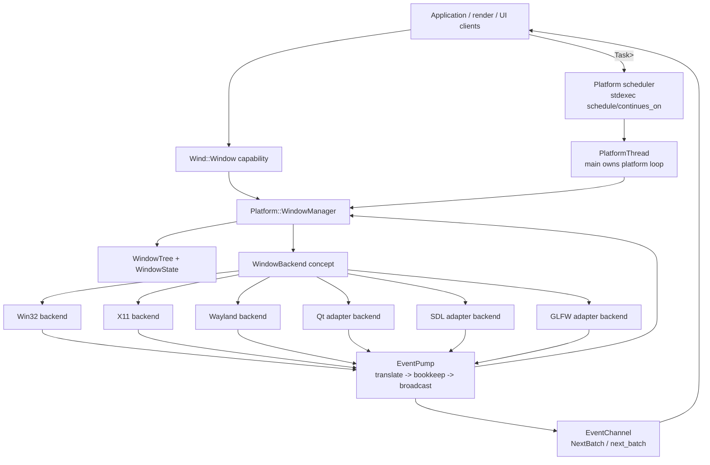

# Unified Window Management And Backend Lowering Implementation Plan

> **For agentic workers:** REQUIRED SUB-SKILL: Use superpowers:subagent-driven-development (recommended) or
> superpowers:executing-plans to implement this plan task-by-task. Steps use checkbox (`- [ ]`) syntax for tracking.

**Goal:** Build a unified, tree-structured, backend-neutral window-management layer for Mashiro, with one semantic
`WindowManager`, one application-facing `Window` capability object, one `SystemEvent` vocabulary, and backend-specific
native lowering for Win32, X11, Wayland, Qt, SDL, and GLFW.

**Architecture:** Window semantics live above native APIs. `WindowManager` owns identity, lifetime, tree topology,
state cache, native-handle mapping, and asynchronous control APIs. Backends lower requests into native objects and lift
native messages/callbacks into `SystemEvent`; they do not own application semantics. `EventPump` remains the single
bookkeep-before-broadcast boundary, and `EventChannel` remains the per-subscriber SPSC event endpoint.

**Tech Stack:** C++26, COCA clang-p2996, `-std=gnu++26 -freflection-latest`, static reflection, annotations,
consteval contract verification, concepts, stdexec senders/receivers, `exec::task`, coroutine APIs, `ChunkedSlotMap`,
`SeqLock`, `SpscRingBuffer`, `MpscQueue`, Catch2.

## Global Constraints

- Public headers use standard Doxygen `/** ... */` comments and 120-column formatting.
- Do not expose native backends as independent application object models.
- Do not introduce runtime registries, string-dispatch command catalogs, virtual event routers, or global mutable
  service locators.
- Compile-time-decidable routing, manager contract checks, backend capability checks, and event availability checks
  must be consteval, concept-based, or annotation-driven.
- Hot event transport remains allocation-free on the producer path; backend callbacks may allocate only where native
  APIs force ownership of variable-sized payloads.
- `SystemEvent` remains the canonical cross-backend event language; payload type remains the discriminator.
- `EventPump` order is fixed: native translation or external inbox drain, manager bookkeeping, subscriber broadcast.
- `WindowManager` methods that mutate native windows return `Platform::Task<Result<T>>` or `Platform::Task<VoidResult>`.
- Any-thread query methods use stable handles plus lock-free or bounded-contention snapshots; they do not schedule to
  the Platform thread.
- `main` is the Platform thread while `PlatformThread::Run()` is active.

---

## 1. Semantic Model

### 1.1 Closed object taxonomy

The window system has six entities. The names are deliberately not synonyms.

| Entity | Layer | Ownership | Purpose |
|---|---|---|---|
| `WindowId` | identity | value | Stable process-local identifier issued by `WindowManager`. |
| `Window` | application capability | non-owning handle | Ergonomic object used by application code to call `WindowManager`. |
| `WindowManager` | semantic owner | Platform thread | Owns state, topology, native mapping, policy, and async control APIs. |
| `WindowTree` | semantic data structure | `WindowManager` | Stores parent-child relations and derived propagation state. |
| `WindowBackend` | native lowering | Platform thread | Creates/destroys native windows and translates native events. |
| `SystemEvent` | event language | value | Backend-neutral facts consumed by managers and clients. |

`Window` must not own `HWND`, `wl_surface*`, `QWindow*`, `SDL_Window*`, or `GLFWwindow*`. Native handles are backend
facts. Application code holds a capability to request operations against a semantic window.

### 1.2 Window relation taxonomy

One field named `parent` is not sufficient because native APIs distinguish ownership, containment, popup placement, and
modal blocking differently. The semantic relation must be explicit.

```cpp
namespace Mashiro::Wind {

    enum class WindowRelation : std::uint8_t {
        Root,
        OwnedTopLevel,
        NativeChild,
        LogicalChild,
        Popup,
        Modal,
    };

    struct ParentLink {
        WindowId parent = WindowId::Invalid;
        WindowRelation relation = WindowRelation::Root;
    };

} /* namespace Mashiro::Wind */
```

The backend may lower `OwnedTopLevel` to a Win32 owner window, X11 transient-for property, Wayland transient parent,
`QWindow::setTransientParent`, or GLFW/SDL hints where available. `LogicalChild` never requires native containment; it
is a Mashiro semantic relation used for cascading lifecycle, visibility, focus policy, and input routing.

### 1.3 Tree propagation rules

The tree is a directed rooted forest. A process may own multiple root windows. Every non-root node has exactly one
semantic parent. Cycles are invalid and rejected before native creation.

| Parent action/event | Default child rule | Override point |
|---|---|---|
| Destroy | Post-order destroy children before retiring parent. | `ChildLifetimePolicy::DetachOnParentDestroy`. |
| Hide | Children enter inherited-hidden state; explicit child visible flag is preserved. | `VisibilityPolicy::Independent`. |
| Show | Children leave inherited-hidden state if their own visible flag is true. | `VisibilityPolicy::Independent`. |
| Minimize | Owned top-level and logical children are suppressed from input and rendering. | `MinimizePolicy::Independent`. |
| Restore | Recompute effective visibility and focus eligibility. | None; derived state only. |
| Move | Native child uses native positioning; logical child keeps semantic anchor. | `PlacementPolicy`. |
| Resize | Logical children may receive layout invalidation event, not automatic resize. | Future layout manager. |
| DPI scale change | Child inherits scale unless desc declares explicit scale policy. | `DpiPolicy::Explicit`. |
| Focus | Modal child blocks parent focus/input until dismissed. | `ModalPolicy`. |
| Enable/disable | Disabled parent suppresses input delivery to descendants. | `InputPolicy::Independent`. |

Effective state is derived from local state plus ancestor state:

```cpp
effectiveVisible = localVisible && allAncestorsVisible && !anyAncestorMinimized;
effectiveEnabled = localEnabled && allAncestorsEnabled && !blockedByModalDescendant;
effectiveDpiScale = explicitDpi ? localDpiScale : nearestAncestorDpiScale;
```

These are semantic invariants owned by `WindowManager`. Backends receive lowered operations after the derived state has
been computed.

---

## 2. Layered Architecture



The only legal vertical dependencies are:

| From | May depend on | Must not depend on |
|---|---|---|
| `Wind::Window` | `WindowId`, `WindowManager` forward declaration | Native handles, backend headers. |
| `WindowManager` | `WindowTypes`, `WindowTree`, `WindowBackend` concept, `SystemEvent` | Win32/X11/Qt concrete headers in public header. |
| Concrete backend | `NativeWindowCreateInfo`, `SystemEventConsumerRef`, `WindowManager` lookup view | Application `Window` object. |
| `EventPump` | `SystemEvent`, manager `On(const P&)` convention | Backend-specific event enums beyond translation unit. |
| `PlatformThread` | manager pack, scheduler, scope, stop source | Per-backend application API. |

---

## 3. Public API Target

### 3.1 Namespace placement

Use `Mashiro::Wind` for application-level window vocabulary. Use `Mashiro::Platform` for owner-thread managers and
native/backend infrastructure.

```cpp
namespace Mashiro::Wind {
    struct WindowDesc;
    class Window;
}

namespace Mashiro::Platform {
    class WindowManager;
}
```

`Mashiro::Window` must not be used as a namespace because it collides semantically with the `Window` class. Existing
`Mashiro/include/Mashiro/Surface/Window.h` should be moved or replaced by `Mashiro/include/Mashiro/Wind/Window.h` and
`Mashiro/include/Mashiro/Wind/WindowTypes.h`.

### 3.2 Application capability object

```cpp
namespace Mashiro::Wind {

    class Window final {
    public:
        Window() = default;

        [[nodiscard]] constexpr WindowId Id() const noexcept { return id_; }
        [[nodiscard]] constexpr explicit operator bool() const noexcept { return id_ != WindowId::Invalid; }

        [[nodiscard]] auto Destroy() const -> Platform::Task<VoidResult>;
        [[nodiscard]] auto SetTitle(std::string title) const -> Platform::Task<VoidResult>;
        [[nodiscard]] auto Show() const -> Platform::Task<VoidResult>;
        [[nodiscard]] auto Hide() const -> Platform::Task<VoidResult>;

    private:
        friend class Platform::WindowManager;
        constexpr Window(Platform::WindowManager& manager, WindowId id) noexcept : manager_(&manager), id_(id) {}

        Platform::WindowManager* manager_ = nullptr;
        WindowId id_ = WindowId::Invalid;
    };

} /* namespace Mashiro::Wind */
```

This object is intentionally small: one pointer plus one id. If later API ergonomics prefer pure handles, `Window` can
be replaced with `WindowHandle` without changing the manager/backend model.

### 3.3 WindowManager public surface

```cpp
namespace Mashiro::Platform {

    class [[=OnPlatformThread]] WindowManager final {
    public:
        [[nodiscard]] auto Create(Wind::WindowDesc desc) -> Task<Result<Wind::Window>>;
        [[nodiscard]] auto Destroy(WindowId id) -> Task<VoidResult>;
        [[nodiscard]] auto SetTitle(WindowId id, std::string title) -> Task<VoidResult>;
        [[nodiscard]] auto SetSize(WindowId id, ivec2 size) -> Task<VoidResult>;
        [[nodiscard]] auto SetMode(WindowId id, Wind::WindowMode mode) -> Task<VoidResult>;
        [[nodiscard]] auto Show(WindowId id) -> Task<VoidResult>;
        [[nodiscard]] auto Hide(WindowId id) -> Task<VoidResult>;
        [[nodiscard]] auto Reparent(WindowId child, Wind::ParentLink parent) -> Task<VoidResult>;

        [[nodiscard]] bool IsValid(WindowId id) const noexcept;
        [[nodiscard]] Wind::WindowSnapshot Snapshot(WindowId id) const noexcept;
        [[nodiscard]] ivec2 SizeOf(WindowId id) const noexcept;
        [[nodiscard]] float DpiScaleOf(WindowId id) const noexcept;
        [[nodiscard]] NativeWindowView NativeViewOf(WindowId id) const noexcept;

        [[nodiscard]] WindowId IdOf(NativeWindowHandle native) const noexcept;
        [[nodiscard]] NativeWindowHandle HandleOf(WindowId id) const noexcept;

        void On(const Event::WindowCreateEvent& ev) noexcept;
        void On(const Event::WindowResizeEvent& ev) noexcept;
        void On(const Event::WindowMoveEvent& ev) noexcept;
        void On(const Event::WindowDpiChangeEvent& ev) noexcept;
        void On(const Event::WindowFocusEvent& ev) noexcept;
        void On(const Event::WindowVisibilityChangeEvent& ev) noexcept;
        void On(const Event::WindowDestroyEvent& ev) noexcept;
    };

} /* namespace Mashiro::Platform */
```

`Create` and mutators are owner-thread operations. Queries are any-thread reads over snapshots. `IdOf` and `HandleOf`
remain available for backend translation and surface creation, but application code should prefer `Window`.

---

## 4. Backend Model

### 4.1 Backend capability record

Backends are selected statically where possible. Capability mismatch is rejected at compile time for impossible
configurations and at `Create` time for runtime-selected adapter backends.

```cpp
namespace Mashiro::Platform {

    struct WindowBackendCapabilities {
        bool nativeChildWindows = false;
        bool transientParent = false;
        bool modalParent = false;
        bool programmaticMove = false;
        bool programmaticResize = true;
        bool serverSideDecoration = false;
        bool clientSideDecoration = false;
        bool fractionalScale = false;
        bool rawMouseInput = false;
        bool imeCandidateWindow = false;
        bool dragDrop = false;
    };

    template<WindowBackendCapabilities Caps>
    struct WindowBackendCaps {
        static constexpr WindowBackendCapabilities value = Caps;
        constexpr bool operator==(const WindowBackendCaps&) const = default;
    };

} /* namespace Mashiro::Platform */
```

Use annotations on backend types:

```cpp
struct [[=WindowBackendCaps<WindowBackendCapabilities{
    .nativeChildWindows = true,
    .transientParent = true,
    .modalParent = true,
    .programmaticMove = true,
    .programmaticResize = true,
    .serverSideDecoration = true,
    .fractionalScale = false,
    .rawMouseInput = true,
    .imeCandidateWindow = true,
    .dragDrop = true,
}>{}]] Win32WindowBackend;
```

The annotation is not identity. It is a compile-time capability fact.

### 4.2 Backend concept

```cpp
namespace Mashiro::Platform {

    template<class B>
    concept WindowBackend = requires(B& backend, NativeWindowCreateInfo create, NativeWindowHandle handle,
                                     SystemEventConsumerRef emit, std::string_view title, ivec2 size) {
        typename B::native_handle_type;
        { B::Capabilities() } -> std::same_as<WindowBackendCapabilities>;
        { backend.CreateWindow(create) } -> std::same_as<Result<NativeWindowHandle>>;
        { backend.DestroyWindow(handle) } noexcept -> std::same_as<void>;
        { backend.SetTitle(handle, title) } -> std::same_as<Result<void>>;
        { backend.SetSize(handle, size) } -> std::same_as<Result<void>>;
        { backend.Show(handle) } -> std::same_as<Result<void>>;
        { backend.Hide(handle) } -> std::same_as<Result<void>>;
        { backend.DrainNative(emit) } noexcept;
        { backend.Wake() } noexcept;
    };

} /* namespace Mashiro::Platform */
```

The concept belongs in `Platform/WindowBackend.h`, not in every backend translation unit. Concrete backends must satisfy
it without virtual dispatch on the hot path. A type-erased fallback is acceptable only at process boundary or plugin ABI
boundary, neither of which is in scope for this plan.

### 4.3 NativeWindowCreateInfo as lowering IR

`WindowDesc` is user-facing. `NativeWindowCreateInfo` is backend-facing. The lowering is owned by `WindowManager` because
it uses tree policy and backend capabilities.

```cpp
namespace Mashiro::Platform {

    struct NativeWindowCreateInfo {
        WindowId id = WindowId::Invalid;
        NativeWindowHandle parentNative = nullptr;
        Wind::WindowRelation relation = Wind::WindowRelation::Root;
        std::string_view title;
        ivec2 size{};
        ivec2 position{};
        Wind::WindowMode mode = Wind::WindowMode::Windowed;
        Wind::WindowFlags flags = Wind::WindowFlags::Default;
        bool visible = true;
        bool inheritedHidden = false;
        float dpiScale = 1.0f;
    };

} /* namespace Mashiro::Platform */
```

The lowering has three passes:

1. Validate semantic relation: no cycle, parent exists, relation legal for requested window kind.
2. Compute effective state: visibility, enabledness, DPI scale, modality, native parent candidate.
3. Lower to backend capability: native child when supported, transient/owned top-level when supported, logical relation
   otherwise.

### 4.4 Backend matrix

| Backend | Event source | Native parent support | Main limitation | Mashiro policy |
|---|---|---|---|---|
| Win32 Native | message queue / WndProc | owner and `WS_CHILD` | synchronous re-entry during create/destroy | Fully native lowering where possible. |
| X11 Native | XCB/Xlib event queue | child windows and transient hints | WM compliance varies | Native parent for real child; logical fallback for policy. |
| Wayland Native | `wl_display` fd + xdg callbacks | transient/popup, not arbitrary tree | compositor controls move/resize/global position | Logical tree is primary; lower only supported relations. |
| Qt | Qt event loop callbacks | QObject parent and transient parent | Qt thread affinity and nested event loops | Adapter must run on Platform thread; no direct QObject leakage. |
| SDL | SDL event pump | limited parent properties | API abstracts too much native detail | Treat as lightweight native provider; logical tree primary. |
| GLFW | GLFW callbacks | limited transient/monitor APIs | global init and callback model | Treat as root/top-level provider; logical tree primary. |

Adapter backends may be useful for demos and portability, but the architectural baseline should be Win32 Native plus
Linux Native. Qt/SDL/GLFW must not define the semantic ceiling of the engine.

---

## 5. Event Model Extensions

### 5.1 Required payload additions

`SystemEvent.h` already has window lifecycle and state payloads. Tree semantics need a small number of additional
payloads.

```cpp
namespace Mashiro::Event::Wind {

    struct WindowParentChangeEvent : WindowSpecificEvent {
        WindowId oldParent = WindowId::Invalid;
        WindowId newParent = WindowId::Invalid;
        Wind::WindowRelation relation = Wind::WindowRelation::Root;
    };

    struct WindowEffectiveVisibilityChangeEvent : WindowSpecificEvent {
        bool visible = false;
        bool inherited = false;
    };

    struct WindowEffectiveEnableChangeEvent : WindowSpecificEvent {
        bool enabled = true;
        bool blockedByModal = false;
    };

    struct WindowLayoutInvalidatedEvent : WindowSpecificEvent {
        WindowId cause = WindowId::Invalid;
    };

} /* namespace Mashiro::Event::Wind */
```

Do not emit tree events for every internal recomputation. Emit only observable facts that clients need for rendering,
input, layout, or lifecycle. Internal propagation can update `WindowSnapshot` without broadcasting if no external
consumer needs the edge.

### 5.2 Dispatch invariant

For every `SystemEvent` payload `P`:

```text
native/backend record
    -> SystemEvent{P}
    -> EventPump::DispatchEvent
    -> WindowManager::On(const P&) if it exists
    -> other managers' On(const P&) if they exist
    -> EventChannel::TryPush(SystemEvent{P})
```

No backend may update `WindowManager` state directly after event materialisation. The only exception is the internal
create path before native event re-entry, where `WindowManager` allocates a semantic slot before calling the backend.

---

## 6. Compile-Time Mechanisms

### 6.1 Reflection-driven manager contract verification

Add a consteval verifier that checks:

- Platform-thread managers have `[[=OnPlatformThread]]`.
- Mutating public methods return `Task<Result<T>>` or `Task<VoidResult>`.
- Any-thread queries are `noexcept`.
- Bookkeep handlers have the exact shape `void On(const P&) noexcept`.
- No manager exposes concrete backend types in public signatures.

Sketch:

```cpp
namespace Mashiro::Platform::Detail {

    template<class M>
    consteval void VerifyWindowManagerContract() {
        constexpr auto type = ^^M;
        for (auto member : std::meta::members_of(type, std::meta::access_context::unchecked())) {
            if (!std::meta::is_function(member)) {
                continue;
            }

            constexpr auto name = std::meta::identifier_of(member);
            if constexpr (name == "On") {
                VerifyBookkeepHandler(member);
            } else if constexpr (IsPublicMutatorName(name)) {
                VerifyPlatformTaskReturn(member);
            } else if constexpr (IsAnyThreadQueryName(name)) {
                VerifyNoexcept(member);
            }
        }
    }

} /* namespace Mashiro::Platform::Detail */
```

Use constexpr exceptions in the verifier to produce direct diagnostics such as
`"WindowManager::SetTitle must return Task<VoidResult>"`.

### 6.2 Backend capability validation

Every backend type is checked once:

```cpp
template<class B>
consteval void VerifyWindowBackend() {
    static_assert(WindowBackend<B>);
    constexpr auto caps = BackendCapabilitiesOf<B>();
    if constexpr (!caps.programmaticResize) {
        throw "Window backend must support programmatic resize for Mashiro Platform baseline";
    }
}
```

For optional features, the verifier should not reject the backend. It should expose a capability predicate used by
lowering:

```cpp
template<class B>
consteval bool SupportsNativeRelation(Wind::WindowRelation relation) {
    constexpr auto caps = BackendCapabilitiesOf<B>();
    switch (relation) {
        case Wind::WindowRelation::NativeChild: return caps.nativeChildWindows;
        case Wind::WindowRelation::OwnedTopLevel: return caps.transientParent;
        case Wind::WindowRelation::Modal: return caps.modalParent;
        default: return true;
    }
}
```

### 6.3 Event availability pruning

`SystemEvent` already uses platform annotations. Extend the same approach to backend family annotations if needed:

```cpp
struct OnWindowBackend {
    WindowBackendBit set = WindowBackendBit_All;
    constexpr bool operator==(const OnWindowBackend&) const = default;
};
```

Do not introduce this annotation until a real event differs by backend family rather than OS/platform. Platform bits are
already sufficient for `WindowsOnly`, `LinuxOnly`, and `WaylandOnly`.

### 6.4 Static lowering tables

For backend-specific native message maps, use compile-time tables where the source API has numeric message identifiers.

Win32 example:

```cpp
template<UINT Msg>
consteval auto Win32MessageRoute();

consteval {
    Detail::VerifyMessageRoute<WM_SIZE, Event::WindowResizeEvent>();
    Detail::VerifyMessageRoute<WM_DPICHANGED, Event::WindowDpiChangeEvent>();
    Detail::VerifyMessageRoute<WM_DESTROY, Event::WindowDestroyEvent>();
}
```

Do not force this shape onto Wayland, Qt, SDL, or GLFW where callbacks are already typed by the library. The common
abstraction is backend event lifting into `SystemEvent`, not a universal numeric message table.

---

## 7. Data Structures

### 7.1 WindowState

```cpp
namespace Mashiro::Platform {

    struct WindowRuntimeState {
        bool alive = false;
        bool localVisible = false;
        bool effectiveVisible = false;
        bool localEnabled = true;
        bool effectiveEnabled = true;
        bool focused = false;
        bool minimized = false;
        bool maximized = false;
        bool fullscreen = false;
        bool occluded = false;
        float dpiScale = 1.0f;
        ivec2 size{};
        ivec2 position{};
    };

    struct WindowState {
        WindowId id = WindowId::Invalid;
        WindowId parent = WindowId::Invalid;
        Wind::WindowRelation relation = Wind::WindowRelation::Root;
        std::inplace_vector<WindowId, 16> children{};
        NativeWindowHandle native = nullptr;
        Wind::WindowDesc desc{};
        WindowRuntimeState runtime{};
    };

} /* namespace Mashiro::Platform */
```

Use `std::inplace_vector<WindowId, 16>` for the common child list. If a window exceeds the inline capacity, the design
can promote to a side vector, but that should be measured before adding complexity.

### 7.2 WindowSnapshot

Any-thread readers should receive a compact snapshot rather than references into manager internals.

```cpp
namespace Mashiro::Wind {

    struct WindowSnapshot {
        WindowId id = WindowId::Invalid;
        WindowId parent = WindowId::Invalid;
        WindowRelation relation = WindowRelation::Root;
        WindowMode mode = WindowMode::Windowed;
        ivec2 size{};
        ivec2 position{};
        float dpiScale = 1.0f;
        bool alive = false;
        bool visible = false;
        bool enabled = true;
        bool focused = false;
    };

} /* namespace Mashiro::Wind */
```

`WindowManager` writes snapshots through `SeqLock<WindowSnapshot>` for the first bounded set of live windows. Rare
overflow can use a slow mutex path. If this project later expects thousands of offscreen windows, replace the overflow
path with a chunked seqlock slab.

### 7.3 Native handle table

Reverse lookup from native handle to `WindowId` must be backend-owned in representation but manager-owned in semantics.
For Win32, the fastest path is still setting `GWLP_USERDATA` to a stable `WindowId` or state pointer during
`WM_NCCREATE`; the manager also keeps a fallback map for messages arriving before the association is complete.

For X11, use `xcb_window_t -> WindowId`.
For Wayland, use `wl_surface*` / `xdg_surface* -> WindowId`.
For Qt, use `QObject*` / `QWindow* -> WindowId`.
For SDL, use `SDL_WindowID -> WindowId`.
For GLFW, use `glfwSetWindowUserPointer(window, state)`.

---

## 8. Creation And Destruction Algorithms

### 8.1 Create

```text
Caller thread:
1. auto result = co_await platform.Windows().Create(desc)
2. Task initial suspension schedules body on platform scheduler.

Platform thread:
3. Validate desc: size, relation, parent existence, no tree cycle, backend capability.
4. Allocate WindowId and WindowState with native = nullptr, alive = false.
5. Insert tree edge if parent exists.
6. Compute effective inherited state.
7. Write initial WindowSnapshot through SeqLock.
8. Lower WindowDesc + tree/effective state into NativeWindowCreateInfo.
9. Call backend.CreateWindow(info).
10. If backend creation fails, remove tree edge, release state, write dead snapshot, return error.
11. Patch native handle into WindowState and native lookup table.
12. Mark alive = true and write live snapshot.
13. Emit or accept backend-emitted WindowCreateEvent.
14. Return Wind::Window{*this, id}.
```

Native APIs may re-enter during step 9. Therefore every handler must be correct while `native == nullptr` or while the
native mapping is only partially installed. The manager should prefer `WindowId` carried in creation user data over
reverse native lookup for creation-time events.

### 8.2 Destroy

```text
Caller thread:
1. co_await window.Destroy()

Platform thread:
2. Validate handle and load state.
3. Traverse children according to ChildLifetimePolicy.
4. For recursive destroy, destroy descendants in post-order.
5. Mark local state alive = false before native destroy.
6. Write dead/effectively-hidden snapshot.
7. Call backend.DestroyWindow(native).
8. Backend/native callback yields WindowDestroyEvent.
9. EventPump bookkeep removes native mapping and retires state.
10. Broadcast WindowDestroyEvent.
11. Resume caller.
```

`WindowCloseEvent` is advisory. It does not retire the slot. `WindowDestroyEvent` is the retirement signal.

---

## 9. File Structure

### 9.1 New files

| File | Responsibility |
|---|---|
| `Mashiro/include/Mashiro/Wind/WindowTypes.h` | Public window enums, flags, desc, relation, policies, snapshot. |
| `Mashiro/include/Mashiro/Wind/Window.h` | Application-facing `Wind::Window` capability object. |
| `Mashiro/include/Mashiro/Platform/WindowBackend.h` | Backend concepts, capabilities, native create info. |
| `Mashiro/include/Mashiro/Platform/WindowTree.h` | Internal tree algorithms and propagation helpers. |
| `Mashiro/src/Platform/WindowTree.cpp` | Non-template tree operations if needed. |
| `Mashiro/src/Platform/Backends/Win32WindowBackend.cpp` | Win32 window creation, native mutation, event lifting. |
| `Mashiro/src/Platform/Backends/X11WindowBackend.cpp` | X11 native backend. |
| `Mashiro/src/Platform/Backends/WaylandWindowBackend.cpp` | Wayland native backend. |
| `Mashiro/src/Platform/Backends/QtWindowBackend.cpp` | Optional Qt adapter backend. |
| `Mashiro/src/Platform/Backends/SdlWindowBackend.cpp` | Optional SDL adapter backend. |
| `Mashiro/src/Platform/Backends/GlfwWindowBackend.cpp` | Optional GLFW adapter backend. |
| `Mashiro/tests/Platform/WindowTreeTest.cpp` | Pure semantic tree and propagation tests. |
| `Mashiro/tests/Platform/WindowManagerContractTest.cpp` | Compile-time and source-level manager contract tests. |
| `Mashiro/tests/Platform/WindowBackendConceptTest.cpp` | Backend concept and capability checks. |
| `Mashiro/tests/Platform/WindowManagerLifecycleTest.cpp` | Create/destroy ordering with fake backend. |
| `Mashiro/tests/Platform/WindowEventPropagationTest.cpp` | Parent-child event/effective state propagation. |

### 9.2 Modified files

| File | Change |
|---|---|
| `Mashiro/include/Mashiro/Surface/Window.h` | Replace old placeholder or forward to `Mashiro/Wind/WindowTypes.h`. |
| `Mashiro/include/Mashiro/Platform/Managers/WindowManager.h` | Expand from registry to full semantic manager. |
| `Mashiro/include/Mashiro/Platform/SystemEvent.h` | Add parent/effective state payloads only if needed by tests. |
| `Mashiro/include/Mashiro/Platform/PlatformBackend.h` | Split native readiness from window backend lowering. |
| `Mashiro/src/Platform/Windows/PlatformBackendWindows.cpp` | Move window creation/lowering into Win32 backend file. |
| `Mashiro/include/Mashiro/Platform/ManagerSet.h` | Keep `WindowManager` in platform manager pack. |
| `Mashiro/include/Mashiro/Platform/PlatformThread.h` | Expose `Windows()`, scheduler, stop token, scope, channel attach. |
| `Mashiro/src/Platform/PlatformThread.cpp` | Store managers as members or stable run-frame object exposed by facade. |
| `Mashiro/CMakeLists.txt` and platform CMake fragments | Add backend targets and optional adapter switches. |

---

## 10. Implementation Tasks

### Task 1: Public Wind Vocabulary

**Files:**
- Create: `Mashiro/include/Mashiro/Wind/WindowTypes.h`
- Create: `Mashiro/include/Mashiro/Wind/Window.h`
- Modify: `Mashiro/include/Mashiro/Surface/Window.h`
- Test: `Mashiro/tests/Surface/WindowTest.cpp`

**Interfaces:**
- Produces: `Wind::WindowDesc`, `Wind::WindowFlags`, `Wind::WindowMode`, `Wind::WindowRelation`,
  `Wind::WindowSnapshot`, `Wind::Window`.
- Consumes: `WindowId`, `ivec2`, `Result`, `Platform::Task`.

- [ ] Write tests asserting default `WindowDesc` values, bitflag behavior, and `Window` bool/id semantics.
- [ ] Create `WindowTypes.h` with Doxygen file header, enums, flags, policies, and snapshots.
- [ ] Create `Window.h` with the small capability object and forwarding methods declared.
- [ ] Replace the old `Surface/Window.h` placeholder with compatibility includes or remove stale `namespace Window`.
- [ ] Run `Test.Surface.WindowTest`.
- [ ] Review all public naming: application vocabulary is `Wind`, manager vocabulary is `Platform`.

### Task 2: WindowBackend Concept And Capabilities

**Files:**
- Create: `Mashiro/include/Mashiro/Platform/WindowBackend.h`
- Test: `Mashiro/tests/Platform/WindowBackendConceptTest.cpp`

**Interfaces:**
- Produces: `NativeWindowHandle`, `NativeWindowView`, `NativeWindowCreateInfo`,
  `WindowBackendCapabilities`, `WindowBackend` concept.
- Consumes: `Wind::WindowDesc`, `SystemEventConsumerRef`, `Result`.

- [ ] Write a fake backend in the test that satisfies `WindowBackend`.
- [ ] Write a negative compile probe for a backend missing `DrainNative`.
- [ ] Implement `WindowBackendCapabilities` and `NativeWindowCreateInfo`.
- [ ] Implement `WindowBackend` concept with exact required operations.
- [ ] Add consteval `VerifyWindowBackend<B>()`.
- [ ] Run backend concept tests and negative compile probe.

### Task 3: WindowTree Pure Semantics

**Files:**
- Create: `Mashiro/include/Mashiro/Platform/WindowTree.h`
- Create: `Mashiro/src/Platform/WindowTree.cpp` if non-template operations grow beyond header size.
- Test: `Mashiro/tests/Platform/WindowTreeTest.cpp`

**Interfaces:**
- Produces: cycle detection, insert/remove edge, post-order traversal, propagation computation.
- Consumes: `WindowId`, `Wind::WindowRelation`, propagation policy enums.

- [ ] Test root insertion, child insertion, cycle rejection, detach, recursive destroy order.
- [ ] Test effective visibility under hide/show/minimize.
- [ ] Test modal blocking: parent becomes effectively disabled while modal child is active.
- [ ] Implement tree storage helper with deterministic traversal order.
- [ ] Keep tree algorithms native-handle-free.
- [ ] Run `WindowTreeTest`.

### Task 4: WindowManager State Storage

**Files:**
- Modify: `Mashiro/include/Mashiro/Platform/Managers/WindowManager.h`
- Test: `Mashiro/tests/Platform/WindowManagerLifecycleTest.cpp`

**Interfaces:**
- Produces: `WindowState`, `AdoptPrepared`, `Retire`, `Snapshot`, `NativeViewOf`, `IdOf`, `HandleOf`.
- Consumes: `WindowTree`, `SeqLock`, `ChunkedSlotMap`.

- [ ] Build tests with a fake backend and direct `WindowManager` state transitions.
- [ ] Replace flat vector registry with stable state storage.
- [ ] Add native handle reverse lookup abstraction.
- [ ] Add snapshot seqlock writes on create, resize, move, dpi, visibility, destroy.
- [ ] Preserve `IdOf` and `HandleOf` semantics for `PlatformBackendWindows.cpp` migration.
- [ ] Run lifecycle tests.

### Task 5: WindowManager Async API

**Files:**
- Modify: `Mashiro/include/Mashiro/Platform/Managers/WindowManager.h`
- Modify: `Mashiro/src/Platform/PlatformThread.cpp`
- Test: `Mashiro/tests/Platform/WindowManagerLifecycleTest.cpp`

**Interfaces:**
- Produces: `Create`, `Destroy`, `SetTitle`, `SetSize`, `Show`, `Hide`, `Reparent`.
- Consumes: `Platform::Task`, platform scheduler binding, backend concept.

- [ ] Add fake-backend test: `co_await Create(desc)` returns a valid `Wind::Window`.
- [ ] Add fake-backend test: `Destroy` recursively destroys children in post-order.
- [ ] Implement mutators as `Task<Result<T>>` / `Task<VoidResult>`.
- [ ] Enforce that method bodies run on Platform thread by scheduler affinity, not explicit lock.
- [ ] Add invalid-handle error returns.
- [ ] Run lifecycle tests.

### Task 6: PlatformThread Facade Exposure

**Files:**
- Modify: `Mashiro/include/Mashiro/Platform/PlatformThread.h`
- Modify: `Mashiro/src/Platform/PlatformThread.cpp`
- Test: `Mashiro/tests/Platform/PlatformThreadIntegrationTest.cpp`

**Interfaces:**
- Produces: `PlatformThread::Windows()`, `AttachChannel`, `Scheduler`, `StopToken`, `Scope`.
- Consumes: manager run-frame lifetime, `EventPump`, `EventChannel`.

- [ ] Add tests asserting `WhenReady` and `Windows()` lifetime behavior.
- [ ] Move managers into a stable run-frame owned by `PlatformThread` while `Run()` is active.
- [ ] Expose references only when running; before startup, return a sender or fail fast by contract.
- [ ] Keep shutdown order: request stop, drain pump, join scope, unpublish channels, destroy managers on owner thread.
- [ ] Run platform integration test with fake backend if real windows are unavailable in CI.

### Task 7: Event Payload Extension

**Files:**
- Modify: `Mashiro/include/Mashiro/Platform/SystemEvent.h`
- Test: `Mashiro/tests/Platform/SystemEventTest.cpp`
- Test: `Mashiro/tests/Platform/WindowEventPropagationTest.cpp`

**Interfaces:**
- Produces: optional parent/effective-state payloads.
- Consumes: reflection variant materialisation and `WindowScoped` concept.

- [ ] Add tests proving new payloads appear in `SystemEvent`.
- [ ] Add tests proving `WindowOf` works for new payloads.
- [ ] Add only payloads with immediate consumers.
- [ ] Verify `NameOf` returns type names and no numeric kind table is reintroduced.
- [ ] Run `SystemEventTest`.

### Task 8: EventPump Bookkeeping For Tree Events

**Files:**
- Modify: `Mashiro/include/Mashiro/Platform/EventPump.h`
- Modify: `Mashiro/include/Mashiro/Platform/Managers/WindowManager.h`
- Test: `Mashiro/tests/Platform/EventPumpTest.cpp`
- Test: `Mashiro/tests/Platform/WindowEventPropagationTest.cpp`

**Interfaces:**
- Produces: bookkeep-before-broadcast for new window tree payloads.
- Consumes: `Traits::Event::HandlesBookkeep<M, P>`.

- [ ] Add fake manager test verifying `On(const WindowParentChangeEvent&)` runs before channel broadcast.
- [ ] Add test where client receives an effective visibility event and `WindowManager::Snapshot` already reflects it.
- [ ] Keep dispatch structural: no runtime registration and no `IEventConsumer`.
- [ ] Run `EventPumpTest`.

### Task 9: Win32 Backend Split

**Files:**
- Create: `Mashiro/src/Platform/Backends/Win32WindowBackend.cpp`
- Modify: `Mashiro/src/Platform/Windows/PlatformBackendWindows.cpp`
- Modify: `Mashiro/include/Mashiro/Platform/PlatformBackend.h`
- Test: `Mashiro/tests/Platform/PlatformBackendTest.cpp`

**Interfaces:**
- Produces: `Win32WindowBackend` satisfying `WindowBackend`.
- Consumes: existing Win32 event lifting helpers and `WindowManager::IdOf`.

- [ ] Move native window create/destroy/mutation helpers out of `PlatformBackendWindows.cpp`.
- [ ] Keep readiness/wait/wake/native queue drain in `PlatformBackendWindows.cpp`.
- [ ] Ensure `WM_NCCREATE` receives `WindowId` and establishes native mapping.
- [ ] Ensure `WM_DESTROY` emits `WindowDestroyEvent` and bookkeep retires the slot.
- [ ] Run focused Win32 backend tests under COCA toolchain.

### Task 10: Linux Native Backend Skeletons

**Files:**
- Create: `Mashiro/src/Platform/Backends/X11WindowBackend.cpp`
- Create: `Mashiro/src/Platform/Backends/WaylandWindowBackend.cpp`
- Modify: `Mashiro/src/Platform/Linux/PlatformBackendLinux.cpp`
- Test: `Mashiro/tests/Platform/WindowBackendConceptTest.cpp`

**Interfaces:**
- Produces: compile-time-valid native Linux backend skeletons.
- Consumes: `WindowBackend` concept and capability annotations.

- [ ] Implement no-window smoke skeleton behind CMake feature flags if dev libraries are absent.
- [ ] Make X11 and Wayland capability sets distinct.
- [ ] Route Linux readiness through display fd plus eventfd wake.
- [ ] Do not block Win32 build on Linux dependencies.
- [ ] Add compile-only tests for concept satisfaction under Linux CI.

### Task 11: Qt, SDL, GLFW Adapter Backends

**Files:**
- Create: `Mashiro/src/Platform/Backends/QtWindowBackend.cpp`
- Create: `Mashiro/src/Platform/Backends/SdlWindowBackend.cpp`
- Create: `Mashiro/src/Platform/Backends/GlfwWindowBackend.cpp`
- Modify: CMake backend option files.
- Test: backend concept compile tests.

**Interfaces:**
- Produces: optional adapter backends.
- Consumes: `WindowBackend` concept.

- [ ] Add CMake options `MASHIRO_PLATFORM_BACKEND_QT`, `MASHIRO_PLATFORM_BACKEND_SDL`, `MASHIRO_PLATFORM_BACKEND_GLFW`.
- [ ] Implement adapters as optional targets with no dependency unless option is enabled.
- [ ] Ensure Qt adapter uses Platform thread as Qt GUI owner thread.
- [ ] Ensure SDL/GLFW adapters do not expose their window pointer in public API.
- [ ] Run concept tests for each enabled adapter.

### Task 12: Compile-Time Contract Probes

**Files:**
- Create: `Mashiro/tests/Platform/WindowManagerContractTest.cpp`
- Add: CMake try-compile probes.

**Interfaces:**
- Produces: compile-fail checks for bad manager/backend definitions.
- Consumes: consteval verifiers.

- [ ] Negative probe: mutating manager method returns plain `Result<T>` instead of `Task<Result<T>>`.
- [ ] Negative probe: bookkeep handler is not `noexcept`.
- [ ] Negative probe: backend exposes missing `Wake`.
- [ ] Positive probe: `WindowManager` and fake backend pass all checks.
- [ ] Run CMake configure and contract tests.

### Task 13: End-To-End Window Creation Demo

**Files:**
- Modify: `Mashiro/demos/Playground/Main.cpp`
- Add or modify: `Mashiro/demos/Playground/WindowTreeDemo.cpp`

**Interfaces:**
- Produces: executable example using `platform.Windows().Create`, `EventChannel::NextBatch`, child windows.
- Consumes: complete manager/backend/event stack.

- [ ] Create root window.
- [ ] Create logical child or modal child.
- [ ] Hide parent and assert child effective visibility changes through event batch.
- [ ] Destroy parent and observe child destroy before parent destroy.
- [ ] Use `NextBatch` as the only event drain API in the demo loop.

### Task 14: Documentation Update

**Files:**
- Modify: `docs/superpowers/specs/2026-06-11-platform-thread-infrastructure-design.md`
- Create: `docs/superpowers/specs/2026-06-24-unified-window-management-design.md`

**Interfaces:**
- Produces: canonical design documentation.
- Consumes: implemented interfaces and tests.

- [ ] Document semantic taxonomy.
- [ ] Document backend capability matrix.
- [ ] Document tree propagation rules.
- [ ] Document create/destroy ordering.
- [ ] Document what is current implementation and what is future extension.
- [ ] Keep terminology consistent: `Wind::Window`, `Platform::WindowManager`, `WindowBackend`, `SystemEvent`.

---

## 11. Testing Strategy

| Test | Backend | Required assertion |
|---|---|---|
| `WindowTreeTest` | none | Tree insertion, cycle rejection, propagation, post-order destroy. |
| `WindowManagerLifecycleTest` | fake backend | Create/destroy state ordering and snapshot correctness. |
| `WindowBackendConceptTest` | fake + enabled real backends | Concept and capability annotations are correct. |
| `WindowManagerContractTest` | compile probes | Bad manager/backend definitions fail at compile time. |
| `EventPumpTest` | fake events | Bookkeep precedes broadcast for all window payloads. |
| `EventChannelTest` | none | `NextBatch` drains atomic batch without caller-side `TryPop` loops. |
| `PlatformThreadIntegrationTest` | fake or native backend | Cross-thread create, event observe, stop, scope join. |
| Win32 backend smoke | Win32 | Create native window, receive resize/destroy, no invalid HWND lookup. |

CI should include fake-backend tests on all platforms. Native backend tests may be gated by display availability.

---

## 12. Review Gates

### Gate A: Semantic boundary

- `Wind::Window` contains no native handle.
- `WindowManager` public header contains no Win32/X11/Qt/SDL/GLFW concrete type.
- Backends do not update `WindowManager` after producing `SystemEvent`; `EventPump` remains the bookkeep boundary.

### Gate B: Performance

- Event broadcast path allocates no heap memory for trivially movable payloads.
- `EventPump::DispatchEvent` still compiles to direct `On(const P&)` calls pruned by `if constexpr`.
- Any-thread queries do not schedule to Platform thread.
- Backend capability selection for built-in backend is compile-time.

### Gate C: Correctness

- Parent-child relation cannot form a cycle.
- Destroy order is post-order for recursive policy.
- `WindowDestroyEvent` is broadcast after slot is logically invalid.
- `WindowCloseEvent` does not destroy or retire a slot.
- Create re-entry is safe while native handle is partially installed.

### Gate D: Portability

- Wayland backend is not forced to implement arbitrary native child windows.
- SDL/GLFW adapters are not treated as full semantic owners.
- Qt adapter honors single GUI owner thread.
- Linux build does not require Qt/SDL/GLFW unless corresponding options are enabled.

---

## 13. Implementation Order

1. Public `Wind` vocabulary.
2. Backend concept and fake backend.
3. Pure `WindowTree`.
4. `WindowManager` state storage.
5. `WindowManager` async API.
6. `PlatformThread` facade exposure.
7. Event payload additions.
8. EventPump tree bookkeeping tests.
9. Win32 backend split.
10. Linux backend skeletons.
11. Optional adapter backend targets.
12. Compile-time contract probes.
13. End-to-end demo.
14. Spec update.

This order keeps every step testable. It also avoids starting with Win32 details before the semantic model is stable.

---

## 14. Self-Review

### Spec coverage

- Owner-thread model: covered by `PlatformThread`, scheduler, and manager API tasks.
- Unified event mechanism: covered by `SystemEvent`, `EventPump`, `EventChannel`, and propagation tests.
- Multi-backend support: covered by `WindowBackend` concept, capability matrix, native and adapter backend tasks.
- Window tree: covered by `WindowTree`, propagation rules, lifecycle algorithms, and tests.
- Parent affects child: covered by propagation table, effective state, destroy order, modal blocking, DPI inheritance.
- C++20-26 features: concepts, annotations, consteval verifiers, reflection-driven checks, stdexec, coroutine tasks,
  `std::inplace_vector`, and contracts are assigned to concrete sites.

### Placeholder scan

The plan avoids unspecified "handle edge cases" tasks. Each task has files, interfaces, test targets, and acceptance
conditions. Backend adapter internals depend on optional third-party availability, so they are intentionally scoped as
optional CMake-gated adapters rather than baseline blockers.

### Type consistency

Application namespace is `Mashiro::Wind`. Owner-thread manager namespace is `Mashiro::Platform`. Event payloads remain
under `Mashiro::Event::Wind`. Native lowering uses `Platform::NativeWindowCreateInfo` and `Platform::WindowBackend`.

