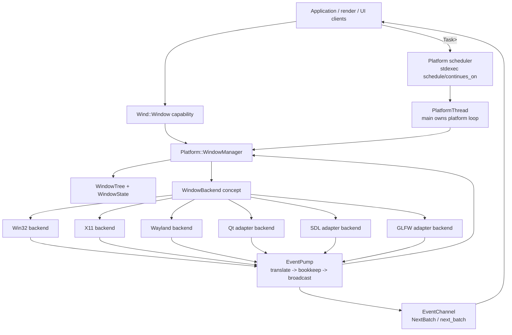

# Unified Window Management And Backend Lowering 中文实施计划

> **For agentic workers:** REQUIRED SUB-SKILL: Use superpowers:subagent-driven-development (recommended) or
> superpowers:executing-plans to implement this plan task-by-task. Steps use checkbox (`- [ ]`) syntax for tracking.

**Goal:** 为 Mashiro 构建统一的、tree-structured 的、backend-neutral 的 Window management layer。目标形态是一个语义
`WindowManager`、一个 application-facing `Window` capability object、一个 `SystemEvent` vocabulary，以及针对 Win32、
X11、Wayland、Qt、SDL、GLFW 的 backend-specific native lowering。

**Architecture:** Window semantics 位于 native APIs 之上。`WindowManager` 负责 identity、lifetime、tree topology、
state cache、native-handle mapping 与 asynchronous control APIs。Backend 只负责把 semantic request lower 到 native
objects，并把 native messages/callbacks lift 为 `SystemEvent`；backend 不拥有 application semantics。`EventPump`
保持唯一的 bookkeep-before-broadcast boundary，`EventChannel` 保持每个 subscriber 一个 SPSC event endpoint。

**Tech Stack:** C++26、COCA clang-p2996、`-std=gnu++26 -freflection-latest`、static reflection、annotations、
consteval contract verification、concepts、stdexec senders/receivers、`exec::task`、coroutine APIs、
`ChunkedSlotMap`、`SeqLock`、`SpscRingBuffer`、`MpscQueue`、Catch2。

## Global Constraints

- Public headers 使用标准 Doxygen `/** ... */` comments，代码行宽 120。
- Native backends 不得暴露为彼此独立的 application object models。
- 不引入 runtime registries、string-dispatch command catalogs、virtual event routers、global mutable service locators。
- 可以在 compile time 决定的 routing、manager contract checks、backend capability checks、event availability checks，
  必须通过 consteval、concept 或 annotation-driven 机制完成。
- Hot event transport 的 producer path 不得发生 heap allocation；backend callbacks 仅在 native APIs 强制拥有
  variable-sized payloads 时允许 allocation。
- `SystemEvent` 保持 canonical cross-backend event language；payload type 保持 discriminator。
- `EventPump` order 固定为 native translation 或 external inbox drain、manager bookkeeping、subscriber broadcast。
- 修改 native windows 的 `WindowManager` methods 返回 `Platform::Task<Result<T>>` 或 `Platform::Task<VoidResult>`。
- Any-thread query methods 使用 stable handles 加 lock-free 或 bounded-contention snapshots；不得 schedule 到
  Platform thread。
- `PlatformThread::Run()` active 时，`main` 是 Platform thread。

---

## 1. Semantic Model

### 1.1 Closed object taxonomy

Window system 由六个 entity 构成。名称不是同义词，不能互换。

| Entity | Layer | Ownership | Purpose |
|---|---|---|---|
| `WindowId` | identity | value | 由 `WindowManager` 分配的 stable process-local identifier。 |
| `Window` | application capability | non-owning handle | Application code 用于调用 `WindowManager` 的 ergonomic object。 |
| `WindowManager` | semantic owner | Platform thread | 拥有 state、topology、native mapping、policy 与 async control APIs。 |
| `WindowTree` | semantic data structure | `WindowManager` | 存储 parent-child relations 与 derived propagation state。 |
| `WindowBackend` | native lowering | Platform thread | 创建、销毁 native windows，并翻译 native events。 |
| `SystemEvent` | event language | value | Backend-neutral facts，由 managers 与 clients 消费。 |

`Window` 不得拥有 `HWND`、`wl_surface*`、`QWindow*`、`SDL_Window*` 或 `GLFWwindow*`。Native handles 是 backend facts。
Application code 持有的是一个对 semantic window 发起 operation 的 capability。

### 1.2 Window relation taxonomy

单一 `parent` field 无法表达真实窗口系统。Native APIs 区分 ownership、containment、popup placement 与 modal blocking。
因此 semantic relation 必须显式建模。

```cpp
namespace Mashiro::Wind {

    enum class WindowRelation : std::uint8_t {
        Root,
        OwnedTopLevel,
        NativeChild,
        LogicalChild,
        Popup,
        Modal,
    };

    struct ParentLink {
        WindowId parent = WindowId::Invalid;
        WindowRelation relation = WindowRelation::Root;
    };

} /* namespace Mashiro::Wind */
```

Backend 可以把 `OwnedTopLevel` lower 为 Win32 owner window、X11 transient-for property、Wayland transient parent、
`QWindow::setTransientParent`，或者 GLFW/SDL 能表达的 hint。`LogicalChild` 不要求 native containment；它是 Mashiro 的
semantic relation，用于 cascading lifecycle、visibility、focus policy 与 input routing。

### 1.3 Tree propagation rules

Window tree 是 directed rooted forest。一个 process 可以拥有多个 root windows。每个 non-root node 恰有一个 semantic
parent。Cycle 是非法状态，必须在 native creation 前拒绝。

| Parent action/event | Default child rule | Override point |
|---|---|---|
| Destroy | 以 post-order destroy children，再 retire parent。 | `ChildLifetimePolicy::DetachOnParentDestroy`。 |
| Hide | Children 进入 inherited-hidden state；child 自身的 visible flag 保留。 | `VisibilityPolicy::Independent`。 |
| Show | 若 child 自身 visible flag 为 true，则 child 离开 inherited-hidden state。 | `VisibilityPolicy::Independent`。 |
| Minimize | Owned top-level 与 logical children 被排除出 input/rendering eligibility。 | `MinimizePolicy::Independent`。 |
| Restore | 重新计算 effective visibility 与 focus eligibility。 | 无；仅更新 derived state。 |
| Move | Native child 使用 native positioning；logical child 保持 semantic anchor。 | `PlacementPolicy`。 |
| Resize | Logical children 接收 layout invalidation，而不是自动 resize。 | Future layout manager。 |
| DPI scale change | Child 继承 scale，除非 desc 声明 explicit scale policy。 | `DpiPolicy::Explicit`。 |
| Focus | Modal child 阻塞 parent focus/input，直到 modal child dismiss。 | `ModalPolicy`。 |
| Enable/disable | Disabled parent 抑制 descendant input delivery。 | `InputPolicy::Independent`。 |

Effective state 由 local state 与 ancestor state 派生：

```cpp
effectiveVisible = localVisible && allAncestorsVisible && !anyAncestorMinimized;
effectiveEnabled = localEnabled && allAncestorsEnabled && !blockedByModalDescendant;
effectiveDpiScale = explicitDpi ? localDpiScale : nearestAncestorDpiScale;
```

这些 invariant 由 `WindowManager` 拥有。Backend 只接收派生状态已经计算完成后的 lowered operations。

---

## 2. Layered Architecture



合法依赖关系如下。

| From | May depend on | Must not depend on |
|---|---|---|
| `Wind::Window` | `WindowId`、`WindowManager` forward declaration | Native handles、backend headers。 |
| `WindowManager` | `WindowTypes`、`WindowTree`、`WindowBackend` concept、`SystemEvent` | Public header 中的 Win32/X11/Qt/SDL/GLFW concrete headers。 |
| Concrete backend | `NativeWindowCreateInfo`、`SystemEventConsumerRef`、`WindowManager` lookup view | Application `Window` object。 |
| `EventPump` | `SystemEvent`、manager `On(const P&)` convention | Translation unit 之外的 backend-specific event enums。 |
| `PlatformThread` | manager pack、scheduler、scope、stop source | Per-backend application API。 |

---

## 3. Public API Target

### 3.1 Namespace placement

Application-level window vocabulary 使用 `Mashiro::Wind`。Owner-thread managers 与 native/backend infrastructure 使用
`Mashiro::Platform`。

```cpp
namespace Mashiro::Wind {
    struct WindowDesc;
    class Window;
}

namespace Mashiro::Platform {
    class WindowManager;
}
```

`Mashiro::Window` 不应作为 namespace 使用，因为它与 `Window` class 在语义上冲突。现有
`Mashiro/include/Mashiro/Surface/Window.h` 应移动或替换为 `Mashiro/include/Mashiro/Wind/Window.h` 与
`Mashiro/include/Mashiro/Wind/WindowTypes.h`。

### 3.2 Application capability object

```cpp
namespace Mashiro::Wind {

    class Window final {
    public:
        Window() = default;

        [[nodiscard]] constexpr WindowId Id() const noexcept { return id_; }
        [[nodiscard]] constexpr explicit operator bool() const noexcept { return id_ != WindowId::Invalid; }

        [[nodiscard]] auto Destroy() const -> Platform::Task<VoidResult>;
        [[nodiscard]] auto SetTitle(std::string title) const -> Platform::Task<VoidResult>;
        [[nodiscard]] auto Show() const -> Platform::Task<VoidResult>;
        [[nodiscard]] auto Hide() const -> Platform::Task<VoidResult>;

    private:
        friend class Platform::WindowManager;
        constexpr Window(Platform::WindowManager& manager, WindowId id) noexcept : manager_(&manager), id_(id) {}

        Platform::WindowManager* manager_ = nullptr;
        WindowId id_ = WindowId::Invalid;
    };

} /* namespace Mashiro::Wind */
```

该 object 有意保持小型化：一个 pointer 加一个 id。若后续 API ergonomics 更偏向 pure handle，可以把 `Window` 替换为
`WindowHandle`，而不改变 manager/backend model。

### 3.3 WindowManager public surface

```cpp
namespace Mashiro::Platform {

    class [[=OnPlatformThread]] WindowManager final {
    public:
        [[nodiscard]] auto Create(Wind::WindowDesc desc) -> Task<Result<Wind::Window>>;
        [[nodiscard]] auto Destroy(WindowId id) -> Task<VoidResult>;
        [[nodiscard]] auto SetTitle(WindowId id, std::string title) -> Task<VoidResult>;
        [[nodiscard]] auto SetSize(WindowId id, ivec2 size) -> Task<VoidResult>;
        [[nodiscard]] auto SetMode(WindowId id, Wind::WindowMode mode) -> Task<VoidResult>;
        [[nodiscard]] auto Show(WindowId id) -> Task<VoidResult>;
        [[nodiscard]] auto Hide(WindowId id) -> Task<VoidResult>;
        [[nodiscard]] auto Reparent(WindowId child, Wind::ParentLink parent) -> Task<VoidResult>;

        [[nodiscard]] bool IsValid(WindowId id) const noexcept;
        [[nodiscard]] Wind::WindowSnapshot Snapshot(WindowId id) const noexcept;
        [[nodiscard]] ivec2 SizeOf(WindowId id) const noexcept;
        [[nodiscard]] float DpiScaleOf(WindowId id) const noexcept;
        [[nodiscard]] NativeWindowView NativeViewOf(WindowId id) const noexcept;

        [[nodiscard]] WindowId IdOf(NativeWindowHandle native) const noexcept;
        [[nodiscard]] NativeWindowHandle HandleOf(WindowId id) const noexcept;

        void On(const Event::WindowCreateEvent& ev) noexcept;
        void On(const Event::WindowResizeEvent& ev) noexcept;
        void On(const Event::WindowMoveEvent& ev) noexcept;
        void On(const Event::WindowDpiChangeEvent& ev) noexcept;
        void On(const Event::WindowFocusEvent& ev) noexcept;
        void On(const Event::WindowVisibilityChangeEvent& ev) noexcept;
        void On(const Event::WindowDestroyEvent& ev) noexcept;
    };

} /* namespace Mashiro::Platform */
```

`Create` 与 mutators 是 owner-thread operations。Queries 是 any-thread reads over snapshots。`IdOf` 与 `HandleOf`
保留给 backend translation 与 surface creation；application code 应优先使用 `Window`。

---

## 4. Backend Model

### 4.1 Backend capability record

Built-in backends 应尽量 statically selected。Capability mismatch 对 impossible configurations 使用 compile-time
rejection；对 runtime-selected adapter backends 使用 `Create` time rejection。

```cpp
namespace Mashiro::Platform {

    struct WindowBackendCapabilities {
        bool nativeChildWindows = false;
        bool transientParent = false;
        bool modalParent = false;
        bool programmaticMove = false;
        bool programmaticResize = true;
        bool serverSideDecoration = false;
        bool clientSideDecoration = false;
        bool fractionalScale = false;
        bool rawMouseInput = false;
        bool imeCandidateWindow = false;
        bool dragDrop = false;
    };

    template<WindowBackendCapabilities Caps>
    struct WindowBackendCaps {
        static constexpr WindowBackendCapabilities value = Caps;
        constexpr bool operator==(const WindowBackendCaps&) const = default;
    };

} /* namespace Mashiro::Platform */
```

Backend type 使用 annotation 声明 capability：

```cpp
struct [[=WindowBackendCaps<WindowBackendCapabilities{
    .nativeChildWindows = true,
    .transientParent = true,
    .modalParent = true,
    .programmaticMove = true,
    .programmaticResize = true,
    .serverSideDecoration = true,
    .fractionalScale = false,
    .rawMouseInput = true,
    .imeCandidateWindow = true,
    .dragDrop = true,
}>{}]] Win32WindowBackend;
```

该 annotation 不是 identity，而是 compile-time capability fact。

### 4.2 Backend concept

```cpp
namespace Mashiro::Platform {

    template<class B>
    concept WindowBackend = requires(B& backend, NativeWindowCreateInfo create, NativeWindowHandle handle,
                                     SystemEventConsumerRef emit, std::string_view title, ivec2 size) {
        typename B::native_handle_type;
        { B::Capabilities() } -> std::same_as<WindowBackendCapabilities>;
        { backend.CreateWindow(create) } -> std::same_as<Result<NativeWindowHandle>>;
        { backend.DestroyWindow(handle) } noexcept -> std::same_as<void>;
        { backend.SetTitle(handle, title) } -> std::same_as<Result<void>>;
        { backend.SetSize(handle, size) } -> std::same_as<Result<void>>;
        { backend.Show(handle) } -> std::same_as<Result<void>>;
        { backend.Hide(handle) } -> std::same_as<Result<void>>;
        { backend.DrainNative(emit) } noexcept;
        { backend.Wake() } noexcept;
    };

} /* namespace Mashiro::Platform */
```

Concept 属于 `Platform/WindowBackend.h`，不应散落在每个 backend translation unit 中。Concrete backends 必须在 hot path
上无 virtual dispatch。Type-erased fallback 仅在 process boundary 或 plugin ABI boundary 中成立；本计划不覆盖这两个边界。

### 4.3 NativeWindowCreateInfo as lowering IR

`WindowDesc` 面向 user。`NativeWindowCreateInfo` 面向 backend。Lowering 由 `WindowManager` 拥有，因为 lowering 依赖
tree policy 与 backend capabilities。

```cpp
namespace Mashiro::Platform {

    struct NativeWindowCreateInfo {
        WindowId id = WindowId::Invalid;
        NativeWindowHandle parentNative = nullptr;
        Wind::WindowRelation relation = Wind::WindowRelation::Root;
        std::string_view title;
        ivec2 size{};
        ivec2 position{};
        Wind::WindowMode mode = Wind::WindowMode::Windowed;
        Wind::WindowFlags flags = Wind::WindowFlags::Default;
        bool visible = true;
        bool inheritedHidden = false;
        float dpiScale = 1.0f;
    };

} /* namespace Mashiro::Platform */
```

Lowering 分三步：

1. Validate semantic relation：无 cycle，parent 存在，relation 对 requested window kind 合法。
2. Compute effective state：visibility、enabledness、DPI scale、modality、native parent candidate。
3. Lower to backend capability：支持 native child 时使用 native child；支持 transient/owned top-level 时使用 transient；
   否则保留 logical relation。

### 4.4 Backend matrix

| Backend | Event source | Native parent support | Main limitation | Mashiro policy |
|---|---|---|---|---|
| Win32 Native | message queue / WndProc | owner 与 `WS_CHILD` | create/destroy 期间 synchronous re-entry | 能 native lowering 的关系全部 native lowering。 |
| X11 Native | XCB/Xlib event queue | child windows 与 transient hints | WM compliance 不稳定 | real child 使用 native parent；policy 使用 logical fallback。 |
| Wayland Native | `wl_display` fd + xdg callbacks | transient/popup，不支持 arbitrary tree | compositor 控制 move/resize/global position | logical tree 是 primary；只 lower compositor 支持的 relation。 |
| Qt | Qt event loop callbacks | QObject parent 与 transient parent | Qt thread affinity 与 nested event loops | Adapter 必须在 Platform thread 作为 Qt GUI owner thread 运行。 |
| SDL | SDL event pump | limited parent properties | API 抽象掉大量 native detail | 视为 lightweight native provider；logical tree primary。 |
| GLFW | GLFW callbacks | limited transient/monitor APIs | global init 与 callback model | 视为 root/top-level provider；logical tree primary。 |

Adapter backends 对 demo 与 portability 有价值，但 architectural baseline 应是 Win32 Native 加 Linux Native。Qt/SDL/GLFW
不得定义 engine 的 semantic ceiling。

---

## 5. Event Model Extensions

### 5.1 Required payload additions

`SystemEvent.h` 已有 window lifecycle 与 state payloads。Tree semantics 需要少量新增 payload。

```cpp
namespace Mashiro::Event::Wind {

    struct WindowParentChangeEvent : WindowSpecificEvent {
        WindowId oldParent = WindowId::Invalid;
        WindowId newParent = WindowId::Invalid;
        Wind::WindowRelation relation = Wind::WindowRelation::Root;
    };

    struct WindowEffectiveVisibilityChangeEvent : WindowSpecificEvent {
        bool visible = false;
        bool inherited = false;
    };

    struct WindowEffectiveEnableChangeEvent : WindowSpecificEvent {
        bool enabled = true;
        bool blockedByModal = false;
    };

    struct WindowLayoutInvalidatedEvent : WindowSpecificEvent {
        WindowId cause = WindowId::Invalid;
    };

} /* namespace Mashiro::Event::Wind */
```

不要为每次 internal recomputation 产生 tree event。只有 rendering、input、layout、lifecycle 需要的 observable facts
才进入 `SystemEvent`。若没有 external consumer，internal propagation 可以只更新 `WindowSnapshot`。

### 5.2 Dispatch invariant

每个 `SystemEvent` payload `P` 的顺序固定：

```text
native/backend record
    -> SystemEvent{P}
    -> EventPump::DispatchEvent
    -> WindowManager::On(const P&) if it exists
    -> other managers' On(const P&) if they exist
    -> EventChannel::TryPush(SystemEvent{P})
```

Backend 在 event materialisation 后不得直接更新 `WindowManager` state。唯一例外是 internal create path：在 native event
re-entry 前，`WindowManager` 先分配 semantic slot。

---

## 6. Compile-Time Mechanisms

### 6.1 Reflection-driven manager contract verification

新增 consteval verifier，检查六类事实：

- Platform-thread managers 必须带 `[[=OnPlatformThread]]`。
- Mutating public methods 必须返回 `Task<Result<T>>` 或 `Task<VoidResult>`。
- Any-thread queries 必须 `noexcept`。
- Bookkeep handlers 必须精确满足 `void On(const P&) noexcept`。
- Manager public signatures 不得暴露 concrete backend types。
- `WindowManager` 不得通过 public API 泄漏 native ownership。

Sketch:

```cpp
namespace Mashiro::Platform::Detail {

    template<class M>
    consteval void VerifyWindowManagerContract() {
        constexpr auto type = ^^M;
        for (auto member : std::meta::members_of(type, std::meta::access_context::unchecked())) {
            if (!std::meta::is_function(member)) {
                continue;
            }

            constexpr auto name = std::meta::identifier_of(member);
            if constexpr (name == "On") {
                VerifyBookkeepHandler(member);
            } else if constexpr (IsPublicMutatorName(name)) {
                VerifyPlatformTaskReturn(member);
            } else if constexpr (IsAnyThreadQueryName(name)) {
                VerifyNoexcept(member);
            }
        }
    }

} /* namespace Mashiro::Platform::Detail */
```

Verifier 使用 constexpr exceptions 产生直接 diagnostics，例如
`"WindowManager::SetTitle must return Task<VoidResult>"`。

### 6.2 Backend capability validation

每个 backend type 只检查一次：

```cpp
template<class B>
consteval void VerifyWindowBackend() {
    static_assert(WindowBackend<B>);
    constexpr auto caps = BackendCapabilitiesOf<B>();
    if constexpr (!caps.programmaticResize) {
        throw "Window backend must support programmatic resize for Mashiro Platform baseline";
    }
}
```

Optional features 不应直接 reject backend。Verifier 应暴露 capability predicate，供 lowering 使用：

```cpp
template<class B>
consteval bool SupportsNativeRelation(Wind::WindowRelation relation) {
    constexpr auto caps = BackendCapabilitiesOf<B>();
    switch (relation) {
        case Wind::WindowRelation::NativeChild: return caps.nativeChildWindows;
        case Wind::WindowRelation::OwnedTopLevel: return caps.transientParent;
        case Wind::WindowRelation::Modal: return caps.modalParent;
        default: return true;
    }
}
```

### 6.3 Event availability pruning

`SystemEvent` 已使用 platform annotations。只有当真实事件按 backend family 而不是 OS/platform 区分时，才引入
backend-family annotation。

```cpp
struct OnWindowBackend {
    WindowBackendBit set = WindowBackendBit_All;
    constexpr bool operator==(const OnWindowBackend&) const = default;
};
```

若 `PlatformBit` 已能表达 `WindowsOnly`、`LinuxOnly`、`WaylandOnly`，不得额外引入重复 annotation。

### 6.4 Static lowering tables

对于 source API 具有 numeric message identifiers 的 backend，可使用 compile-time tables。

Win32 example:

```cpp
template<UINT Msg>
consteval auto Win32MessageRoute();

consteval {
    Detail::VerifyMessageRoute<WM_SIZE, Event::WindowResizeEvent>();
    Detail::VerifyMessageRoute<WM_DPICHANGED, Event::WindowDpiChangeEvent>();
    Detail::VerifyMessageRoute<WM_DESTROY, Event::WindowDestroyEvent>();
}
```

不要把这种 shape 强行套给 Wayland、Qt、SDL、GLFW，因为这些库本身通常以 typed callbacks 暴露事件。共同抽象是把 backend
event lift 为 `SystemEvent`，不是 universal numeric message table。

---

## 7. Data Structures

### 7.1 WindowState

```cpp
namespace Mashiro::Platform {

    struct WindowRuntimeState {
        bool alive = false;
        bool localVisible = false;
        bool effectiveVisible = false;
        bool localEnabled = true;
        bool effectiveEnabled = true;
        bool focused = false;
        bool minimized = false;
        bool maximized = false;
        bool fullscreen = false;
        bool occluded = false;
        float dpiScale = 1.0f;
        ivec2 size{};
        ivec2 position{};
    };

    struct WindowState {
        WindowId id = WindowId::Invalid;
        WindowId parent = WindowId::Invalid;
        Wind::WindowRelation relation = Wind::WindowRelation::Root;
        std::inplace_vector<WindowId, 16> children{};
        NativeWindowHandle native = nullptr;
        Wind::WindowDesc desc{};
        WindowRuntimeState runtime{};
    };

} /* namespace Mashiro::Platform */
```

`std::inplace_vector<WindowId, 16>` 覆盖 common child list。若单个 window 超过 inline capacity，再根据 profiling 决定
是否 promotion 到 side vector；不要预先引入复杂结构。

### 7.2 WindowSnapshot

Any-thread readers 应收到 compact snapshot，而不是 manager internals 的 reference。

```cpp
namespace Mashiro::Wind {

    struct WindowSnapshot {
        WindowId id = WindowId::Invalid;
        WindowId parent = WindowId::Invalid;
        WindowRelation relation = WindowRelation::Root;
        WindowMode mode = WindowMode::Windowed;
        ivec2 size{};
        ivec2 position{};
        float dpiScale = 1.0f;
        bool alive = false;
        bool visible = false;
        bool enabled = true;
        bool focused = false;
    };

} /* namespace Mashiro::Wind */
```

`WindowManager` 对前若干 live windows 使用 `SeqLock<WindowSnapshot>` 写 snapshot。Rare overflow 可以使用 slow mutex
path。若项目未来需要 thousands of offscreen windows，再把 overflow path 替换为 chunked seqlock slab。

### 7.3 Native handle table

Native handle 到 `WindowId` 的 reverse lookup 在 representation 上由 backend 决定，但语义归 `WindowManager` 所有。

| Backend | Native lookup key |
|---|---|
| Win32 | `GWLP_USERDATA` 中的 stable `WindowId` 或 state pointer，另保留 fallback map。 |
| X11 | `xcb_window_t -> WindowId`。 |
| Wayland | `wl_surface*` / `xdg_surface* -> WindowId`。 |
| Qt | `QObject*` / `QWindow* -> WindowId`。 |
| SDL | `SDL_WindowID -> WindowId`。 |
| GLFW | `glfwSetWindowUserPointer(window, state)`。 |

Win32 creation-time messages 可能早于完整 mapping，因此 `WM_NCCREATE` 应通过 creation payload 携带 `WindowId`，而不是依赖
后置 reverse lookup。

---

## 8. Creation And Destruction Algorithms

### 8.1 Create

```text
Caller thread:
1. auto result = co_await platform.Windows().Create(desc)
2. Task initial suspension schedules body on platform scheduler.

Platform thread:
3. Validate desc: size, relation, parent existence, no tree cycle, backend capability.
4. Allocate WindowId and WindowState with native = nullptr, alive = false.
5. Insert tree edge if parent exists.
6. Compute effective inherited state.
7. Write initial WindowSnapshot through SeqLock.
8. Lower WindowDesc + tree/effective state into NativeWindowCreateInfo.
9. Call backend.CreateWindow(info).
10. If backend creation fails, remove tree edge, release state, write dead snapshot, return error.
11. Patch native handle into WindowState and native lookup table.
12. Mark alive = true and write live snapshot.
13. Emit or accept backend-emitted WindowCreateEvent.
14. Return Wind::Window{*this, id}.
```

Native APIs 可能在 step 9 re-enter。因此每个 handler 必须在 `native == nullptr` 或 native mapping 尚未完整安装时仍正确。
Creation-time events 应优先使用 creation user data 携带的 `WindowId`，而不是 reverse native lookup。

### 8.2 Destroy

```text
Caller thread:
1. co_await window.Destroy()

Platform thread:
2. Validate handle and load state.
3. Traverse children according to ChildLifetimePolicy.
4. For recursive destroy, destroy descendants in post-order.
5. Mark local state alive = false before native destroy.
6. Write dead/effectively-hidden snapshot.
7. Call backend.DestroyWindow(native).
8. Backend/native callback yields WindowDestroyEvent.
9. EventPump bookkeep removes native mapping and retires state.
10. Broadcast WindowDestroyEvent.
11. Resume caller.
```

`WindowCloseEvent` 是 advisory event，不 retire slot。`WindowDestroyEvent` 是 slot-retirement signal。

---

## 9. File Structure

### 9.1 New files

| File | Responsibility |
|---|---|
| `Mashiro/include/Mashiro/Wind/WindowTypes.h` | Public window enums、flags、desc、relation、policies、snapshot。 |
| `Mashiro/include/Mashiro/Wind/Window.h` | Application-facing `Wind::Window` capability object。 |
| `Mashiro/include/Mashiro/Platform/WindowBackend.h` | Backend concepts、capabilities、native create info。 |
| `Mashiro/include/Mashiro/Platform/WindowTree.h` | Internal tree algorithms 与 propagation helpers。 |
| `Mashiro/src/Platform/WindowTree.cpp` | 非 template tree operations，只有 header 超出可读范围时创建。 |
| `Mashiro/src/Platform/Backends/Win32WindowBackend.cpp` | Win32 window creation、native mutation、event lifting。 |
| `Mashiro/src/Platform/Backends/X11WindowBackend.cpp` | X11 native backend。 |
| `Mashiro/src/Platform/Backends/WaylandWindowBackend.cpp` | Wayland native backend。 |
| `Mashiro/src/Platform/Backends/QtWindowBackend.cpp` | Optional Qt adapter backend。 |
| `Mashiro/src/Platform/Backends/SdlWindowBackend.cpp` | Optional SDL adapter backend。 |
| `Mashiro/src/Platform/Backends/GlfwWindowBackend.cpp` | Optional GLFW adapter backend。 |
| `Mashiro/tests/Platform/WindowTreeTest.cpp` | Pure semantic tree 与 propagation tests。 |
| `Mashiro/tests/Platform/WindowManagerContractTest.cpp` | Compile-time 与 source-level manager contract tests。 |
| `Mashiro/tests/Platform/WindowBackendConceptTest.cpp` | Backend concept 与 capability checks。 |
| `Mashiro/tests/Platform/WindowManagerLifecycleTest.cpp` | 使用 fake backend 检查 create/destroy ordering。 |
| `Mashiro/tests/Platform/WindowEventPropagationTest.cpp` | Parent-child event/effective state propagation。 |

### 9.2 Modified files

| File | Change |
|---|---|
| `Mashiro/include/Mashiro/Surface/Window.h` | 替换旧 placeholder，或 forward 到 `Mashiro/Wind/WindowTypes.h`。 |
| `Mashiro/include/Mashiro/Platform/Managers/WindowManager.h` | 从 registry 扩展为完整 semantic manager。 |
| `Mashiro/include/Mashiro/Platform/SystemEvent.h` | 仅在 tests 需要时添加 parent/effective state payloads。 |
| `Mashiro/include/Mashiro/Platform/PlatformBackend.h` | 拆分 native readiness 与 window backend lowering。 |
| `Mashiro/src/Platform/Windows/PlatformBackendWindows.cpp` | 将 window creation/lowering 移到 Win32 backend file。 |
| `Mashiro/include/Mashiro/Platform/ManagerSet.h` | 保持 `WindowManager` 位于 platform manager pack。 |
| `Mashiro/include/Mashiro/Platform/PlatformThread.h` | 暴露 `Windows()`、scheduler、stop token、scope、channel attach。 |
| `Mashiro/src/Platform/PlatformThread.cpp` | 将 managers 存为 members 或 stable run-frame object，并由 facade 暴露。 |
| `Mashiro/CMakeLists.txt` and platform CMake fragments | 增加 backend targets 与 optional adapter switches。 |

---

## 10. Implementation Tasks

### Task 1: Public Wind Vocabulary

**Files:**
- Create: `Mashiro/include/Mashiro/Wind/WindowTypes.h`
- Create: `Mashiro/include/Mashiro/Wind/Window.h`
- Modify: `Mashiro/include/Mashiro/Surface/Window.h`
- Test: `Mashiro/tests/Surface/WindowTest.cpp`

**Interfaces:**
- Produces: `Wind::WindowDesc`、`Wind::WindowFlags`、`Wind::WindowMode`、`Wind::WindowRelation`、
  `Wind::WindowSnapshot`、`Wind::Window`。
- Consumes: `WindowId`、`ivec2`、`Result`、`Platform::Task`。

- [ ] 编写 tests，断言 default `WindowDesc` values、bitflag behavior、`Window` bool/id semantics。
- [ ] 创建 `WindowTypes.h`，包含 Doxygen file header、enums、flags、policies、snapshots。
- [ ] 创建 `Window.h`，包含 small capability object 与 forwarding methods declarations。
- [ ] 替换旧 `Surface/Window.h` placeholder，使用 compatibility includes 或移除 stale `namespace Window`。
- [ ] 运行 `Test.Surface.WindowTest`。
- [ ] Review public naming：application vocabulary 是 `Wind`，manager vocabulary 是 `Platform`。

### Task 2: WindowBackend Concept And Capabilities

**Files:**
- Create: `Mashiro/include/Mashiro/Platform/WindowBackend.h`
- Test: `Mashiro/tests/Platform/WindowBackendConceptTest.cpp`

**Interfaces:**
- Produces: `NativeWindowHandle`、`NativeWindowView`、`NativeWindowCreateInfo`、
  `WindowBackendCapabilities`、`WindowBackend` concept。
- Consumes: `Wind::WindowDesc`、`SystemEventConsumerRef`、`Result`。

- [ ] 在 test 中写一个满足 `WindowBackend` 的 fake backend。
- [ ] 写 negative compile probe：backend 缺少 `DrainNative` 时必须 fail。
- [ ] 实现 `WindowBackendCapabilities` 与 `NativeWindowCreateInfo`。
- [ ] 实现 `WindowBackend` concept，精确定义 required operations。
- [ ] 增加 consteval `VerifyWindowBackend<B>()`。
- [ ] 运行 backend concept tests 与 negative compile probe。

### Task 3: WindowTree Pure Semantics

**Files:**
- Create: `Mashiro/include/Mashiro/Platform/WindowTree.h`
- Create: `Mashiro/src/Platform/WindowTree.cpp` if non-template operations grow beyond header size.
- Test: `Mashiro/tests/Platform/WindowTreeTest.cpp`

**Interfaces:**
- Produces: cycle detection、insert/remove edge、post-order traversal、propagation computation。
- Consumes: `WindowId`、`Wind::WindowRelation`、propagation policy enums。

- [ ] 测试 root insertion、child insertion、cycle rejection、detach、recursive destroy order。
- [ ] 测试 hide/show/minimize 下的 effective visibility。
- [ ] 测试 modal blocking：modal child active 时 parent effectively disabled。
- [ ] 实现 tree storage helper，保证 deterministic traversal order。
- [ ] 保持 tree algorithms native-handle-free。
- [ ] 运行 `WindowTreeTest`。

### Task 4: WindowManager State Storage

**Files:**
- Modify: `Mashiro/include/Mashiro/Platform/Managers/WindowManager.h`
- Test: `Mashiro/tests/Platform/WindowManagerLifecycleTest.cpp`

**Interfaces:**
- Produces: `WindowState`、`AdoptPrepared`、`Retire`、`Snapshot`、`NativeViewOf`、`IdOf`、`HandleOf`。
- Consumes: `WindowTree`、`SeqLock`、`ChunkedSlotMap`。

- [ ] 使用 fake backend 与直接 `WindowManager` state transitions 编写 tests。
- [ ] 用 stable state storage 替换 flat vector registry。
- [ ] 添加 native handle reverse lookup abstraction。
- [ ] 在 create、resize、move、dpi、visibility、destroy 时写 snapshot seqlock。
- [ ] 保留 `IdOf` 与 `HandleOf` 语义，支撑 `PlatformBackendWindows.cpp` migration。
- [ ] 运行 lifecycle tests。

### Task 5: WindowManager Async API

**Files:**
- Modify: `Mashiro/include/Mashiro/Platform/Managers/WindowManager.h`
- Modify: `Mashiro/src/Platform/PlatformThread.cpp`
- Test: `Mashiro/tests/Platform/WindowManagerLifecycleTest.cpp`

**Interfaces:**
- Produces: `Create`、`Destroy`、`SetTitle`、`SetSize`、`Show`、`Hide`、`Reparent`。
- Consumes: `Platform::Task`、platform scheduler binding、backend concept。

- [ ] 增加 fake-backend test：`co_await Create(desc)` 返回 valid `Wind::Window`。
- [ ] 增加 fake-backend test：`Destroy` 以 post-order recursively destroys children。
- [ ] 将 mutators 实现为 `Task<Result<T>>` / `Task<VoidResult>`。
- [ ] 通过 scheduler affinity 保证 method bodies 运行在 Platform thread，而不是显式加锁。
- [ ] 添加 invalid-handle error returns。
- [ ] 运行 lifecycle tests。

### Task 6: PlatformThread Facade Exposure

**Files:**
- Modify: `Mashiro/include/Mashiro/Platform/PlatformThread.h`
- Modify: `Mashiro/src/Platform/PlatformThread.cpp`
- Test: `Mashiro/tests/Platform/PlatformThreadIntegrationTest.cpp`

**Interfaces:**
- Produces: `PlatformThread::Windows()`、`AttachChannel`、`Scheduler`、`StopToken`、`Scope`。
- Consumes: manager run-frame lifetime、`EventPump`、`EventChannel`。

- [ ] 添加 tests，断言 `WhenReady` 与 `Windows()` lifetime behavior。
- [ ] 将 managers 移入 `PlatformThread` active 期间稳定存在的 run-frame。
- [ ] 只在 running 时暴露 references；startup 前通过 sender 或 contract fail fast。
- [ ] 保持 shutdown order：request stop、drain pump、join scope、unpublish channels、在 owner thread destroy managers。
- [ ] 若 CI 无 real windows，则使用 fake backend 运行 platform integration test。

### Task 7: Event Payload Extension

**Files:**
- Modify: `Mashiro/include/Mashiro/Platform/SystemEvent.h`
- Test: `Mashiro/tests/Platform/SystemEventTest.cpp`
- Test: `Mashiro/tests/Platform/WindowEventPropagationTest.cpp`

**Interfaces:**
- Produces: optional parent/effective-state payloads。
- Consumes: reflection variant materialisation 与 `WindowScoped` concept。

- [ ] 添加 tests，证明 new payloads 出现在 `SystemEvent`。
- [ ] 添加 tests，证明 `WindowOf` 对 new payloads 正确。
- [ ] 只添加具有 immediate consumers 的 payloads。
- [ ] 验证 `NameOf` 返回 type names，且没有重新引入 numeric kind table。
- [ ] 运行 `SystemEventTest`。

### Task 8: EventPump Bookkeeping For Tree Events

**Files:**
- Modify: `Mashiro/include/Mashiro/Platform/EventPump.h`
- Modify: `Mashiro/include/Mashiro/Platform/Managers/WindowManager.h`
- Test: `Mashiro/tests/Platform/EventPumpTest.cpp`
- Test: `Mashiro/tests/Platform/WindowEventPropagationTest.cpp`

**Interfaces:**
- Produces: new window tree payloads 的 bookkeep-before-broadcast。
- Consumes: `Traits::Event::HandlesBookkeep<M, P>`。

- [ ] 增加 fake manager test，验证 `On(const WindowParentChangeEvent&)` 先于 channel broadcast。
- [ ] 增加 test：client 收到 effective visibility event 时，`WindowManager::Snapshot` 已反映新状态。
- [ ] 保持 structural dispatch：无 runtime registration，无 `IEventConsumer`。
- [ ] 运行 `EventPumpTest`。

### Task 9: Win32 Backend Split

**Files:**
- Create: `Mashiro/src/Platform/Backends/Win32WindowBackend.cpp`
- Modify: `Mashiro/src/Platform/Windows/PlatformBackendWindows.cpp`
- Modify: `Mashiro/include/Mashiro/Platform/PlatformBackend.h`
- Test: `Mashiro/tests/Platform/PlatformBackendTest.cpp`

**Interfaces:**
- Produces: 满足 `WindowBackend` 的 `Win32WindowBackend`。
- Consumes: existing Win32 event lifting helpers 与 `WindowManager::IdOf`。

- [ ] 将 native window create/destroy/mutation helpers 从 `PlatformBackendWindows.cpp` 移出。
- [ ] 将 readiness/wait/wake/native queue drain 保留在 `PlatformBackendWindows.cpp`。
- [ ] 确保 `WM_NCCREATE` 接收 `WindowId` 并建立 native mapping。
- [ ] 确保 `WM_DESTROY` emits `WindowDestroyEvent`，bookkeep retire slot。
- [ ] 使用 COCA toolchain 运行 focused Win32 backend tests。

### Task 10: Linux Native Backend Skeletons

**Files:**
- Create: `Mashiro/src/Platform/Backends/X11WindowBackend.cpp`
- Create: `Mashiro/src/Platform/Backends/WaylandWindowBackend.cpp`
- Modify: `Mashiro/src/Platform/Linux/PlatformBackendLinux.cpp`
- Test: `Mashiro/tests/Platform/WindowBackendConceptTest.cpp`

**Interfaces:**
- Produces: compile-time-valid native Linux backend skeletons。
- Consumes: `WindowBackend` concept 与 capability annotations。

- [ ] 若 dev libraries 缺失，则在 CMake feature flags 后实现 no-window smoke skeleton。
- [ ] 区分 X11 与 Wayland capability sets。
- [ ] Linux readiness 通过 display fd 加 eventfd wake 接入。
- [ ] 不让 Linux dependencies 阻塞 Win32 build。
- [ ] 在 Linux CI 中添加 concept satisfaction compile-only tests。

### Task 11: Qt, SDL, GLFW Adapter Backends

**Files:**
- Create: `Mashiro/src/Platform/Backends/QtWindowBackend.cpp`
- Create: `Mashiro/src/Platform/Backends/SdlWindowBackend.cpp`
- Create: `Mashiro/src/Platform/Backends/GlfwWindowBackend.cpp`
- Modify: CMake backend option files.
- Test: backend concept compile tests.

**Interfaces:**
- Produces: optional adapter backends。
- Consumes: `WindowBackend` concept。

- [ ] 添加 CMake options：`MASHIRO_PLATFORM_BACKEND_QT`、`MASHIRO_PLATFORM_BACKEND_SDL`、
  `MASHIRO_PLATFORM_BACKEND_GLFW`。
- [ ] 将 adapters 实现为 optional targets；option 未开启时不得引入 dependency。
- [ ] Qt adapter 使用 Platform thread 作为 Qt GUI owner thread。
- [ ] SDL/GLFW adapters 不在 public API 中暴露 window pointer。
- [ ] 对每个 enabled adapter 运行 concept tests。

### Task 12: Compile-Time Contract Probes

**Files:**
- Create: `Mashiro/tests/Platform/WindowManagerContractTest.cpp`
- Add: CMake try-compile probes.

**Interfaces:**
- Produces: bad manager/backend definitions 的 compile-fail checks。
- Consumes: consteval verifiers。

- [ ] Negative probe：mutating manager method 返回 plain `Result<T>` 而不是 `Task<Result<T>>`。
- [ ] Negative probe：bookkeep handler 非 `noexcept`。
- [ ] Negative probe：backend 缺少 `Wake`。
- [ ] Positive probe：`WindowManager` 与 fake backend 通过所有 checks。
- [ ] 运行 CMake configure 与 contract tests。

### Task 13: End-To-End Window Creation Demo

**Files:**
- Modify: `Mashiro/demos/Playground/Main.cpp`
- Add or modify: `Mashiro/demos/Playground/WindowTreeDemo.cpp`

**Interfaces:**
- Produces: 使用 `platform.Windows().Create`、`EventChannel::NextBatch`、child windows 的 executable example。
- Consumes: complete manager/backend/event stack。

- [ ] 创建 root window。
- [ ] 创建 logical child 或 modal child。
- [ ] Hide parent，并通过 event batch 观察 child effective visibility changes。
- [ ] Destroy parent，并观察 child destroy 先于 parent destroy。
- [ ] Demo loop 只使用 `NextBatch` 作为 event drain API。

### Task 14: Documentation Update

**Files:**
- Modify: `docs/superpowers/specs/2026-06-11-platform-thread-infrastructure-design.md`
- Create: `docs/superpowers/specs/2026-06-24-unified-window-management-design.md`

**Interfaces:**
- Produces: canonical design documentation。
- Consumes: implemented interfaces and tests。

- [ ] 记录 semantic taxonomy。
- [ ] 记录 backend capability matrix。
- [ ] 记录 tree propagation rules。
- [ ] 记录 create/destroy ordering。
- [ ] 区分 current implementation 与 future extension。
- [ ] 保持 terminology consistent：`Wind::Window`、`Platform::WindowManager`、`WindowBackend`、`SystemEvent`。

---

## 11. Testing Strategy

| Test | Backend | Required assertion |
|---|---|---|
| `WindowTreeTest` | none | Tree insertion、cycle rejection、propagation、post-order destroy。 |
| `WindowManagerLifecycleTest` | fake backend | Create/destroy state ordering 与 snapshot correctness。 |
| `WindowBackendConceptTest` | fake + enabled real backends | Concept 与 capability annotations 正确。 |
| `WindowManagerContractTest` | compile probes | Bad manager/backend definitions 在 compile time fail。 |
| `EventPumpTest` | fake events | Bookkeep precedes broadcast for all window payloads。 |
| `EventChannelTest` | none | `NextBatch` drains atomic batch，无 caller-side `TryPop` loops。 |
| `PlatformThreadIntegrationTest` | fake or native backend | Cross-thread create、event observe、stop、scope join。 |
| Win32 backend smoke | Win32 | Create native window、receive resize/destroy、无 invalid HWND lookup。 |

CI 应在所有平台运行 fake-backend tests。Native backend tests 可由 display availability gating。

---

## 12. Review Gates

### Gate A: Semantic boundary

- `Wind::Window` 不包含 native handle。
- `WindowManager` public header 不包含 Win32/X11/Qt/SDL/GLFW concrete type。
- Backend 产生 `SystemEvent` 后不直接更新 `WindowManager`；`EventPump` 保持 bookkeep boundary。

### Gate B: Performance

- 对 trivially movable payloads，event broadcast path 无 heap allocation。
- `EventPump::DispatchEvent` 仍编译为 direct `On(const P&)` calls，并由 `if constexpr` prune。
- Any-thread queries 不 schedule 到 Platform thread。
- Built-in backend 的 capability selection 是 compile-time。

### Gate C: Correctness

- Parent-child relation 不能形成 cycle。
- Recursive policy 下 destroy order 是 post-order。
- `WindowDestroyEvent` broadcast 时 slot 已经 logically invalid。
- `WindowCloseEvent` 不 destroy，也不 retire slot。
- Create re-entry 在 native handle partially installed 时仍安全。

### Gate D: Portability

- Wayland backend 不被要求实现 arbitrary native child windows。
- SDL/GLFW adapters 不被视为 full semantic owners。
- Qt adapter 遵守 single GUI owner thread。
- Linux build 不要求 Qt/SDL/GLFW，除非对应 options enabled。

---

## 13. Implementation Order

1. Public `Wind` vocabulary。
2. Backend concept and fake backend。
3. Pure `WindowTree`。
4. `WindowManager` state storage。
5. `WindowManager` async API。
6. `PlatformThread` facade exposure。
7. Event payload additions。
8. EventPump tree bookkeeping tests。
9. Win32 backend split。
10. Linux backend skeletons。
11. Optional adapter backend targets。
12. Compile-time contract probes。
13. End-to-end demo。
14. Spec update。

该顺序保证每一步都可独立测试。它也避免在 semantic model 稳定前让 Win32 details 反向污染上层模型。

---

## 14. Self-Review

### Spec coverage

- Owner-thread model：由 `PlatformThread`、scheduler、manager API tasks 覆盖。
- Unified event mechanism：由 `SystemEvent`、`EventPump`、`EventChannel`、propagation tests 覆盖。
- Multi-backend support：由 `WindowBackend` concept、capability matrix、native and adapter backend tasks 覆盖。
- Window tree：由 `WindowTree`、propagation rules、lifecycle algorithms、tests 覆盖。
- Parent affects child：由 propagation table、effective state、destroy order、modal blocking、DPI inheritance 覆盖。
- C++20-26 features：concepts、annotations、consteval verifiers、reflection-driven checks、stdexec、coroutine tasks、
  `std::inplace_vector`、contracts 均有明确落点。

### Placeholder scan

计划没有未限定的 "handle edge cases" 类型任务。每个 task 均包含 files、interfaces、test targets 与 acceptance conditions。
Backend adapter internals 依赖 optional third-party availability，因此被限定为 optional CMake-gated adapters，而不是
baseline blockers。

### Type consistency

Application namespace 是 `Mashiro::Wind`。Owner-thread manager namespace 是 `Mashiro::Platform`。Event payloads 位于
`Mashiro::Event::Wind`。Native lowering 使用 `Platform::NativeWindowCreateInfo` 与 `Platform::WindowBackend`。

