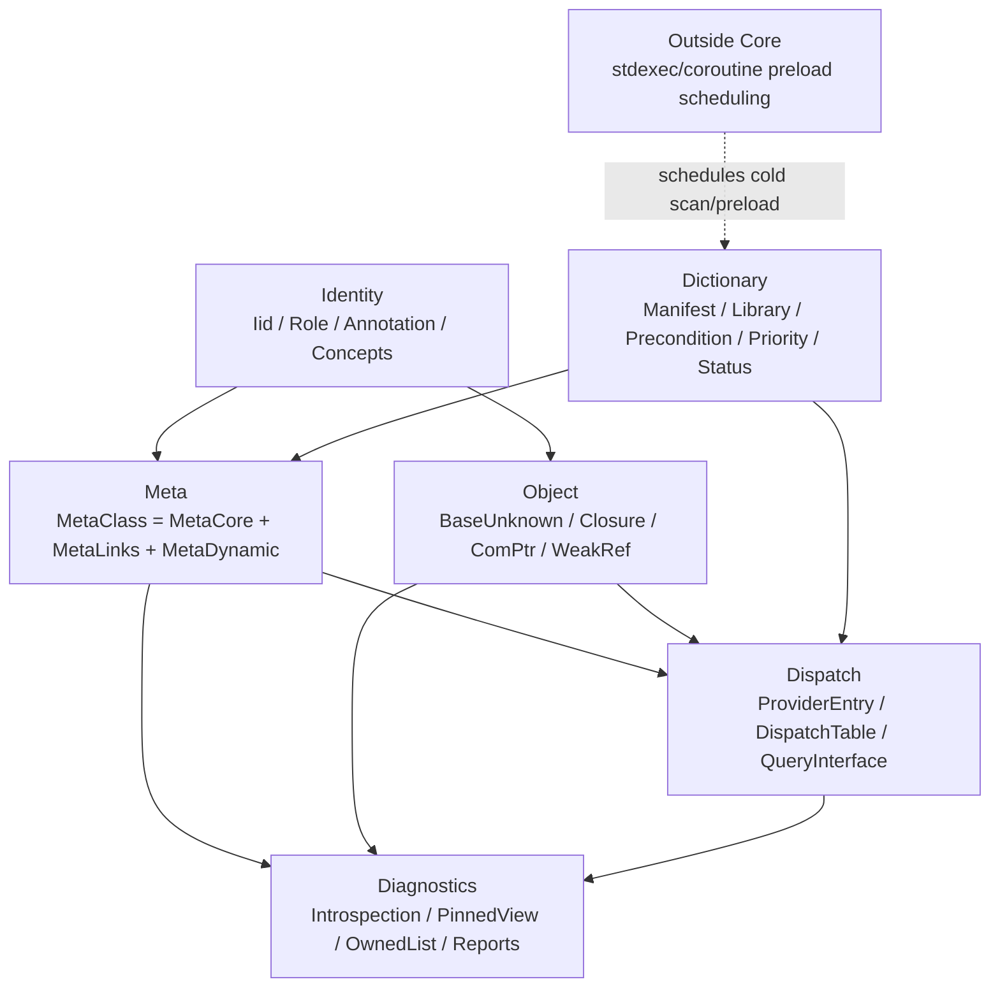
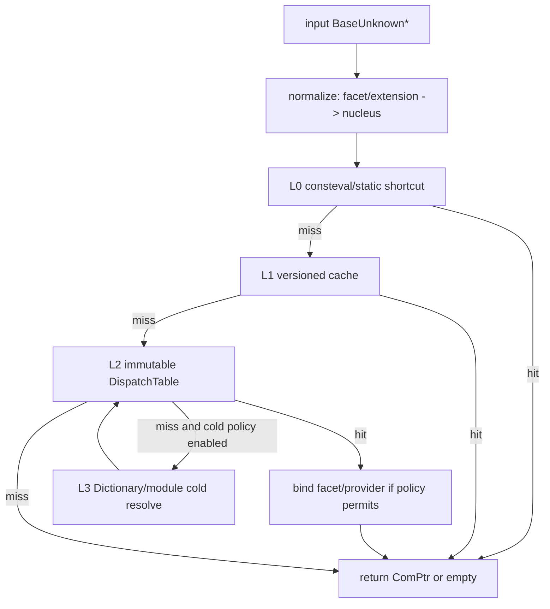

# Yuki/Core 统合架构设计

Status: Implemented-kernel-pass-0 (2026-06-28)

Scope:
`Yuki/include/Yuki/Core_Old`、`Yuki/include/Yuki/Core_Deprecated`、`Yuki/src/Core` 的语义审计与新
`Yuki/include/Yuki/Core` / `Yuki/src/Core` 设计。`Yuki/tests/Core` 旧测试矩阵废除，仅作为历史行为样本，不作为验收
标准。`Yuki/src/Core` 视为 `Core_Deprecated` 的源文件。

工具链目标: COCA clang-p2996, `-std=gnu++26 -freflection-latest`, libc++。设计优先级为语义正确性、热路径零额外
损耗、编译期完结、动态装载能力、术语稳定性。

## 1. 设计立场

新 `Yuki/Core` 不是对 `Core_Old` 的机械现代化，也不是对 `Core_Deprecated` 的继续补丁化。它是一次以
`Core_Old` 语义为事实源、以 `Core_Deprecated` 的可取方向为技术素材的重写。

此判断来自两类源代码事实：

| 实现 | 可保留的事实 | 必须清除的问题 |
|---|---|---|
| `Core_Old` | `BaseUnknown` / `MetaClass` / `DictionaryManager` / `BaseUnknownData` 链共同表达了完整的 CAA/COM 型对象模型，覆盖 `QueryInterface`、TIE、BOA、Extension、弱引用、字典、动态库装载、组件接口记录 | 宏注册、字符串接口名、手写链表、静态初始化副作用、非线程安全引用计数、类型与实例边界混杂、Extension 类型语义叠加 |
| `Core_Deprecated` | `ComPtr`、annotation/reflection、IID、`MetaCore/MetaLinks/MetaDynamic` 三层、`DispatchEntry`、不可变发布表、RCU、closure 术语具有正确方向 | 结构零碎，部分实现未完成；`IidsOf` 返回脱离 RCU guard 的 span；`Closure.cpp` 仍返回空表；`EagerChain.cpp` 与 `TaggedPayload` 接口不一致；L1 缓存把 x86-64 TSO 写入语义核心；源文件引用尚不存在的 `Yuki/Core` |

由此得到三条总原则：

1. 术语以 `Core_Old` 为主，保留 `BaseUnknown`、`MetaClass`、`Dictionary`、`CompIntfRecord`、
   `QueryInterface`、`Implementation`、`Interface`、`Extension`、`TIE`、`BOA`、`Extendee`、`Component`。
2. 新术语只用于消除旧术语的语义重叠：`ComPtr`、`ProviderEntry`、`closure`、`facet`、`nucleus`、
   `inline facet`、`bound facet` 可进入新 Core 的一等词表。`snapshot` 与 `materialized` 不进入一等词表；
   前者混淆时间切片与已发布表，后者描述创建时机而非对象角色。
3. `Yuki/Core` 是对象与数据平面。`std::execution`、协程、异步预扫描和预装载调度可以作为外围设施；同步 PATH section scan 属于 `Dictionary` 冷路径，不进入
   `BaseUnknown`、`Dictionary`、`QueryInterface` 的语义核心。

## 2. 术语表

`Core_Old` 的术语是外部读者已经理解的对象模型语言，新术语用于补齐旧模型中未被命名的结构。新设计不引入同义词竞争。

| 术语 | 新设计中的定义 | 说明 |
|---|---|---|
| `BaseUnknown` | 所有可查询对象、接口面、扩展对象的公共锚点 | 保留旧名。实现上不沿用旧 `_data` 链表结构 |
| `MetaClass` | 类型运行期元对象，组合 `MetaCore`、`MetaLinks`、`MetaDynamic` | 保留旧名。它是类型事实，不是实例事实 |
| `Implementation` | 组件的具体实现类 | 每个 closure 恰有一个实现侧根对象 |
| `nucleus` | 某个 closure 的唯一生命周期核心，即 canonical `Implementation` 实例 | 新术语。用于消除 `GetImpl` 在 TIE、BOA、Extension 场景中的多义性 |
| `Interface` | 查询目标能力的类型声明 | Interface 本身不拥有状态 |
| `facet` | 某个 `Interface` 或完整 object type 在某个 closure 上可被强引用访问的类型化对象面 | `QueryInterface` 返回 facet；facet 的物理形式可以是 direct、inline 或 bound |
| `closure` | 以 nucleus 为根的运行期对象闭包，包含 nucleus、已附着 Extension、已绑定 facet、弱引用控制块 | 替代旧 `BaseUnknownData` 链表的语义名称 |
| `BOA` | Interface 由 Implementation 或 Extension 直接提供的绑定事实 | 物理上表现为 direct facet 或 `inline facet` |
| `inline facet` | facet 作为 provider 对象内联子对象、基类子对象或零偏移视图存在 | 热接口使用此路径，`QueryInterface` 可退化为静态地址调整 |
| `TIE` / `TIEchain` | Interface 由独立对象转发到 provider | 物理上表现为 `bound facet`；旧术语保留为用户面对的声明模型 |
| `bound facet` | 独立 facet 对象，归属 closure，并绑定到 provider 或 nucleus | 用于冷接口、TIE/TIEchain、跨扩展转发、动态模块提供的接口 |
| `Extension` | 对某个 Extendee 或其 nucleus 增加能力的 provider | 保留旧词。内部拆分存储策略与绑定策略 |
| `Extendee` | Extension 声明扩展的对象或类型 | 保留旧词。实例层 `Extendee(e)` 最终必须归约到同一 nucleus |
| `Dictionary` | 运行期组件、接口、库、工厂、装载条件、候选 provider 的索引 | `DictionaryManager` 改为职责更窄的 `Dictionary` |
| `CompIntfRecord` | 历史记录格式：component-interface 绑定记录 | 作为兼容视图保留 |
| `ProviderEntry` | 新 Core 的规范记录：某个 Component 以某种 dispatch kind 提供某个 Interface | 它是 class-level fact，不是实例所有权 |
| `ComPtr<T>` | 指向 BaseUnknown-anchored facet 或对象面的 typed owning handle | `T` 可以是 Interface，也可以是用户有完整声明的 concrete object / Extension / TIE；增减引用计数作用于 closure/nucleus 生命周期 |

`ProviderEntry` 不是 `ProviderEntry` 的拼写变体。新 Core 使用 `ProviderEntry`，因为它描述的是“提供关系”这条事实，而
非 provider 对象本身。

## 3. 公理与不变量

新 Core 的正确性来自一组小而硬的不变量。实现可以演化，以下语义不变。

1. 每个 closure 恰有一个 nucleus。任何 facet、Extension、bound facet 归属到且仅归属到一个 nucleus。
2. `QueryInterface` 返回 facet，不返回“provider 本体”这个概念。若调用者需要 provider，可显式调用
   `ProviderOf(facet)` 或 `NucleusOf(facet)`。
3. 所有 facet 共享 closure 的强引用生命周期。`ComPtr<T>` 指向 `T` facet 或 concrete object 面，但
   retain/release 的实际目标是 closure 控制块。
4. `ProviderEntry` 是类型层事实。它描述 `Component` 能提供 `Interface`，不描述某个实例是否已经创建或绑定对应 facet。
5. 对同一个 closure 与同一个 interface IID，发布后的 dispatch table 中最多存在一个 winning provider。
   `priority` 只参与候选合并，不能把二义性带入热路径。
6. `MetaCore` 不可变，进入 `.rodata`；`MetaLinks` 以不可变表发布；`MetaDynamic` 是冷尾部，不允许被
   `QueryInterface` 热路径依赖。
7. `Dictionary` 可以触发动态装载，但已进入 L0/L1/L2 的查询路径不得访问文件系统、解析 JSON 或持有全局写锁。
8. RCU / `PinnedView` 不得返回生命周期悬空的 `std::span`。凡 span 依赖内部发布表，返回类型必须同时持有 pin/guard。
9. Extension 的 `DataExtension`、`CodeExtension`、`CacheExtension`、`TransientExtension` 是用户可读分类；
   核心实现用正交 policy 表达存储、共享、缓存、临时性。
10. `Yuki/Core` 不依赖 `<execution>`。PATH section scan 是同步冷路径；异步预扫描、预装载、热更新调度属于 `Yuki/CoreDiscovery` 或更上层 PAL。

## 4. 总体架构

新 `Yuki/Core` 分为六个层次。层次关系是单向的：下层不反向依赖上层，热路径只穿过前三层。



六层职责如下：

| 层 | 文件族 | 一等对象 | 运行期属性 |
|---|---|---|---|
| Identity | `Identity.h`, `Annotation.h`, `Iid.h`, `Concepts.h` | IID、role、annotation、concept | 全部可编译期求值 |
| Meta | `Object.h` 内的 `MetaClass` / `MetaCore` / `MetaLinks` / `MetaDynamic` | 类型事实、继承/扩展链接、冷属性 | `MetaCore` 静态，`MetaLinks` 以表发布，`MetaDynamic` 冷路径 |
| Object | `Object.h` 内的 `BaseUnknown` / `ComPtr` / `WeakRef` | nucleus、facet、closure、引用计数 | 实例层热路径 |
| Dispatch | `Query.h` 内的 `ProviderEntry` / `DispatchTable` / `QueryInterface` | ProviderEntry、dispatch arm、bound facet factory | 查询热路径 |
| Dictionary | `Dictionary.h` | 组件接口记录、库记录、装载条件、PATH section scan、lazy realization | 冷路径与装载期 |
| Diagnostics | `Query.h` / `Dictionary.h` 内的 `PinnedView` 与 caller-owned list | pinned view、错误枚举、报告 | 非热路径 |

此分层保留 `Core_Old` 的完整功能面，但切断三种旧耦合：类型事实与实例链表耦合、查询热路径与动态库装载耦合、Extension
分类与生命周期策略耦合。

## 5. Identity: 编译期身份层

Identity 层定义三类编译期事实：

1. `Iid`: Interface、Implementation、Extension、TIE/TIEchain、bound facet 的稳定身份。
2. `Role`: `Interface`、`Implementation`、`Extension`、`TIE`、`TIEchain`、`DictionaryOnly`。
3. `Annotation`: 声明 `implements`、`extends`、facet kind、extension policy、IID override、动态库导出名。

原则是：凡能从 C++ 声明、annotation、反射、consteval 验证得到的事实，必须在编译期得到。宏不再参与元数据表达。

示意声明如下，具体语法以后按 COCA clang-p2996 的 reflection/annotation 现状收敛：

```cpp
struct [[=Anno::Interface]] IGraphicProperties;

struct [[=Anno::Implementation]]
       [[=Anno::Implements{^^IGraphicProperties}]]
       Point;

struct [[=Anno::Extension]]
       [[=Anno::Extends{^^Point}]]
       [[=Anno::Implements{^^IGraphicProperties}]]
       PointGraphicPropertiesExtension;
```

Identity 层使用 concepts 表达成员资格，不使用 SFINAE、手写 trait 偏特化或宏生成的 `Name` 字符串：

```cpp
template <typename T>
concept InterfaceClass = requires { RoleOf<T> == Role::Interface; };

template <typename T>
concept ComponentClass = ImplementationClass<T> || ExtensionClass<T>;
```

`DEBaseUnknownTraits.h` 中已经出现的概念方向可以保留，但要把事实来源从手写静态成员迁移到 annotation/reflection。

## 6. Meta: `MetaClass` 三层模型

`MetaClass` 是稳定外壳，内部由三部分组成：

| 子层 | 可变性 | 数据来源 | 使用场景 |
|---|---|---|---|
| `MetaCore` | 不可变 | reflection + annotation + consteval block | role、IID、qualified name、base、implements、extends |
| `MetaLinks` | 发布表可替换 | Dictionary fold-in / PATH section scan / lazy realization | reverse links、dispatch table、extension candidates |
| `MetaDynamic` | 冷路径可变 | 诊断、统计、脚本扩展 | properties、counters、debug labels |

`MetaCore` 的目标形态是 `.rodata` 中的一组互相引用的静态记录。`consteval` block 负责生成数组、排序、去重、校验。

应在编译期检查的条件：

1. Interface 不能声明 `extends` 到 Implementation。
2. Implementation 不能声明 Extendee。
3. Extension 必须至少有一个 Extendee。
4. 每个 `ProviderEntry` 的 component 与 interface role 必须匹配。
5. 静态可见的 `ProviderEntry` 在同一 Component 内不得产生重复 IID。
6. `inline facet` 的 offset、alignment、cv/ref 行为必须可由编译器证明。

`MetaLinks` 采用不可变表发布。模块装载、字典合并、动态扩展注册只生成新表，然后一次性发布指针。读侧不观察半成品。

`MetaDynamic` 不进入 `QueryInterface`。任何需要持锁、分配、格式化字符串、统计更新的行为都放到冷路径。

## 7. Object: `BaseUnknown`、closure 与 `ComPtr`

### 7.1 `BaseUnknown`

`BaseUnknown` 继续作为 public anchor，但它的实现不再等价于旧 `BaseUnknownData` 链。它提供四类能力：

1. 身份：到达 `MetaClass`。
2. 生命周期：retain/release 到达 closure 控制块。
3. 查询：通过 `QueryInterface` 到达 facet。
4. 导航：`Nucleus()`、`Extendee()`、`Provider()`、`Closure()`。

旧接口中 `GetImpl(bool iDisallowExtension)` 的语义过载过重。新设计保留兼容名，但规范入口应拆成三项：

| 新入口 | 含义 |
|---|---|
| `NucleusOf(x)` | 返回 closure 的唯一 nucleus |
| `ExtendeeOf(x)` | 若 `x` 为 Extension，返回一跳 Extendee，否则为空 |
| `ProviderOf(facet)` | 返回该 facet 背后的 provider 对象 |

这样可以避免“Implementation、Extension、TIE、BOA 都叫 impl”的同名反复。

### 7.2 closure

closure 是实例层结构，不是类型层结构。它至少包含：

| 成员 | 说明 |
|---|---|
| nucleus | canonical `Implementation` 实例 |
| strong count | closure 级强引用计数 |
| weak token | 弱引用控制块，替代旧链表中的 `WeakRef` 节点 |
| extension table | 已附着 Extension 实例 |
| bound facet table | 已绑定的独立 facet 实例 |
| dispatch version | 与 `MetaLinks` 发布表和实例 side table 对齐的版本号 |

`inline facet` 在逻辑上属于 closure，但不需要进入 bound facet table。`bound facet` 是独立对象，必须进入表并由 closure
统一销毁。

### 7.3 `ComPtr<T>`

`ComPtr<T>` 是 typed strong handle，不是 `InterfacePtr<T>`。`T` 的语义条件分成两层：

1. 所有权层只要求 `T` 能归约到同一 closure/nucleus，即 `T` 是完整声明的 `BaseUnknown`-anchored 类型或等价 facet 类型。`T` 可以是 Interface，也可以是 concrete Implementation、Extension、TIE/TIEchain 或用户能看到完整声明的对象类型。
2. 查询层才要求目标类型具有可计算 IID，并能作为 `QueryInterface` 的目标。普通 `QueryInterface<I>` 仍以 Interface 为主路径；`ComPtr<T>` 本身不把 `T` 限制为 Interface。
3. 从 `ComPtr<From>` 到 `ComPtr<To>` 的隐式转换只允许标准指针可转换路径；跨 facet 转换必须显式走 `QueryInterface`，不使用 RTTI 与 `dynamic_cast`。

因此 `ComPtr<Concrete>` 是合法句柄，不是绕过对象模型的特殊情况。它与 `ComPtr<I>` 的差别仅在类型化访问面不同，强引用仍落到同一个 closure 控制块。

`ComPtr` 需要两种构造标签：

| 标签 | 语义 |
|---|---|
| retain | 输入裸 facet 指针未增加引用，构造时 retain closure |
| adopt | 输入裸 facet 指针已经由 `QueryInterface` 增加引用，构造时不重复 retain |

`ComPtr` 不参与动态装载错误传播。查询失败返回空 `ComPtr`；动态装载失败由显式 `Dictionary` / `Module` API 返回
`std::expected`。

## 8. Dispatch: `ProviderEntry` 与 `QueryInterface`

### 8.1 `ProviderEntry`

`ProviderEntry` 是新 Core 的中心记录。它取代旧 `CompIntfRecord` 在热路径中的位置，但 `CompIntfRecord` 可以作为
字典兼容视图存在。

规范字段：

| 字段 | 含义 |
|---|---|
| `component` | 提供能力的 Implementation 或 Extension 的 `MetaCore` |
| `interface` | 被提供的 Interface 的 `MetaCore` / IID |
| `dispatchKind` | direct、inline facet、bound facet、extension、singleton code extension 等 |
| `factory` | 必要时创建 bound facet 或 Extension 的函数指针 |
| `offset` | inline/direct 路径的静态地址调整 |
| `policy` | eager/lazy/transient/cache、ownership、thread-safety |
| `priority` | 冷路径候选合并时使用 |
| `status` | declared、loaded、disabled、unauthorized、unreachable |
| `source` | static reflection、manifest、dynamic module、compat shim |

`ProviderEntry` 的热路径副本不携带字符串、不持有 owning container、不调用虚函数。字符串名、framework、library、precondition
保留在 Dictionary 层。

### 8.2 dispatch kind

新 Core 的 dispatch kind 应按 facet 表达方式、绑定关系和运行期成本划分：

| kind | 物理形式 | 查询成本 | 用途 |
|---|---|---|---|
| `Direct` | provider 本身就是 facet | 指针不变或静态 upcast | Implementation 直接继承 Interface |
| `InlineFacet` | facet 是 provider 内联子对象 | 常量 offset | 热接口、BOA 快路径 |
| `BoundFacet` | 独立 facet 对象，绑定到 provider 或 nucleus | 一次 side table 查找；可缓存 | 冷接口、TIE/TIEchain |
| `AttachedExtension` | per-closure Extension 作为 provider | extension table 查找；可 eager | DataExtension / CacheExtension |
| `CodeExtensionSingleton` | process/module 级共享 provider | 常量指针或 module slot | CodeExtension |
| `TransientProvider` | 可重建 provider，不保证常驻 closure | 冷路径 factory | TransientExtension |

`CacheExtension` 不应再作为独立本体角色进入 dispatch kind。它是 `AttachedExtension` 或 `BoundFacet` 上的缓存策略。

### 8.3 查询路径

`QueryInterface` 是从任意 closure node 到目标 Interface facet 的函数。规范路径如下：



四层含义：

| 层 | 事实来源 | 约束 |
|---|---|---|
| L0 | 编译期 `ProviderEntry`，静态类型已知 | 只处理可证明的 direct/inline facet，不读 RCU |
| L1 | 版本化小缓存 | 仅优化，不定义语义；内存序按标准 C++ 表达，不把 TSO 写入模型 |
| L2 | `DispatchTable` | 查询主路径，读侧持有 pin/guard，二分或 perfect hash |
| L3 | `Dictionary` / module image index | 冷路径；可 realize owning DLL、合并候选、发布新 table 后重试 |

L3 不能隐藏在默认热查询中无限递归。推荐策略是：

1. 普通 `Query<I>(p)` 默认只查已发布 table。
2. `QueryWithLoad<I>(p, Dictionary&)` 或显式 policy 可触发 PATH scan、owning DLL realization 与冷解析。
3. 冷解析成功后发布 table，后续普通 `Query` 走 L1/L2。

这能保留 `Core_Old` 的动态库能力，同时避免查询热路径承担文件系统、JSON 解析或 DLL 初始化成本。

## 9. Dictionary: PATH section scan 与 lazy realization

`Dictionary` 继承 `DictionaryManager` 的功能面，但不继承其静态初始化模型，也不要求 DLL 先加载再调用注册入口。新的模块契约是 data-first：模块把自描述记录写入特殊 section，Core 在未加载 DLL 的状态下直接读取这些记录；只有某个 provider 真正被使用时，Core 才加载拥有该 provider 的 DLL。

`YukiCore_RegisterModule(Dictionary&)` 不进入最终架构。该入口的问题是把“模块发现”重新绑定到“模块装载后执行代码”，从而引入全局构造顺序、初始化副作用和不必要的启动装载。新模型中，注册信息是 DLL 文件的一段只读数据，不是 DLL 初始化代码的一次回调。

### 9.1 三阶段模型

| 阶段 | 动作 | 是否加载 DLL | 是否执行 DLL 代码 | 产物 |
|---|---|---|---|---|
| PATH scan | 遍历 `PATH` 中的 DLL，静态解析 PE/COFF section | 否 | 否 | `ModuleImage` 与 `ModuleRecord` 候选事实 |
| Fold | 校验 ABI、架构、IID、priority，折叠为 declared dispatch table | 否 | 否 | 可查询但未 realized 的 `ProviderEntry` |
| Realize | 首次使用某 provider 时加载拥有它的 DLL，解析 RVA/export token | 是 | 是，仅此时发生 | loaded dispatch table 与可调用 factory |

普通 `QueryInterface` 的 L0/L1/L2 不访问文件系统。`QueryWithLoad` 或显式 create/query policy 可以触发 lazy realization。PATH scan 可以由 `Dictionary::ScanPath()` 显式调用，也可以由 cold query 在受控路径中调用一次；无论哪种形式，scan 只做只读文件解析，不做 `LoadLibrary`。

### 9.2 PATH scan 规则

1. 候选目录来自进程 `PATH`，并可叠加 executable directory 与显式 `YUKI_CORE_PATH`。所有路径先 canonicalize，再按文件 ID 去重。
2. 只枚举 `.dll`，以只读方式打开文件并映射为 data file。Windows 上不得使用 `LoadLibrary` 或触发 image relocation 来读取元数据。
3. Scanner 解析 DOS header、NT header、COFF section table，寻找固定 section，如 `.yuki` / `.yuki$m` 合并后的 image section。
4. Scanner 校验 `magic`、`abiVersion`、`machine`、`pointerSize`、`endianness`、record bounds、string table bounds。失败的 DLL 只形成诊断，不影响其他 DLL。
5. 所有从 DLL 文件读出的字符串、记录、RVA token 必须复制到 Core 拥有的存储中。不得把 file mapping 内的指针泄露到 `Dictionary` 热路径。

### 9.3 Section ABI 必须 relocation-free

未加载 DLL 的磁盘镜像不能解释 C++ 指针。最终 section 记录不得包含 `const MetaClass*`、`const char*`、函数指针或虚表相关地址。规范记录只能包含以下四类值：

| 值类别 | 示例 | 说明 |
|---|---|---|
| value | `Iid`、role、priority、record count、flags | 可直接复制 |
| offset | name offset、record offset、string table offset | 相对 section 起点 |
| RVA | factory RVA、condition RVA、static MetaCore RVA | 加载后以 module base + RVA 解析 |
| export token | factory export name offset | 加载后通过 `GetProcAddress` / 平台等价物解析 |

因此，当前源码中 pointer-list 形式的 linked section 只能作为单 image 内的临时兼容路径。cross-DLL 静态扫描必须使用 relocation-free manifest section。若同一套宏需要同时支持 linked executable 与 DLL 文件扫描，应让宏生成 relocation-free blob；loaded image 内也按同一 blob 解释，而不是另建 pointer ABI。

### 9.4 Lazy realization 规则

1. `Dictionary` 为每个 `ProviderEntry` 保存 owning module path、module identity、factory token 和 load state。
2. 首次使用 unloaded provider 时，Core 用 scan 阶段记录的绝对路径加载 DLL，不按裸 DLL 名走系统搜索路径。
3. 加载前校验文件 identity 未变化，至少比较 size、timestamp、image checksum 或 section digest。变化则重新 scan 该 DLL 或标记为 unreachable。
4. 加载后根据 RVA/export token 解析 factory、condition、static MetaCore 等运行时地址，再发布 loaded dispatch table。
5. Realization 是 one-shot。已加载 DLL 在进程内不卸载；hot reload 需要进程级重启或未来独立设计。

`CompIntfRecord` 作为兼容视图保留，字段映射如下：

| `Core_Old` 字段 | 新字段 |
|---|---|
| component name | `ModuleRecord::componentIid` + Dictionary string pool |
| interface name | `ModuleRecord::interfaceIid` + Dictionary string pool |
| creation function | factory RVA/export token，realize 后变为 `ProviderEntry::factory` |
| framework/library | owning module path + framework string |
| precondition | declarative condition 或 condition RVA/export token |
| priority | candidate merge priority |
| status | declared、loaded、disabled、unauthorized、unreachable |
## 10. Extension: 保留旧分类，内部正交化

`Core_Old` 的 Extension 分类能覆盖需求，但把“对象是否共享、是否缓存、是否随 closure 销毁、是否可重复创建”压在同一个枚举
里。新设计保留外部词表，内部拆成三组 policy。

| 旧分类 | 新解释 | 存储策略 | 绑定策略 |
|---|---|---|---|
| `CodeExtension` | 无 per-closure 状态或状态由模块自身管理的 provider | shared/module singleton | eager 或 lazy，通常不进入 closure ownership |
| `DataExtension` | 每个 closure 一份状态，扩展具体 Extendee | attached per closure | eager 或 lazy，进入 extension table |
| `CacheExtension` | DataExtension 或 bound facet 的缓存声明 | attached/cache slot | lazy bind, cached until invalidated |
| `TransientExtension` | 可重建、非稳定常驻的 provider | transient/scoped | lazy bind, no permanent slot unless policy says cache |

这种拆分带来三个收益：

1. 查询唯一性可以在 `ProviderEntry` 层检查，不必理解四个旧枚举的组合语义。
2. 生命周期由 ownership policy 表达，引用计数规则不再散落在 `Release()` 分支中。
3. 未来新增缓存策略不需要新增 `TypeOfClass` 枚举值。

`AddExtension` 的新语义：

1. 校验 extension 的 `MetaCore` 声明确实 extends 当前 nucleus 或其类型祖先。
2. 校验 extension 对每个 Interface 的 `ProviderEntry` 不破坏 closure 唯一 provider 规则。
3. 将 extension 加入 closure extension table。
4. 生成或更新实例级 dispatch overlay。
5. 发布新实例 dispatch overlay table，并递增 dispatch version。

## 11. Published Table、PinnedView 与 RCU

`snapshot` 不作为最终术语。该词适合描述时间上的状态切片，但 Core 的关键对象不是时间切片，而是读侧可见的不可变发布表、带生命周期保护的视图，以及诊断路径的调用者自有结果。新 Core 使用三种形态：

| 形态 | 定义 | 用途 |
|---|---|---|
| `DispatchTable` / published table | 一次构造、排序、去重、校验后原子发布的不可变表 | `QueryInterface` 热路径、Dictionary fold 结果、实例级 dispatch overlay |
| `PinnedView<T>` | 同时持有 RCU guard/pin 与 `std::span<const T>` 的非 owning view | 调用者必须遍历内部发布表，且不能复制结果时使用 |
| caller-owned list | `std::inplace_vector`、`std::vector` 或调用者提供的 buffer | 诊断、报告、测试、低频 introspection |

禁止形态：

```cpp
std::span<const ProviderEntry> IidsOf(const BaseUnknown*) noexcept;
```

允许形态：

```cpp
PinnedView<ProviderEntry> IidsOf(const BaseUnknown*) noexcept;
void ForEachIid(const BaseUnknown*, std::function_ref<void(const ProviderEntry&)>) noexcept;
std::vector<ProviderEntry> CopyIidsOf(const BaseUnknown*);
```

读侧原则：

1. `QueryInterface` 在函数内部持有 pin，不把 span 传出。
2. `WalkClosure` 若遍历 bound facet 和 extension，必须用同一个 pin 读取所有 side table。
3. `PinnedView` 不可复制，可移动；析构时释放读侧保护。
4. 写侧发布新 table 后，旧 table 进入 retire list，待所有读侧退出后释放。

若 libc++ 的 `<rcu>` 在目标工具链可用，可用标准库 RCU 作为实现后端；否则保留内部 `EpochRcu`。这属于实现替换，不影响 API 语义。

## 12. C++20 到 C++26 特性的使用边界

新 Core 应充分利用现代 C++，但只在特性与模型同构时使用。

| 特性 | 使用位置 | 边界 |
|---|---|---|
| reflection / annotation | Identity、MetaCore、ProviderEntry 静态生成 | 不用于运行期 PE/COFF 解析；动态模块通过 relocation-free section 暴露数据 |
| consteval block | 生成 `.rodata` 元数据、排序、去重、静态断言 | 不做复杂全局图搜索导致编译时间失控 |
| expansion statement | 遍历 implements/extends/fields，生成静态数组 | 不替代普通运行期循环 |
| concepts | Interface/Implementation/Extension/facet policy 约束 | 不建立过宽概念，不把函数级要求塞进类型概念 |
| contracts | `BaseUnknown`、`Dictionary`、published-table / `PinnedView` API 的前后置条件 | 契约表达式不得有副作用；不替代错误返回 |
| `std::expected` | 动态装载、manifest 解析、precondition 求值 | `Query` miss 不是异常错误，不强行 expected 化 |
| `std::function_ref` | 冷路径遍历、诊断 visitor | 不存储到对象中 |
| `std::inplace_vector` | 小规模候选合并、诊断临时缓冲 | 容量必须由不变量或统计依据给出 |
| `std::flat_map` | Dictionary 冷路径索引 | 不进入每次 Query 的热路径 |
| `std::execution` / coroutine | 可用于外围异步预扫描、预热、批量 realization | `Yuki/Core` 本体不依赖 `<execution>` |

`#embed` 可用于把静态 manifest 嵌入模块，但不是必须路径。若 reflection 已能生成全部静态记录，不应再引入外部生成器。

## 13. 文件布局

新建 `Yuki/include/Yuki/Core`，不要把 Deprecated 头文件移动改名后继续使用。最终布局以少数文件承载稳定语义层，不按每个名词拆头文件。概念可以在文档中分层，工程文件必须克制。

```text
Yuki/include/Yuki/Core/
  Core.h          # optional aggregate include; no logic
  Object.h        # Iid / annotation vocabulary / MetaClass / BaseUnknown / ComPtr / WeakRef / MakeOwned
  Query.h         # ProviderEntry / DispatchTable / QueryInterface / closure navigation / bound facet / PinnedView
  Dictionary.h    # CoreErrc / RecordStatus / section ABI / ModuleImage / Dictionary / factories / PATH scan
  Annotations.h   # optional thin re-export if annotation vocabulary grows; otherwise merge into Object.h

Yuki/src/Core/
  Object.cpp
  Query.cpp
  Dictionary.cpp
```

文件边界按变更原因划分：

| 文件 | 变更原因 | 不应放入 |
|---|---|---|
| `Object.h` | 对象身份、类型事实、强弱引用、`ComPtr` 语义变化 | Dictionary fold、模块扫描、动态装载策略 |
| `Query.h` | 查询路径、facet 表达方式、closure 遍历、pinned view API 变化 | 字典文件格式、平台 section 枚举、库装载错误细节 |
| `Dictionary.h` | 组件接口候选、special section ABI、PATH scan、module image、manifest/library/factory 记录变化 | `BaseUnknown` 生命周期策略、热查询 side table 细节 |
| `Annotations.h` | annotation 词表需要被外部声明端单独包含 | 运行时代码、容器、锁、RCU 后端 |

`MetaClass.h`、`Closure.h`、`ComPtr.h`、`ProviderEntry.h`、`DispatchTable.h`、`QueryInterface.h`、`PinnedView.h` 不作为活动 public 文件存在。它们是设计维度，不是工程边界。若后续某个文件超过可维护阈值，优先在文件内部建立清晰 section，而不是为每个概念生成一个新文件。

命名说明：

| Deprecated 倾向 | 新设计处理 |
|---|---|
| `MetaCore/MetaLinks/MetaDynamic` 三文件 | 合并进 `Object.h`，保留结构体名，不保留文件拆分 |
| `RootObject` | 不进入新 Core；`BaseUnknown` 是唯一 anchor |
| `Registry` / `ArmRegistry` | 归入 `Dictionary` 的 section fold 与运行时索引职责 |
| `DispatchEntry` | 归入 `ProviderEntry` / `DispatchTable`，不再作为并列术语 |
| `SnapshotView` | 改为 `PinnedView` 或 caller-owned list |
| `Facade` | 若指查询面，统一称 `facet`；若指 TIE 独立对象，称 `bound facet` |
## 14. 兼容与迁移

迁移策略是“语义继承，接口重定”。旧宏和旧测试不作为新设计的边界。

| 对象 | 处理方式 |
|---|---|
| `Core_Old` | 保留为语义参考与行为样本，不 include 到新 Core |
| `Core_Deprecated` | 保留为草稿参考，摘取概念，不在其上继续修补 |
| `Yuki/src/Core` | 视为 Deprecated 源文件；新实现开始时应整体替换其 include 指向 |
| `Yuki/tests/Core` | 全部废除；只可人工阅读以理解历史意图 |
| 宏绑定 | 不迁移为主路径；必要时提供薄兼容层生成 annotation/manifest |
| 字符串接口名 | 仅在 Dictionary 兼容视图存在；热路径使用 IID |
| `DEAutoVar` | 由 `ComPtr` 替代；兼容适配晚于 kernel 稳定 |

迁移顺序：

1. 建立 `Identity`、`Iid`、annotation、concept、`MetaCore` 静态生成。
2. 建立 `BaseUnknown`、closure 控制块、`ComPtr`。
3. 建立 `ProviderEntry`、`DispatchTable`、L0/L2 查询。
4. 接入 `Dictionary` 的 PATH section scan 与 lazy realization。
5. 实现 Extension policy 与 bound facet。
6. 实现诊断与 introspection pinned views。
7. 最后提供旧宏、`DEAutoVar`、字符串 `QueryInterface` 的兼容层。

## 15. 新测试矩阵

新测试矩阵不继承 `Yuki/tests/Core`。验收按语义域重建。

| 域 | 必测行为 |
|---|---|
| Identity/Meta | annotation 生成 IID、role、implements、extends；重复 provider 编译期拒绝 |
| Query direct | Implementation 直接提供 Interface；`ComPtr` 引用计数正确 |
| inline facet | offset 正确；无分配；L0 命中 |
| bound facet | 首次查询绑定；重复查询复用；closure 销毁时释放 |
| Extension | DataExtension attach；CodeExtension singleton；CacheExtension policy；TransientExtension 不污染常驻表 |
| Dictionary | PATH scan；section ABI 校验；precondition；priority 合并；unauthorized/unreachable 状态 |
| Lazy realization | unloaded provider 首次使用时加载 owning DLL；普通 Query 后续命中 |
| PublishedTable/RCU | span 不悬空；读写并发下旧 table 延迟回收 |
| WeakRef | nucleus 析构后 weak token 失效；不访问已释放对象 |
| Diagnostics | `IidsOf`、`BoundFacets`、`Extensions` 返回 pinned view 或 caller-owned copy |

性能验收：

1. direct/inline 查询不得比静态 cast 多出不可消除分配或锁。
2. L2 查询必须在不可变连续数组或 perfect hash 上完成。
3. `ComPtr` 大小目标为一个指针；若为满足 closure retain 需要扩为两个指针，必须有基准数据证明收益大于成本。
4. Dictionary PATH scan、lazy realization、JSON/manifest 解析不得进入默认 `Query` 热路径。

## 16. 关键设计决议

当前稿给出以下决议：

1. 新 `Yuki/Core` 以 `BaseUnknown` 和 `MetaClass` 为 public anchor，不采用 `RootObject` 作为并列术语。
2. `nucleus`、`closure`、`facet` 是实例层数学模型；`Implementation`、`Interface`、`Extension` 是 Core_Old 兼容
   术语和用户面对的声明模型。
3. `ProviderEntry` 是 class-level dispatch fact，承接旧 `CompIntfRecord` 的核心语义，但剥离动态库字符串和状态细节。
4. `BOA` 归入 direct/inline facet；`TIE/TIEchain` 归入 bound facet。
5. Extension 旧四分类保留为用户词表，内部拆成 ownership、storage、binding policy。
6. `Dictionary` 保留 PATH section scan 与 lazy realization 能力，但默认 `Query` 不触发文件系统路径或 DLL 加载。
7. Deprecated 中的 RCU 方向保留，裸 span API 废除，统一改为 `PinnedView` 或 caller-owned buffer。
8. `<execution>` 与 coroutine 不进入 `Yuki/Core` 本体，只用于外部 discovery/preload 层。

此设计的目标不是兼容旧代码的每个宏调用点，而是保留旧 Core 的对象模型能力，并用 2026 年 C++ 的编译期机制把这些能力
重新落到可验证、可优化、可维护的结构上。

## 17. 2026-06-28 紧凑布局与术语修订

本节记录第 13 节的修订来源：原始草案按名词拆成二十余个文件，适合探索概念地图，但不适合作为最终工程边界。当前规范已把最终布局收敛为 `Object.h`、`Query.h`、`Dictionary.h` 与可选 `Annotations.h`，源文件对应 `Object.cpp`、`Query.cpp`、`Dictionary.cpp`。

同时，以下术语替换成为规范口径：

| 旧草案词 | 新词 | 理由 |
|---|---|---|
| `snapshot` | `published table` / `DispatchTable` / `PinnedView` / caller-owned list | 区分不可变发布表、生命周期受保护视图、调用者自有结果 |
| `materialized facade` | `bound facet` | 表达对象角色和归属关系，而非创建时机 |
| `inline facade` | `inline facet` | 与 `facet` 作为查询返回面的模型一致，避免与 GoF facade 模式混淆 |

`Registry`、`RootObject`、`DispatchEntry`、`QueryInterface.h`、`MakeOwned.h` 等不再作为活动 public 入口存在；它们是 `Dictionary`、`BaseUnknown`、`ProviderEntry`、`Query.h`、`Object.h` 中对应概念的旧同义拆分。旧测试矩阵移入 archive，只保留新的 `CoreKernelTest.cpp` 作为当前源码级行为样本。

该修订不改变前文的语义公理：每个 closure 恰有一个 nucleus，`QueryInterface` 返回 facet，`ProviderEntry` 是 class-level dispatch fact，`ComPtr` 保持 closure/nucleus 生命周期，默认 Query 不触发文件系统或动态模块加载。`std::execution` 与 coroutine 仍属于外层 preload scheduling 层，不进入 Core object kernel。

## 18. 2026-06-28 衍生需求修订

本节吸收后续 review 中确认的三个新增约束，作为实现优先级高于前文草案细节的硬规则。

### 18.1 自动 IID 保留，但以 P2996 反射为规范来源

`Core_Deprecated` 中的自动 IID 方向保留：IID 由类型反射得到的规范名字在编译期计算，不再依赖手写字符串、dict 文件或运行时注册副作用。规范路径为：

1. 若类型带有显式 `Anno::IidOverride`，使用该 IID。该路径用于跨编译器、跨 ABI、跨长期发布周期的稳定二进制接口。
2. 否则使用 `IidOfMeta(^^T)`；内部先 `std::meta::dealias`，再 `std::meta::display_string_of`，最后做 128-bit hash 并写入 RFC 4122 version 8 / variant bits。
3. `IidOf<T>()` 必须路由到 `IidOfMeta(^^std::remove_cvref_t<T>)`，避免 type-based 路径和 annotation/reflection 路径产生两个身份系统。

当前 active Core 中基于 `__FUNCSIG__` / `__PRETTY_FUNCTION__` 的 IID 生成只可作为临时技术债，不进入最终实现。

### 18.2 注册信息进入 DLL special section；Core 扫描 PATH，按需加载 DLL

“消除 dict 文件”不等于消除 `Dictionary`，但也不应退回到 `YukiCore_RegisterModule(Dictionary&)`。新的模块注册模型是：

1. 每个模块把 `MetaClass` shadow、`ProviderEntry` shadow、factory token、library/precondition/status/priority 等自描述记录放入 relocation-free special section。
2. Windows 目标优先实现 PE/COFF static scan。Core 遍历 `PATH` 中的 DLL，未加载 DLL 时只读映射文件，解析 section table 并复制 `.yuki` section 中的记录。
3. Section record 采用固定 ABI 的 POD header：`magic`、`abiVersion`、`recordSize`、`recordKind`、`flags`、string table offset、record count。记录内不得出现 C++ 指针。
4. `Dictionary` 在冷路径校验 ABI 后 fold 成运行时索引，并发布 declared dispatch table。此时 DLL 仍未加载。
5. 某个 provider 首次被 `QueryWithLoad` / create policy 使用时，Core 加载 owning DLL，按 RVA/export token 解析 factory 与运行时地址，然后发布 loaded dispatch table。
6. 普通 `QueryInterface` 热路径不扫描 PATH、不解析 PE、不触发 `LoadLibrary`、不持有全局写锁。

因此 `Dictionary` 的一等职责从“读外部 dict 文件”改为“扫描 PATH 中带有 Core section 的模块、折叠模块自描述表、维护 component-interface 候选索引与 lazy realization 状态”。`Core_Old` 的 `CompIntfRecord` 语义保留为兼容视图：component、interface、creation function、condition function、library/framework、priority、status 均应能从 section record 或 realization 后的运行时地址得到。

### 18.3 `ClassType` 不继承；C++ 继承是多级单继承事实

`ClassType` 是声明在当前类型上的 object-model role，不是 C++ base class 的可继承属性。实现规则如下：

1. `RoleOf<T>` / `ClassTypeOf<T>` 只读取 `T` 自身 annotation；未标注则为 `NothingType`，不得从 base 推导。
2. C++ 继承关系只贡献 `directBaseIid`。每个 object-model class 最多有一个 object-model direct base；多级继承由 `Dictionary` fold 时沿 direct base 链计算 ancestor closure。
3. 若类型有多个可见 object-model base，属于建模错误，应在 consteval bake 阶段拒绝。
4. `Implementation`、`Interface`、`Extension`、`TIE`、`BOA` 等 role 必须由当前类型显式声明，不能因继承某个 implementation 或 interface 而自动获得。

这条规则修正 `Core_Deprecated::Registry` 里“反射遍历 direct C++ bases 并把 subclass 写入 base links”的使用边界：可以用反射发现继承边，但不得让继承边携带或覆盖 `ClassType`。


## 19. 2026-06-29 对象模型收束与实现校准

本节覆盖本次实现阶段的最终约束，优先级高于早期草案中所有依赖 `MetaObject`、`ExtensionObject`、`BoundFacet` helper class 或接口继承 `BaseUnknown` 的描述。

### 19.1 继承公理

1. 活动 Core 禁止虚继承与多继承。所有 object-model object 至多有一个直接 C++ base；实际对象线必须收敛到 `BaseUnknown`。
2. Interface 是 contract，不是 object。`InterfaceClass<T>` 只要求 `T` 声明 `Anno::Interface`，不得要求 `T : BaseUnknown`。
3. `ClassTypeOf<T>` 只读取 `T` 自身 annotation；C++ base 只贡献 `directBaseIid`，不携带或继承 role。

### 19.2 删除继承 helper

`MetaObject`、`ExtensionObject`、`BoundFacet` 不再作为 public 或 internal helper 存在。metaclass、complete object address、extension target、bound target 均由 `BaseUnknown` 的实例状态表达，并由 `MakeOwned<T>` 在最派生对象构造完成后绑定。

该选择的理由是：这些 helper 以 C++ 继承编码对象模型边，天然诱导多继承或虚继承；而新模型中，object identity 与 facet identity 是两个正交维度，应通过 composition 与 explicit binding 表达。

### 19.3 Facet provider 约定

Provider 不再通过 `static_cast<Interface*>(component)` 从多继承子对象取接口。组件、extension、TIE 通过：

1. `using YukiProvides = Yuki::InterfaceList<I1, I2, ...>;`
2. `template<class I> I* Facet() noexcept` 或 `I* Facet(std::type_identity<I>) noexcept`

显式暴露 inline/member facet。`StaticMetaClass<T>()` 在编译期读取 provider list，生成 `ProviderEntry` 数组；运行时 resolver 只做一次 complete-object cast 与 member facet 访问，不引入 RTTI、`dynamic_cast` 或 heap allocation。

### 19.4 ComPtr 与 closure 生命周期

`ComPtr<T>` 允许 `T` 是 interface，也允许 `T` 是用户可见的 concrete object。其运行时状态为 typed pointer + `BaseUnknown* anchor`：typed pointer 决定访问面，anchor 决定 closure/nucleus 生命周期。`QueryInterface<I>` 返回 interface facet 时保留 resolver 返回的 anchor，因此 interface 不需要继承 `BaseUnknown` 也能安全延长 nucleus 生命周期。

`AttachExtension` 与 `AttachBoundFacet` 为 rvalue-only transfer API，避免误用 lvalue `ComPtr` 造成 closure storage 与外部 handle 对同一节点的双重所有权歧义。

### 19.5 当前实现验证

当前活动文件收敛为：`Object.h`、`Query.h`、`Dictionary.h`、`Iid.h`、`Annotations.h` 以及 `Object.cpp`、`Query.cpp`、`Dictionary.cpp`。旧测试矩阵废除，只保留 `CoreKernelTest.cpp` 作为当前 kernel 行为样本。

本轮 x64-asan 验证结果：`Test.Core.CoreKernelTest` 成功构建并运行，20 个 test case、87 个 assertion 全部通过。源级残留扫描确认活动 Core 中不存在 `MetaObject`、`ExtensionObject`、`BoundFacet` class、`Y_OBJECT`、旧 `Meta.h` include、三斜线 Doxygen、class/struct 级多继承行，且活动 Core 文件行宽不超过 120。
## 20. 2026-06-30 当前实现校准与下一轮收束计划

本节覆盖第 19 节中已经过时的实现口径。当前 Core 的新硬约束是：`FacetResolver` 返回
`BaseUnknown*`，`MetaClass` / `ProviderEntry` 只描述 `BaseUnknown` 及其子类构成的对象模型面。`ComPtr<T>` 仍然
可以作为 typed owning handle 保存用户可见的 concrete object 或 interface facet，但进入 metaclass dispatch 的 facet 必须
有 `BaseUnknown` 锚点；否则生命周期 anchor 无法由 Core 统一证明。

当前已实现并通过 x64-asan 验证的事实如下：

1. `BaseUnknown` 是 16 字节、16 字节对齐的 intrusive object header；热对象只保存一个压缩 `ComData` word 与 vptr，
   closure chain、weak state、extension/bound facet 列表全部冷分配。
2. `QueryInterface` 不再经过 `FacetAddress`。provider resolver 直接返回调用方要的 `BaseUnknown` facet，`ComPtr<T>` 保存
   typed pointer + retained anchor。
3. `MetaCore` 保存 `directBaseIid` 与 materialized `directBase` 指针。静态 metaclass 在编译期形成 direct-base IID，运行时
   静态路径直接链接 base metaclass；Dictionary-owned metaclass 在注册后补全 direct-base 指针。
4. `ClassType` 不继承。role 只来自本类型 annotation；C++ 继承只贡献直接 object-model base。Extension 的
   Data/Code 分类由完整对象大小判定：`sizeof(T) == sizeof(BaseUnknown)` 为 CodeExtension，否则为 DataExtension，
   从而正确覆盖继承带来的状态。
5. `Y_OBJECT` 通过 P2996 reflection 获得 `Self`，不再要求用户传模板实参；同时禁止多继承与虚继承进入 active Core。
6. `Dictionary` 已支持 relocation-free Core section record、PATH DLL 静态扫描、未加载 DLL 的 declared record fold-in，以及
   lazy `RealizeModule` 的句柄状态；普通 `QueryInterface` 不触发 PATH 扫描或 `LoadLibrary`。
7. 当前 x64-asan 验证命令为 `cmake --build build/x64-asan --target Test.Core.CoreKernelTest --parallel` 与
   `build/x64-asan/bin/Test.Core.CoreKernelTest.exe`，结果为 20 个 test case、95 个 assertion 全部通过。

下一轮重构目标不是继续增加小文件，而是把 public API 收束成少数语义单元。目标布局如下：

| 目标文件 | 吸收内容 | 保留理由 |
|---|---|---|
| `Object.h` / `Object.cpp` | `Iid`、role/annotation、`MetaClass`、`ProviderEntry`、`BaseUnknown`、`ComPtr`、`Y_OBJECT`、`StaticMetaClass` | 这些共同定义“类型事实 + 对象生命期 + provider fact”，拆散后只是在 include 层制造同义反复 |
| `Query.h` / `Query.cpp` | `QueryInterface`、extension/bound-facet attach、closure views、`TypeOf` / `Provides` / `IidsOf` | 这些是实例级查询与闭包操作，调用者心智上属于同一层 |
| `Dictionary.h` / `Dictionary.cpp` | section ABI、module image、manifest fold、PATH scan、lazy realization、cold provider index | 冷路径和动态模块事实必须隔离，避免污染对象热路径 |
| `Annotations.h` | 只作为用户 include facade，可薄到 include `Object.h` | 给 annotation 用户一个稳定入口，不再放实现 |

执行计划分四步：

1. **文件收束**：先把 `IID.h`、`Types.h`、`Dispatcher.h`、`Meta.h`、`BaseUnknown.h`、`ComPtr.h` 合并进
   `Object.h`，把 `BaseUnknown.cpp` 与 `Meta.cpp` 合并进 `Object.cpp`。合并只改变边界，不改变 ABI 和测试行为。
2. **语义整块化**：把 `BaseUnknown` 内部的小型链操作整理为 Core_Old 式的三个 arm：Implementation chain、Extension
   extendee、TIE/bound target。实现仍用压缩 tagged word + 冷 vector，不回退到旧手写链表。
3. **Dictionary 补链正规化**：把当前机会式 `ResolveDirectBaseLinksUnlocked()` 扩展为“pending links”阶段，section 扫描顺序不再影响
   metaclass graph 完整性；provider/factory/library 也进入同一 fold transaction。
4. **测试扩面**：在 `CoreKernelTest` 基础上补充 section 顺序乱序、direct-base 后补、duplicate provider priority、extension
   inherited state、bound facet anchor、weak expiry、PATH scan no-load 等用例。旧 `Yuki/tests/Core` 矩阵不恢复。

暂不引入 `<execution>` 或 coroutine 到 Core 本体。它们适合做 `CoreDiscovery` 的异步 PATH 预扫描、DLL 预热或后台 realization，
不是 `BaseUnknown` / `QueryInterface` 的对象模型事实。
