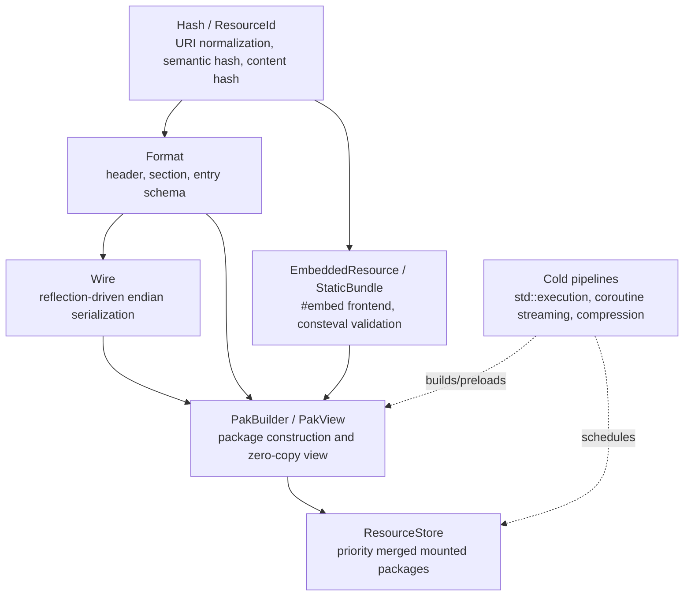
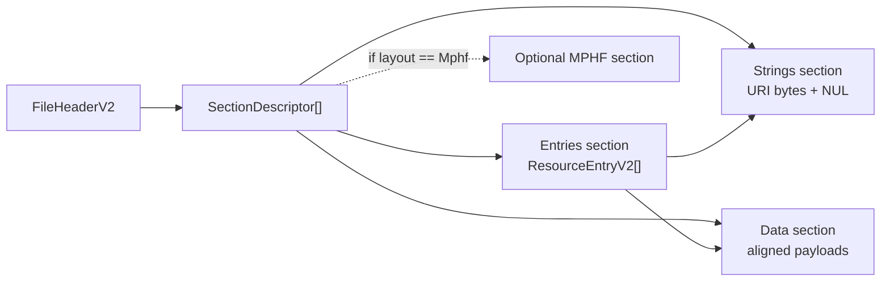

# Sora Resources / `.lpak` 架构设计

Status: Implemented-pass-0 (2026-07-08)

Scope: `Sora/include/Sora/Resources`、`Sora/tests/Resources`、`Sora/tests/CMakeLists.txt`。本设计吸收
`P:/InfraUtilities/smoothie` 的资源包、VFS、embedded/mmap mount、MPHF 与压缩经验，但不把 smoothie 的命名、
v1 wire schema 或隐含索引假设迁入 Sora。Sora 侧采用 `Sora::Resources` 命名空间、PascalCase API、
C++26 reflection/consteval/#embed 范式与 `.lpak` 文件格式。

工具链目标: COCA clang-p2996, `-std=gnu++26 -freflection-latest`, libc++。设计优先级为格式正确性、
编译期完结、热路径零分配、显式物理布局、资源身份稳定性、可扩展 codec/index 管线。

## 1. 问题定义

资源系统处理的是三类对象之间的关系：

| 对象 | 定义 | 一等属性 |
|---|---|---|
| `Resource` | 由 URI 命名的不可变字节序列及其语义类型 | URI、type、semantic hash、content hash、codec、payload |
| `Package` | 一组资源的稳定二进制发布单元 | header、section table、entry index、string table、data section |
| `Store` | 多个 package 或 static bundle 的优先级合并视图 | mount、priority、visible index、lookup |

这三个对象不应混淆。`Resource` 是语义对象，`Package` 是持久化布局，`Store` 是运行时解析关系。v1 smoothie 的
一个结构性问题是 writer 可以按 MPHF slot 重排物理 index，而 reader 在关闭 MPHF 时退回到假设 sorted hash
order 的路径。当前格式由此得到第一条约束：文件必须显式声明 index layout，reader 只能按文件声明的物理布局解释
entry 区域。

第二条约束来自规模。v1 `entry_descriptor::data_offset/data_size` 使用 32-bit 字段，单包 payload 与偏移空间
被限制在 4 GiB 内。当前格式的 section offset、entry data offset、packed/unpacked size 全部使用 64-bit 字段。
小资源不会因此付出热路径额外代价；entry 是顺序紧凑表，二分查找只读 hash 与少量相邻字段。

第三条约束来自 `#embed`。用户主要通过 `#embed` 引入资源，因此资源系统必须把静态字节数组视为主入口，而不是
把它降格为外部工具生成文件的替代物。编译期资源集合应能完成 URI hash、重复检测、静态索引排序，并可选择直接
作为 `StaticBundle` 使用或编译成 `.lpak`。

## 2. 架构分层

`Sora::Resources` 按六层组织。下层不反向依赖上层，热 lookup 只经过身份、格式视图和 store index。



| 层 | 文件 | 职责 | 当前状态 |
|---|---|---|---|
| Hash / Identity | `Hash.h`, `ResourceId.h` | URI 归一化、FNV-1a stable hash、resource identity | 已实现 |
| Format | `Format.h` | `.lpak` wire schema、枚举、section kind、layout kind | 已实现 |
| Wire | `Wire.h` | 反射驱动 little-endian scalar serialization | 已实现 |
| Static frontend | `EmbeddedResource.h`, `StaticBundle.h` | `#embed` 字节数组载体、静态 bundle、重复 hash 检查 | 已实现 |
| Package IO | `PakBuilder.h`, `PakView.h` | package 构建、解析、checksum/hash/entry 验证、payload lookup | Sorted/None 已实现 |
| Runtime store | `ResourceStore.h` | 多 package mount、priority resolution、visible resource index | 已实现 |
| Extension pipeline | 后续文件 | Eytzinger/MPHF、compression、mmap/file source、async build/preload | 待实现 |

## 3. `.lpak` 文件模型

`.lpak` 是 sectioned package，不再把某个 index 策略隐式绑定到 reader 编译选项。



header 包含 magic/version、header size、section count、index layout、file size、section table offset、
resource count、header hash、file hash。section descriptor 包含 kind、alignment、offset、size、checksum。
entry 包含 semantic hash、content hash、data offset、packed size、unpacked size、URI offset/size、type、codec、
flags。

当前 pass-0 的 reader 执行以下验证：

1. header magic、major version、wire header size、file size 与 index layout 必须一致。
2. header hash 在 `HeaderHash` 与 `FileHash` 清零后的 header bytes 上计算。
3. file hash 在 `FileHash` 字段逻辑清零后的完整文件上计算，无需复制整文件。
4. section table 位于 header 之后，所有 section 在文件范围内、满足 alignment、互不重叠、不覆盖 section table。
5. entries、strings、data 三个 section 必须存在且唯一。
6. 每个 section checksum 必须匹配。
7. Sorted layout 下 entries 必须按 `SemanticHash` 严格递增；reader 另建 compact hash table，使查找只二分 8B hash。
8. entry 的 type、codec、flags 必须属于已知集合。pass-0 只接受 `CompressionCodec::None` 与 `ResourceFlags::None`。
9. URI 必须在 string section 范围内，且 `UriOffset + UriSize` 处存在 NUL byte。
10. `HashUri(uri)` 必须等于 entry semantic hash。
11. payload range 必须在 data section 范围内，且 `HashBytes(payload)` 必须等于 content hash。
12. `DataOf` 与 `UriOf` 只接受属于当前 validated view 的 canonical entry，外部伪造 descriptor 不得绕过验证。

这些不变量使 `PakView` 成为 validated view。上层拿到 `PakView` 后，不需要再次证明 package 的内部引用关系。

## 4. Wire schema 与 reflection

当前格式不使用 `reinterpret_cast<WireStruct*>` 读取磁盘结构。原因是 C++ object layout 与 wire layout 不是同一对象：
padding、host endian、ABI 对齐与未来字段插入都会污染文件格式。`Wire.h` 以 reflection 遍历 schema 的
non-static data members，只接受 integral 或 enum scalar 字段，并按成员声明顺序写入 little-endian bytes。

该层有三个性质：

1. `Wire::SizeOf<T>()` 是 wire size，不是 `sizeof(T)`。
2. `Wire::OffsetOf<T, Member>()` 是 wire offset，不是 `offsetof(T, member)`。
3. `Wire::Append/Read/WriteAt` 只依赖 schema 成员序，不依赖 C++ object padding。

这正是 reflection 应该进入资源系统的位置。reflection 不应把任意用户 struct 直接解释为磁盘对象；它应生成固定
wire schema 的序列化、字段偏移与验证逻辑。用户语义类型进入资源系统时，应先投影为 resource metadata 或 decoder
输入，而不是成为 package header。

## 5. `#embed` 前端

用户侧的主入口是静态字节数组：

```cpp
static constexpr unsigned char kShader[] = {
    #embed "fullscreen.slang"
};

constexpr auto shader =
    Sora::Resources::MakeEmbeddedResource<"res://core/shaders/fullscreen.slang"_FS,
                                          Sora::Resources::ResourceType::Shader>(kShader);

constexpr auto bundle = Sora::Resources::MakeStaticBundle(shader);
```

`EmbeddedResource` 只持有指针与长度，不拥有字节。`StaticBundle<N>` 在 constexpr 构造期验证 URI 非空且为
canonical form、`Hash == HashUri(Uri)`、非空 payload 指针非空、semantic hash 不重复，并按 hash 排序。运行时
`Get(hash)` 是对静态数组描述符做二分查找，再返回
`std::span<const std::byte>`。

此路径有两个形态：

| 形态 | 适用场景 | 运行时代价 |
|---|---|---|
| `StaticBundle` | 小型内建资源、测试资源、不可替换 bootstrap asset | 无 package 解析，无 payload copy |
| embedded `.lpak` | 大型资源集合、需要统一 package 格式、需要 priority mount | 一次 package 验证，之后 zero-copy lookup |

pass-0 已支持 `StaticBundle::ToPakBytes()`，使静态 bundle 与 runtime builder 共用同一 package pipeline。
后续可增加 consteval package builder，把完全静态的 package bytes 也前移到编译期；当前实现保持运行时
`PakBuilder`，因为 C++ 标准文件输出仍属于运行时或构建工具职责。

## 6. Runtime store

`ResourceStore` 是 mounted packages 的优先级合并视图。每个 mount 持有一个 `PakView`，owned mount 存储
`std::vector<std::byte>`，borrowed mount 存储外部字节 span。store rebuild index 时收集所有 entry 的
`SemanticHash`、mount priority、mount index 与 entry index，按 `(hash, priority desc, mount index desc)` 排序，
然后每个 hash 只保留最高优先级项。同优先级 overlay 采用后挂载胜出规则，mount name 为空或重复时拒绝挂载。

此设计把 overlay 语义放在 store 层，而不是写入 package 层。package 是事实集合，store 是可见性关系。由此可以
同时支持 base assets、patch packages、mod packages、locale overrides 与 test fixtures，而不污染 `.lpak`
wire format。

## 7. C++26 特性边界

此系统使用现代 C++ 特性，但不把特性当作架构目标本身。

| 特性 | 使用位置 | 理由 |
|---|---|---|
| `#embed` | 用户资源入口 | 把资源字节纳入 translation，不再依赖 `xxd` 类外部生成器 |
| reflection / `template for` | `Wire.h` | 从 schema 成员生成 endian-stable serialization，消除手写字段重复 |
| `consteval` / constexpr | static bundle、wire size/offset、URI hash | 编译期完成稳定事实计算 |
| concepts | byte source、wire scalar 约束 | 把 schema 可序列化性表达为类型约束 |
| annotation | `Sora::Resources::$::Resource` 预留 | 后续反射扫描 annotated static arrays，自动生成 bundle/manifest |
| `std::execution` | 后续 packaging/preload | 并行压缩、hash、dependency preload 属于冷路径结构化并发 |
| coroutine | 后续 large source streaming | 大文件输入、外部资源流式转换，不进入 hot lookup |

`std::execution` 不进入 `PakView::Get` 或 `ResourceStore::Get`。热 lookup 必须是同步、确定、零分配的指针/span
路径。异步调度用于构建、压缩、预加载和依赖图求值。

## 8. 当前实现边界

pass-0 有意只实现最小正确闭环：

1. index layout 只支持 `IndexLayout::Sorted`。`Eytzinger` 与 `Mphf` 已进入 wire enum，但 reader 返回
   `ErrorCode::NotImplemented`。
2. compression 只支持 `CompressionCodec::None`。`Lz4` 与 `Zstd` 已进入 schema，但不接受压缩 entry。
3. `PakBuilder` 复制 payload 到内部 vector。大规模 packaging 后续应引入 borrowed source 与 streaming source。
4. `PakView` 为了简化 validated view 当前把 entry descriptors 与 compact hash table 分别读入
   `std::vector<ResourceEntryV2>` 与 `std::vector<uint64_t>`。当 Eytzinger 与 MPHF 实现后，可以进一步把 sorted
   entry table 映射为 borrowed view 或构建静态 lookup adapter。
5. 文件写入 API `PakBuilder::Write` 已存在，但测试当前覆盖内存 package 与 borrowed mount。Windows Debug CRT
   与 libc++ filesystem/iostream 的退出期组合在本机出现过 heap 异常，文件 IO 测试应在独立 PAL/file test 中处理。

这些边界不是格式债务。schema 已为 64-bit payload、显式 layout、section checksum、content hash 与未来 codec
预留了必要位置；未实现能力通过 `NotImplemented` 明确拒绝。

## 9. 后续阶段

资源系统后续应按四个阶段推进：

| 阶段 | 目标 | 关键验收 |
|---|---|---|
| Phase 1 | Eytzinger layout | builder 可选择 Eytzinger，reader 使用无分支或低分支查找，sorted fallback 不混用物理布局 |
| Phase 2 | MPHF layout | package 内含 MPHF section，reader 按 layout 精确解释，hash collision 与 URI 验证仍保留 |
| Phase 3 | Compression policy | LZ4/Zstd codec、packed/unpacked size 验证、按资源类型选择压缩策略，未压缩 hot path 仍 zero-copy |
| Phase 4 | Annotation registry | `[[=Sora::Resources::$::Resource{...}]]` 标注 static arrays，reflection 生成 bundle manifest |
| Phase 5 | Async build/preload | `std::execution` 并行 hash/compress/build，store 支持冷路径 preload graph |
| Phase 6 | mmap/file mount | PAL file source、memory-mapped source、lifetime guard，避免把 filesystem 细节暴露给 `PakView` |

每个阶段的共同约束是：文件格式不依赖编译宏，reader 行为只由 package header/section table 决定；lookup 热路径不做
分配、不做解压、不访问文件系统。

## 10. 验收状态

当前测试目标为 `Test.Sora.Resources.ResourcePackageTest`，覆盖以下行为：

1. `PakBuilder` 构建 sorted `.lpak`，`PakView` 解析并读取 payload/URI。
2. `StaticBundle` 从 embedded resource 构造，支持 constexpr count、hash lookup 与 package serialization。
3. `ResourceStore` 按 priority 合并多个 mounted package。
4. `PakView` 拒绝损坏 package bytes。
5. `PakBuilder` 接受空 payload，拒绝重复 semantic id。
6. `ResourceStore` 支持 borrowed embedded package mount。
7. `PakBuilder` 规范化运行时 URI，拒绝非法 URI 与未知 resource type。
8. `StaticBundle` 验证 canonical URI、hash 与空 payload 语义。
9. `ResourceStore` 拒绝空/重复 mount name，并在同优先级 overlay 中采用后挂载胜出。
10. `PakView` 拒绝伪造 entry descriptor 与声明但尚未实现的 entry mode。

验证命令：

```powershell
$envText = python T:\toolchains\coca-toolchain-p2996\setup.py env --shell powershell
Invoke-Expression ($envText -join "`n")
cmake --build G:\Teaching\Vulkan\build\x64-debug --target Test.Sora.Resources.ResourcePackageTest --config Debug
G:\Teaching\Vulkan\build\x64-debug\bin\Test.Sora.Resources.ResourcePackageTest.exe

cmake --build G:\Teaching\Vulkan\build\x64-asan --target Test.Sora.Resources.ResourcePackageTest --config Debug
$env:PATH = "T:\toolchains\coca-toolchain-p2996\lib\clang\21\lib\windows;$env:PATH"
G:\Teaching\Vulkan\build\x64-asan\bin\Test.Sora.Resources.ResourcePackageTest.exe
```

Debug 与 ASan/UBSan 配置均通过 11 个 test case、81 个 assertions。

